Taki bałagan nie mógł trwać wiecznie, przecież klienci wpadają w
pomięszanie, co właściwie mają kupować - kiedy produkt ma tyle
indywidualnych cech wyróżniających, zamiast się cieszyć, wpadali w
panikę. Zatem w 1888 roku odbył się w Toronto zlot producentów maszyn do
pisania i ustalono na nim 2 standardy międzynarodowe, oparte o dokonania
Sholesa:

<!--
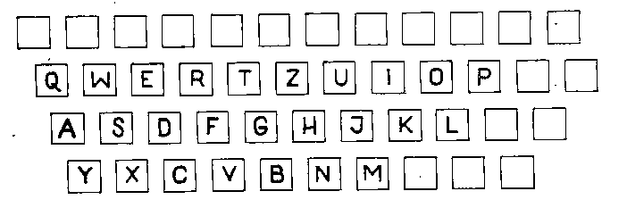
ten
-->



<!--
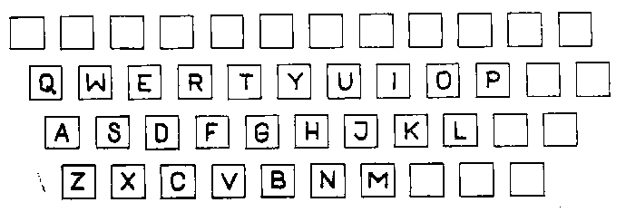
i ten
-->



Jak widać, dla różnej maści dziwaków, wynalazców i innowatorów
pozostawiono całkiem sporo nieoznaczonych klawiszy. Był to również
uprzejmy ukłon w stronę tej milczącej większości na świecie, która
posługuje się alfabetem łacińskim, ale z własnymi, różnymi literkami.
Abstrahujemy od maszyn do pisaniapo rosyjsku, grecku, arabsku,
hebrajsku, persku, ormiańsku, gruzińsku... O chińskim w ogóle nie ma co
mówić, to temat na oddzielny wpis.

Jednakowoż, albowiem, ponieważ, w innych, niektórych krajach podniesiono
larum na zamach na narodowy charakter języka, na cechy szczególne i w
ogóle. I tak Francuzi zrobili sobie własny układ,

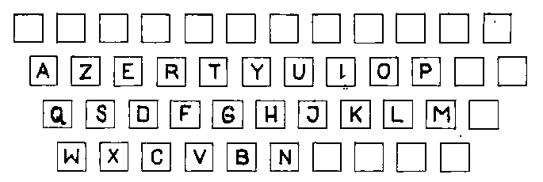

którym posługiwali się też Albańczycy. Włosi wynaleźli własny,

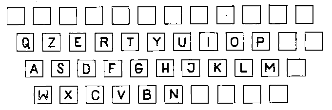

Turcy też nie pozostali w tyle, szczególnie po reformach Kemala Paszy
Ataturka,

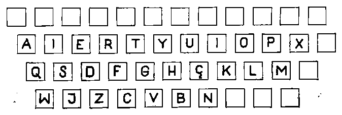

a Portugalczycy ośmielili się nawet zmienić układ tak, że w opisie nie
dało się już powiedzieć "erty", ale czyżby ukryli w układzie nazwisko
jego twórcy?

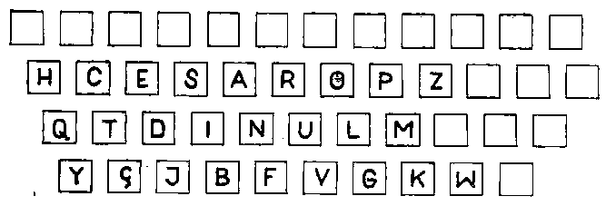

Jak zobaczyłem układ belgijski, zrozumiałem, dlaczego Uderzo i Goscinny
robią sobie z Belgów jaja w komiksie "Asterix i Obelix u Belgów":

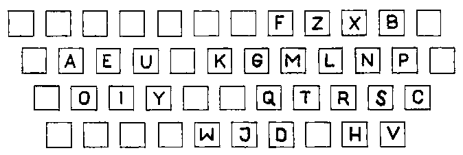

Tymczasem we wzmiankowanej wyżej, naszej dzielnie stawiającej opór
przeciwnościom niespotykanym w innych systemach Polsce z pewną taką
nieśmiałością podjęto pomysł, że może odważylibyśmy się sami montować
czcionki na importowanych z bardziej uprzemysłowionych regionów świata
maszynach? Jak nie wiadomo, co zrobić, to najlepiej zrobić debatę. A jak
nie wiadomo, kto ma coś zrobić, to najlepiej powołać w tym celu komitet.
Nie będę cytował nazwy komitetu, była długa.

Najsampierw ustalono układ klawiatury na podstawie przedwojennej normy:

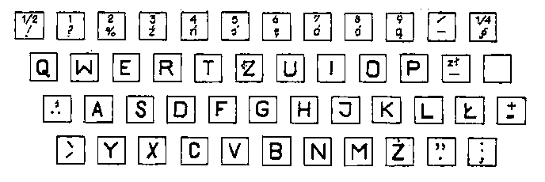

Bo lepszych pomysłów na razie nie było.

Żmudne badania częstotliwości występowania głosek i liter w zapisie
języka polskiego prowadzone były niezależnie przez kilka instytucji - i
wszystkie do dziś pozostały ściśle tajne, w szczególności wyniki tych
badań. *W efekcie my z No-qankiem musieliśmy robić własne badania. I tak
pieniądze podatników nie zostały zmarnowane po raz kolejny.*

Równolegle prowadzono badania, wyobraźcie sobie, sprawności palców. Z
badań tych wyszło, że palce układają się w hierarchii:
1. wskazujący i środkowy prawej ręki
2. wskazujący i środkowy lewej ręki
3. serdeczny i mały prawej ręki
4. serdeczny lewej ręki
5. mały lewej ręki
Przy czem rozkład sprawności z podziałem na ręce w procentach wynosi:
- prawa ręka = 53%
- lewa ręka = 47%

Ciekawe, czy w badaniach uwzględniono mańkutów, bardzo w to wątpię,
wtedy uważano szmajaństwo za odmianę lekkiej niepełnosprawności.

W maju 1951r. przystąpiono oficjalnie do prac nad projektem polskiego
układu klawiatury. Jak to w Polsce, na jednym układzie się nie skończyło
i nie skończy, chciałbym tutaj podkreślić. Np. Główny Instytut Pracy
przedstawił swój projekt:

<!--
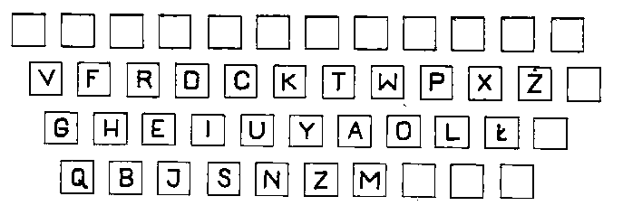
dziwny, no nie?
-->



Minimaliści utrzymywali, że w układ międzynarodowy wnikać trzeba
możliwie jak najmniej, bo przecież tak często się zdarza, że trzeba
klepać w innych językach, a wtedy dedykowany układ nie będzie pasował do
obcego języka. No, ciekawe, a czemuż to nie przeszkadza im, kiedy układ
QWERTY nie pasuje do polskiego? Tak czy owak przedstawili, zasłaniając
się Polskim Komitetem Normalizacyjnym taki oto projekt, który wszedł do
normy numer PN-58F-02000:

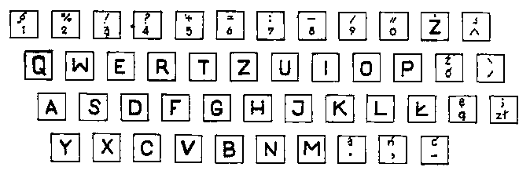

Jak to norma, pamiętają o nim dziś tylko bardzo niektórzy. Problem
dedykowanej klawiatury dla elity piszących bezwzrokowo pozostał wciąż
otwarty. Aż (wróćmy do początku tego artykułu) w 1958r. inż Janusz
Kaczmarek z tuzami polskiej stenografii wprost ze Stowarzyszenia
Stenografów, Sekretarek i Maszynistek, Alfonsem Znanieckim i Henrykiem
Bańskim przedstawili projekt, który bez zatrzymywania się powędrował ad
acta, czyli na wieczyste zesłanie:

<!--
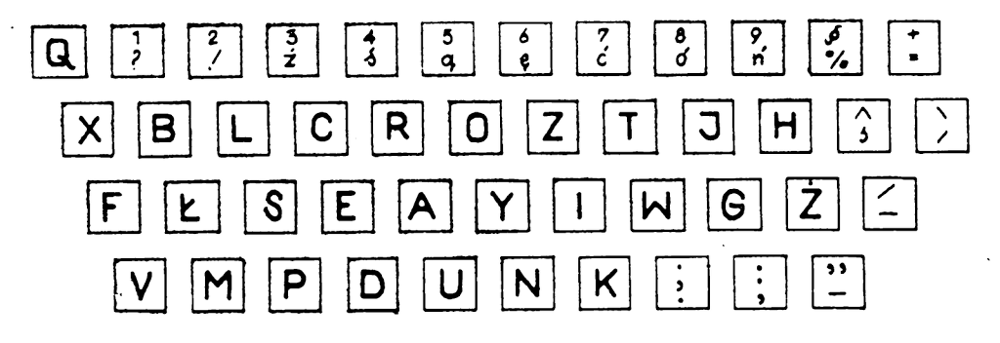
to jeszcze raz ja, ten z samej góry
-->



I moglibyśmy spocząć na Laurach, Werandach, czy jak tam się nazywają
nasze żony, po tym wiekopomnym odkryciu, gdyby nie drobny problem: otóż
maszyny mechaniczne odeszły bezpowrotnie w przeszłość, a zatem i problem
niepełnosprawności małych paluszków również, bo małe paluszki czują się
świetnie na klawiaturze komputera, a przynajmniej moje i przynajmniej
ten najmniej sprawny, czyli lewy (czy wspominałem już, że jestem
szmaja?).

Tymczasem układ ten faworyzuje, czy też wręcz przeciwnie, obciąża ponad
miarę, palce silniejsze i dłuższe, kosztem maluczkich. Jednakowoż z
tabelki zobaczyć można, że niewspółmiernie (a tu posłużę się też własnym
szkiełkiem i okiem oraz własnym doświadczeniem) obciążone są palce
wskazujące, bowiem mają do obsłużenia po 6 klawiszy, gdy pozostałe
paluszki zaledwie po 3. Linii cyfrowej nie policzyłem, mniejsza o nią.

Ośmieliłem się zatem opracować na bazie powyższego układ inny, na razie
tylko z grubsza poprawiający komfort nieszczęsnych palców wskazujących,
w toku eksperymentów sprawdzimy, jak bardzo. Może trzeba będzie
przestawić jeszcze parę literek, żeby je bardziej odciążyć.

<!--
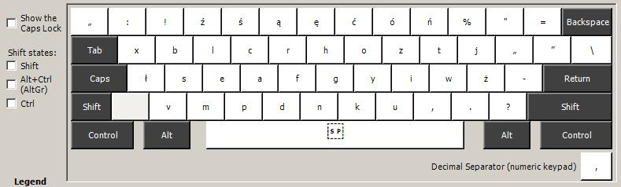
pl.SSiM
-->



Jak widać, rozsunąłem samogłoski. W ten sposób (na przykładzie E i A)
znalazły się po palcem wskazującym i środkowym, nie zaś obie pod palcem
wskazującym. Podobnie uczyniłem w rzędach górnym i dolnym, na dodatkowe
miejsca pracy palca wskazującego delegując rzadziej występujące
spółgłoski.

<!--
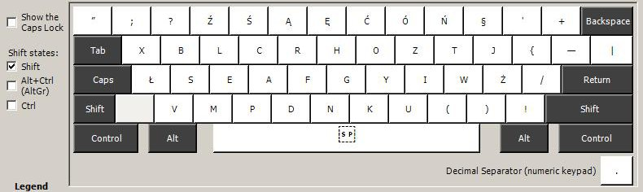
pl.SSiM po naciśnięciu klawisza Shift
-->



W języku polskim, choć może się to wydać dziwne, skoro bez przerwy
"szeleścimy", najczęściej występują samogłoski. Zatem należy im się
odpowiednie miejsce. W powyżej przedstawionej klawiaturze w rzędzie,
gdzie zwykle występują cyfry, pozostawiłem wg życzenia tuzów stenografii
i autorów oryginalnego układu, różne literki typowo polskie. Jednakowoż,
po naciśnięciu klawisza AltGr oraz kombinacji AltGr+Shift, wyłaniają się
znaki przypisane do typowej klawiatury amerykańskiej.

<!--
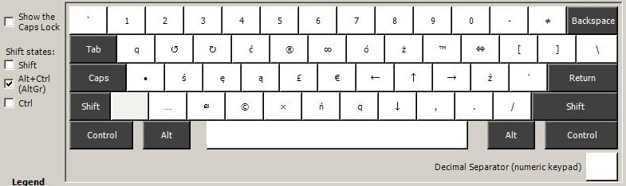
pl.SSiM po naciśnięciu AltGr czyli Prawego Altu
-->



<!--
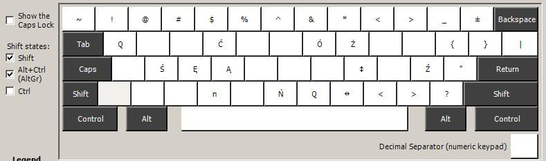
pl.SSiM po naciśnięciu AltGr oraz Shift
-->



Inne znaki, jakie można znaleźć na klawiaturze, wrzuciłem kierując się
zasadą, że od przybytku głowa nie boli, a przecież pisząc w naturalnym
dziś standardzie UTF-8 możemy posługiwać się ładniejszymi niż te z ASCII
znakami pisarskimi, np. otwarcie i zamknięcie cudzysłowu, zamiast
tzw. *dumb quotes*.

Powtarzające się przypisania znaków w różnych miejscach podyktowane jest
wygodą piszącego, ale pod wpływem fachowców oraz zwykłego lenistwa może
to zostać zmienione w przyszłości. Teraz czeka mnie wygenerowanie tej
klawiatury i testy. Ciekawe, jak to się robi?
