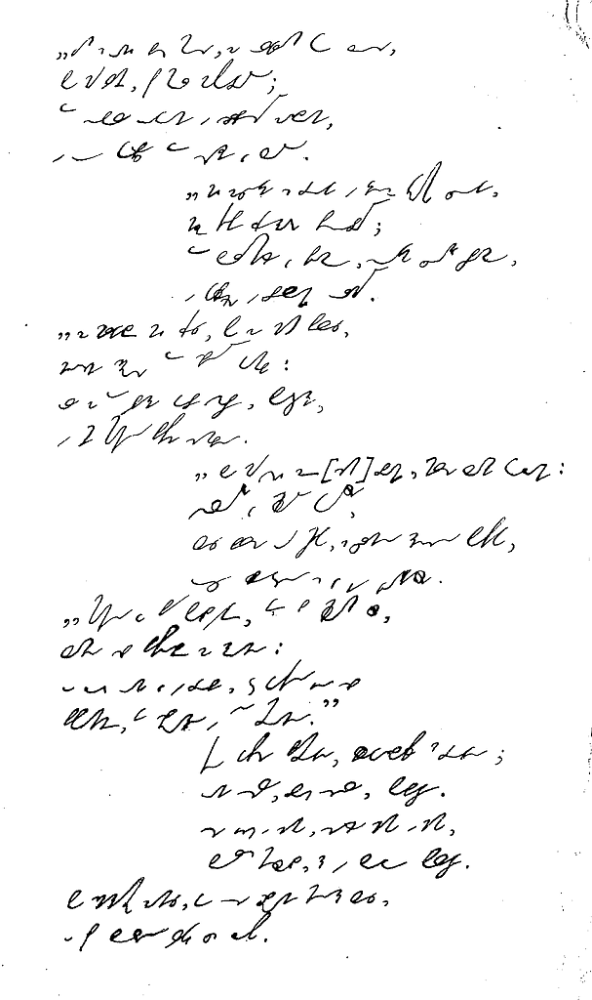
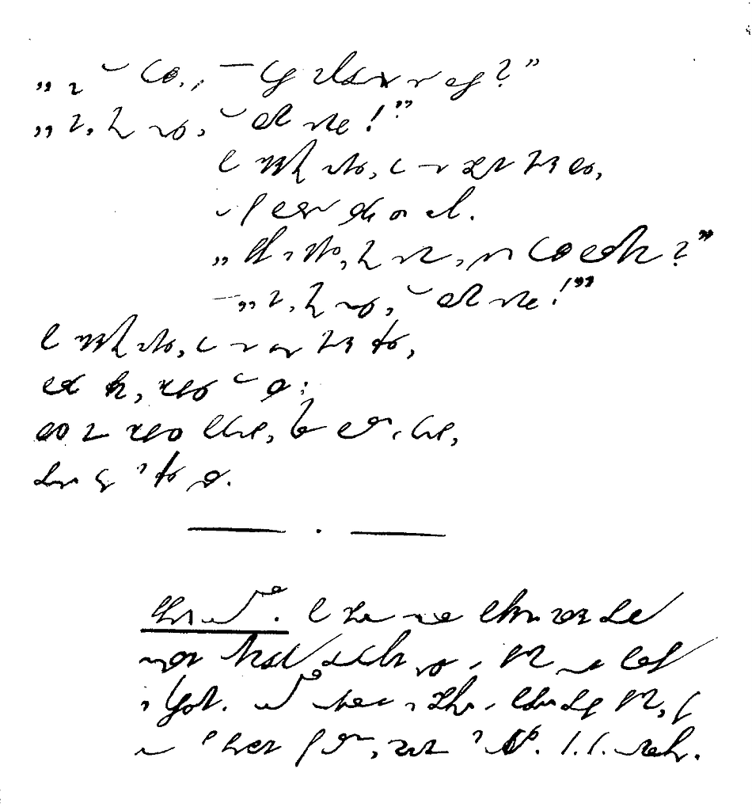

Znalazłem materiał z polskim systemem Ożarowskiego utworzonym w oparciu
o metodę Rollera. Trzeba go zeskanować i ubrać w formę książki PDF,
opublikować na jakimś serwerze i tu wrzucić link. Ale to trochę później,
bo na razie dużo innych zajęć, ale o tym sza...! Dziś zatem, dla
zaostrzenia apetytu, proponuję przyjrzeć się wierszowi (wierszu?) pt.
"*Trzech budrysów*" niejakiego Adama Mickiewicza. Zapisano oczywiście
systemem Rollera-Ożarowskiego. I jak Wam się podoba?

Stary Budrys trzech synów, tęgich jak sam Litwinów, \
Na dziedziniec przyzywa i rzecze:   \
"Wyprowadźcie rumaki i narządźcie kulbaki, \
A wyostrzcie i groty, i miecze.

Bo mówiono mi w Wilnie, że otrąbią niemylnie \
Trzy wyprawy na świata trzy strony: \
Olgierd ruskie posady, Skirgiełł Lachy sąsiady, \
A ksiądz Kiejstut napadnie Teutony.

Wyście krzepcy i zdrowi, jedzcie służyć krajowi, \
Niech litewskie prowadzą was Bogi; \
Tego roku nie jadę, lecz jadącym dam radę: \
Trzej jesteście i macie trzy drogi.

Jeden z waszych biec musi za Olgierdem ku Rusi, \
Ponad Ilmen, pod mur Nowogrodu; \
Tam sobole ogony i srebrzyste zasłony, \
I u kupców tam dziengi jak lodu.

Niech zaciągnie się drugi w księdza Kiejstuta cugi, \
Niechaj tępi Krzyżaki psubraty; \
Tam bursztynów jak piasku, sukna cudnego blasku \
I kapłańskie w brylantach ornaty.

Za Skirgiełłem niech trzeci poza Niemen przeleci; \
Nędzne znajdzie tam sprzęty domowe, \
Ale za to wybierze dobre szable, puklerze \
I innie stamtąd przywiezie synowę.

Bo nad wszystkich ziem branki milsze Laszki kochanki, \
Wesolutkie jak młode koteczki, \
Lice bielsze od mleka, z czarną rzęsą powieka, \
Oczy błyszczą się jak dwie gwiazdeczki.

Stamtąd ja przed półwiekiem, gdym był młodym człowiekiem, \
Laszkę sobie przywiozłem za żonę; \
A choć ona już w grobie, jeszcze dotąd ją sobie \
Przypominam, gdy spojrzę w tę stronę.

Taką dawszy przestrogę, błogosławił na drogę; \
Oni wsiedli, broń wzięli, pobiegli. \
Idzie jesień i zima, synów nié ma i nié ma, \
Budrys myślał, że w boju polegli.

Po śnieżystej zamieci do wsi zbrojny mąż leci, \
A pod burką wielkiego coś chowa. 

"Ej, to kubeł, w tym kuble nowogrodzkie są ruble?" \
"Nie, mój ojcze, to Laszka synowa".

Po śnieżystej zamieci do wsi zbrojny mąż leci, \
A pod burką wielkiego coś chowa. \
"Pewnie z Niemiec, mój synu, wieziesz kubeł bursztynu?" \
"Nie, mój ojcze, to Laszka synowa".

Po śnieżystej zamieci do wsi jedzie mąż trzeci, \
Burka pełna, zdobyczy tam wiele, \
Lecz nim zdobycz pokazał, stary Budrys już kazał \
Prosić gości na trzecie wesele. 
