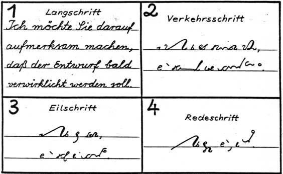
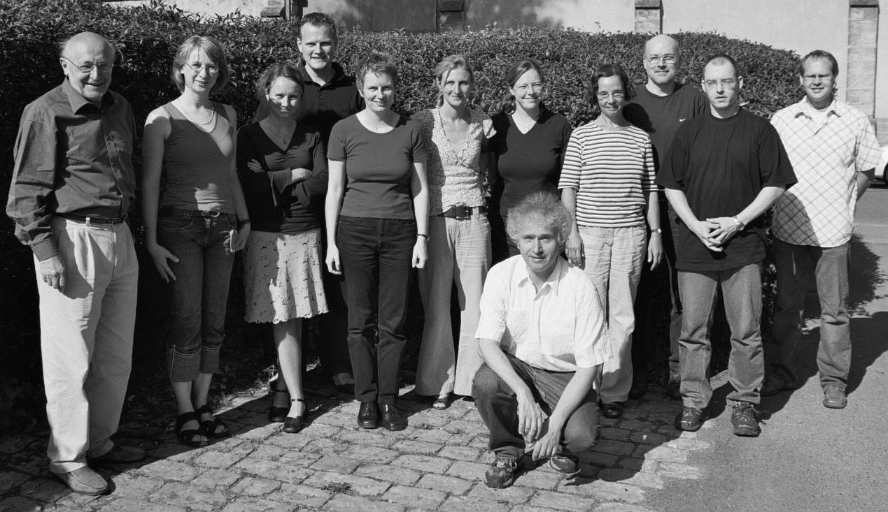

Dzisiaj krótko. Właściwie taka refleksja bardziej niż poważny wpis.
Kliknijcie sobie tutaj: 
<https://www.stenografenbund.de/>

I pomyślcie, jak daleko jesteśmy za Niemcami? Podobną siłą mogło się
Stowarzyszenie Stenografów Maszynistek i Sekretarek pochwalić - 30 lat
temu, być może. Jednakowoż albowiem już wtedy bez owijania w bawełnę (z
zaopatrzeniem w bawełnę były wtedy przejściowe-chwilowe) organizacja
przekierowana była na szkolenie przede wszystkim pań w sztuce szybkiego
klepania w klawiaturę (mechanicznej lub elektrycznej) maszyny do
pisania. Stenografia była już od pewnego czasu ubogim krewnym, od
którego wprawdzie się zaczęło, ale który od dawna już nie ma honorowego
miejsca przy stole, tylko ten talerzyk dla bezdomnego wędrowca, co się
stawia na parapecie, bo na stole miejsca już nie ma.

A na mapie powyżej przecież zaznaczono tylko kluby, a nie ogniki
samotnych dziwaków-stenografów. A zdarzyło mi się z paru z nich
rozpisywać emailowo...

Czy to ważne, czy w tych klubach siedzą staruszkowie? U nas nie ma nawet
staruszków. Organizacja faktycznie się rozpadła, ostatni stenografowie
umierają, lub dożywają, jak to się kiedyś mówiło. Toż nie chodzi o
ratowanie organizacji, tylko w ogóle o istnienie zjawiska. Tam wciąż
działa X stron www, że wspomnę tylko te, które onegdaj
odwiedziłem: <https://www.forschungsstaette.de/>, <http://www.hstj.de/>,
co oznacza, że jest X osób oddanych sprawie, a z lektury tych stron
wynika, że ich aktywność nie polega wyłącznie na utrzymaniu tychże
stron. Ze zdjęć wynika, że paru młodych geeków wciąż tam chce się uczyć
stenografii.

<!--
{width="320" height="184"}](Steno-Prueflinge.jpg)

Uczestnicy seminarium dla nauczycieli stenografii
 w roku 2011 - nie wszyscy to staruszkowie
 (zdjęcie zwww.forschunsstaette.de)
-->



Stąd mam taki wniosek, że jeżeli uda nam się złożyć kompletną stronę
www, na której znajdą się kompletne materiały szkoleniowe, to i u nas
być może tacy ludzie stopniowo się pojawią. A jak już zobaczą, że nie są
każdy samotną wyspą, to może zaczną się wymieniać emailami, uwagami,
knyfami, zaczną się uczyć nawzajem. Ale do tego potrzeba zaczynu:
materiałów edukacyjnych.

Jeżeli ktoś zatem posiada już elektroniczne wersje pomocy naukowych do
opanowania sztuki stenografii, zapraszam, przysyłajcie do mnie, wszystko
zostanie opublikowane. A jeżeli nie posiadacie, to może chociaż
[nagracie parę mp3](../../skrypty/dyktando_sylaby.php) z
dyktandami o różnych prędkościach, 
[kompletna instrukcja, jak to zrobić, dostępna jest na
stronie](h../../repo/dyktanda/)?
