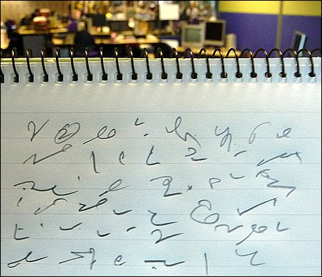
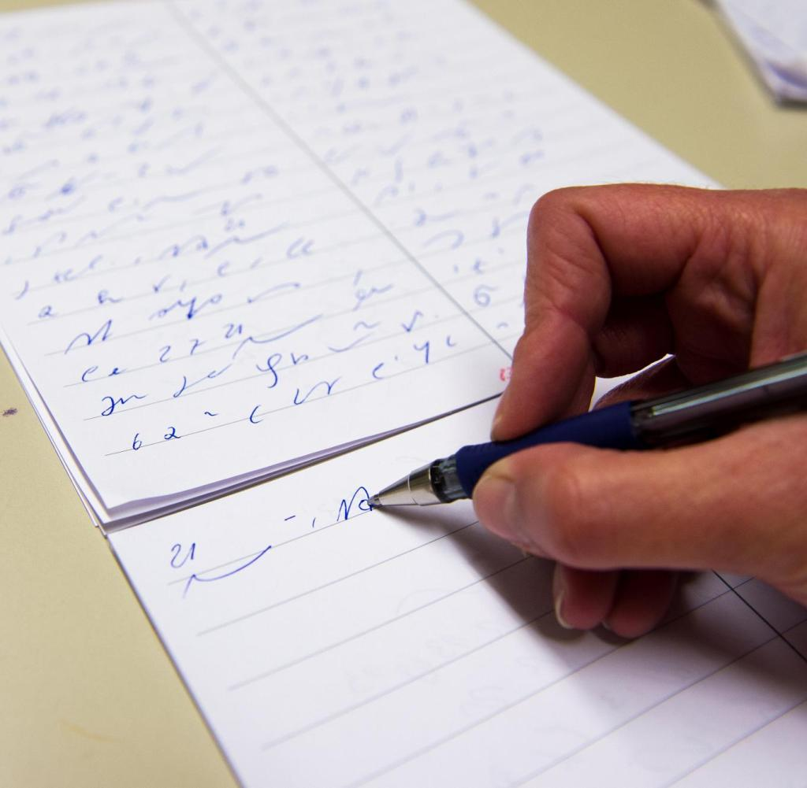
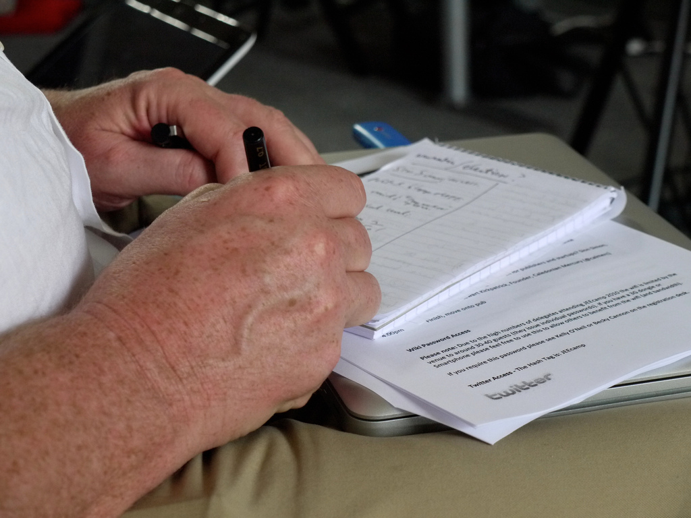
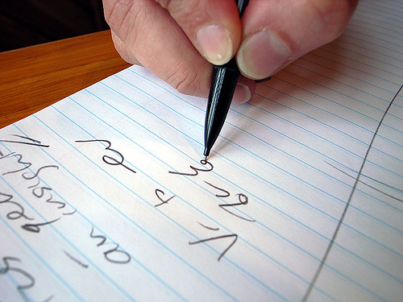

Oto zagadka dla Szanownych Czytelników (bo komentarz jest zbędny): z
którego roku, z jakiej epoki, pochodzi poniżej zacytowany artykuł?

## Każdy dziennikarz powinien umieć stenografować.

Jedną z
dziedzin życia, gdzie znajduje zastosowanie stenografia, jest
dziennikarstwo. Uwagi niniejsze chcę poświęcić zastosowaniu stenografii
w dziennikarstwie, to jest określić rodzaj pracy dziennikarskiej i
odpowiedzieć na pytanie, w jaki sposób stenografia staje się przydatną w
dziennikarstwie, czy jest potrzebna i jakie oddaje usługi. Pomijając
więc zastosowanie stenografii w biurach, parlamentach, na wykładach i
posiedzeniach, zastanówmy się nad dwoma rodzajami pracy dziennikarskiej,
którymi są: wywiady i odbiór telefonogramów.

Wywiad jest
rozmową prowadzoną pomiędzy dziennikarzem a osobą, która z racji
zajmowanego stanowiska może udzielić interesujących informacji z
dziedziny zagadnień aktualnych. Wywiad odbywa się w ten sposób, że osoba
udzieląjąca wywiadu opowiada sama o danej sprawie względnie odpowiada na
stawiane pytania. Dziennikarz odbierający wywiad i umiejący
stenografować zaoszczędza bardzo dużo czasu. Wywiad zyskuje na
wyrazistości, bo dziennikarz wróciwszy do redakcji opracowuje go,
opierając się na obszernym materiale, jakim jest dosłownie zapisana
rozmowa. Może użyć więcej zwrotów i słów, kórych użyła osoba udzielająca
wywiadu i odtworzyć go, opierając się na całej rozmowie, anie na
poszczególnych fragmentach, kóre tylko może zanotować posługując się
zwykłym pismem. Korzyści są jasne. Pismo stenograficzne, podążające za
żywą mową, przyczynia się do dokładności wywiadu, zaoszczędza wiele
czasu, dając w rezultacie artykuł, prawdziwie odtwarzający prowadzoną
rozmowę.

Praca
stenografa-telefonisty polega na przyjmowaniu telefonem wiadomości dla
ajencji i dzienników. W pierwszym rzędzie wymaga sięod
stenografa-telefonisty wielkiej biegłości w stenografowaniu. Przysłowie
"Czas to pieniądz" posiada przy tej pracy szczególne znaczenie, ponieważ
opłata za międzymiastowe rozmowy telefoniczne, odbywające się na dużą
odległość, stanowi poważne obciążenie budżetu ajencji lub wielkiego
dziennika. W Polsce, gdzie linie telefoniczne są przeciążone rozmowani
telefonicznymi, trudno jest uzyskiwać rozmowy na dłuższy przeciąg czasu.
Specjalnie zależy więc na tem, aby stenografowie-telefoniści posiadali
dużą biegłość, gdyż tylko w takim razie i zasada oszczędności i zasada
szybkiego dostarczania wiadomości do druku będą mogły być wcielone w
życie. Poza biegłością i sprawnością stenograf-telefonista jako
dziennikarz musi się orientować we wszystkich zagadnieniach bieżącyhc,
politycznych i ekonomicznych, znać języki, gdyż to znakomicie ułatwia
 mu pracę zawodową. Poza tymi umiejętnościami nabytymi, szczególny
rodzaj pracy dziennikarskiej przy telefonie wymaga przymiotu
naturalnego, to jest dobrego słuchu, który rzecz prosta, jest niezbędny
przy tego rodzaju pracy.

W Niemczech nie
wyobrażają sobie zupełnie dziennikarza bez znajomości stenografii.
Mniejsze dzienniki niemieckie nie robią różnicy między redaktorem a
stenografem, wymagają one od redaktorów znajomości stenografii i na
odwrót. Wielkie natomiast dzienniki posiadają biura złożone z 3-10
stenografów. Jednakże duże wymagania, jakie są stawiane
stenografowi-telefoniście, sprawiają, że zapotrzebowanie na
stenografów-telefonistów nawet w Niemczech nie znajduje zupełnego
pokrycia. Skutkiem tego praca stenografów-telefonistów przetworzyła się
we wszystkich krajach Zachodniej Europy i w Amerycie na bardzo dobrze
płatny zawód. Bardzo częste są wypadki, że stenograf-telefonista
otrzymuje wynagrodzenie większe niż redaktor. Ciekawym faktem w
dziennikarstwie niemieckim jest ścisła współpraca "*Niemieckiego Związku
Prasowego*", obejmującego dziennikarzy zawodowych, z niemieckim
"*Związkiem Stenografów Dziennikarskich*", do którego należą
stenografowie pracujący w ajencjach i dziennikach. Fakt ten dowodzi, że
prasa XX wieku nie może obejść się bez stenografii i że stenografia
wywalczyła sobie w całym świecie cywilizowanym słusznie należne jej
stanowisko.

Jak się
przedstawia sprawa znajomości stenografii wśród dziennikarzy polskich?
Musimy stwierdzić, że dziennikarz w Polsce, znający stenografię, jest
białym krukiem. Jeszcze w Małopolsce, gdzie uczono w szkołach i na
uniwersytetach, którzy umieją stenografować. Natomiast w Kongresówce i
na kresach wschodnich sprawa przedstawia się rozpaczliwie. Sądzimy
jednak, że w Polsce nauka stenografii ogarniająca obecnie coraz szersze
kręgi, przyczyni się do tego, żę za kilka lat, kiedy do polskiej prasy
wejdą młode siły, położenie ulegnie zmianie na lepsze. Pożądane byłoby
wprowadzenie obowiązkowego nauczania stenografii w szkołach średnich i
uczelniach wyższych.

Pod względem
służby telefoniczno-stenograficznej w Polsce sprawa przedstawia się
znacznie lepiej. Dwie wielkie ajencje dziennikarskie: Ajencja Wschodnia
(A.W.) oraz Polska Ajencja Telegraficzna (P.A.T.) zatrudniają w
centralach w Warszawie i oddziałach prowincjonalnych około 50
stenografów, w czym według przeprowadzonej ankiety około 95%
Gabelsberczyków, którzy pod względem sprawności stoją na wysokości
zadania. Organizacja służby telefoniczno-stenograficznej w ajencjach
jest doskonała i nie ustępuje zupełnie niemieckiej.
Kończę słowami
przytoczonymi na początku: Każdy dziennikarz powinien umieć
stenografować. Niechaj każdy, kto zamierza poświęcić się pracy
dziennikarskiej koniecznie nauczy się stenografii. Dążeniem dziennikarzy
polskich powinno być podniesienie prasy polskiej do poziomu zachodnio
europejskiego. Bierzmy wzór z udoskonaleń technicznych, jakie stosuje
prasa na Zachodzie. W ten sposób dźwigniemy prasę polską i uczynimy z
niej sprawniedziałającą gałąź życia społecznego.

Rudolf
Wojnar
student Wyższej
Szkoły Handlowej
