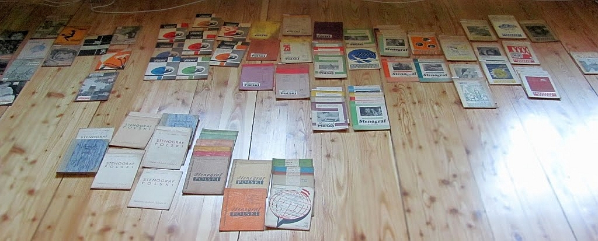

Po prostu muszę znaleźć ten artykuł, który czytałem onegdaj, hen, może
ze dwa lata temu. Było w nim o... No, zapomniałem, ale pamiętam, że był
interesujący i warto by go przytoczyć tutaj na blogu. Od czasu, jak
dostałem komplet pozostałych po [Władysławie
Cybulskim](http://www.stenografia.pl/?p=175) "Stenografów Polskich",
zdążyłem przejrzeć pobieżnie - zapewne wszystkie. I tak w tej graciarni,
w jaką zmieniła się moja pamięć, zachowało się mgliste wspomnienie. Ba,
pamiętam nawet autora: [Lech Klewżyc](http://www.stenografia.pl/?p=112).
No i co z tego, jak szukam już od dłuższego czasu i nie znajduję?

Koniec tego dobrego. Trzeba posortować te "Stenografy", ułożyć
chronololololologicznie i ofiszkować - jeżeli podczas przeglądania
natrafiam na coś interesującego (bo nie ukrywajmy, większość objętości
to jakieś historie ze zjazdów, kongresów, albo konkursów klepania w
maszynę do pisania), od razu ofiszkować, będzie na zaś.

A przy okazji okazało się, że w zbiorze jest może połowa wydanych
stenografów, a nie wszystkie, jak przedtem myślałem...
