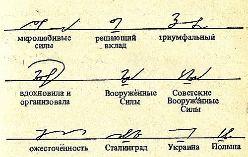

Dopraszam się wybaczenia Szanownych Uczestników naszego [małego
konkursu](http://www.stenografia.pl/?p=57), ale zachorzałem i przez
pewien czas nie byłem zdolny do pełnienia funkcji jurora. Była to
choroba tak zaraźliwa, że infekcje przenosiły się nawet przez pingi.
Aktualnie poziom zakaźności już się obniżył, do zarażenia się potrzebna jest co najmniej rozmowa telefoniczna.  

Przypomnę, że nagrodą jest odbitka ręcznego odpisu (anonimowego,
pisanego piórem w kajecie produkcji anglosaskiej, jak wywnioskowałem z
podglądania papieru pod światło, zresztą papieru niezłej jakości)
pierwszego artykułu dotyczącego stenografii, jaki opublikowano po
polsku.

Zacznę od zrekapitulowania poszczególnych zgłoszeń, abyśmy wiedzieli, co właściwie oceniam, gdzie, jak i czemu:

[Autorka bloga
stenograficzny.blogspot.com](http://www.blogger.com/profile/02276488561015167076)
[Mar 5, 2012 01:51 PM](http://www.stenografia.pl/?p=57?showComment=1330984316258#c5741028249141415753)

*Stawiam na dwudziestolecie międzywojenne, zwłaszcza na pierwszą dekadę, a konkretnie drugą połowę pierwszej dekady, tj. 1924-1929. Strzelałabym, że to rok 1926, ale to już zupełnie w ciemno.*

Anonimowy [Mar 6, 2012 01:46AM](http://www.stenografia.pl/?p=57?showComment=1331027165760#c3709741799404111139)

*Porównując te daty: http://bazy.oss.wroc.pl/lwow/pozycja.php?id=2532&s=7&search=s% i to: http://www.atticus.pl/index.php?pag=poz&id=76829 Obstawiam 1920. Miwilemutetelo.*

Cokolwiek by to ostatnie nie miało znaczyć.

Licznie zgromadzeni uczestnicy wytypowali zatem dwie daty z dokładnością do roku: 1926 i 1920.

Pora ogłosić werdykt. Ach, oczywiście, podaję prawidłowe rozwiązanie dla
rozwiania wątpliwości.

Artykuł ten opublikowany został w numerze III Lipiec-wrzesień 1922, Rok
III Stenografa Polskiego, kwartalnika zwolenników systemu
Gabelsbergera-Polińskiego redagowanego wówczas i wydawanego przez
Antoniego Wojnara, Krucza 26/13, Warszawa, a administrowanego przez
Franciszka Wojnara Krucza 26/13, Warszawa. Jak widać, wszystko zostało w
rodzinie.

Można powiedzieć, że uczestnicy strzelali po skraju tarczy. Trzeba
będzie jednak rozstrzygnąć ten konkurs, bo niepisany regulamin nie
przewidywał ani remisów, ani nieprzyznania nagrody.

[{width="320"
height="301"}]({filename}/wp-images/uploads/2012/03/283251.png)

Tadammmm!!!

Wygrał Anonimowy. Uzasadnienie jest takie, że podał datę bez widełek w
odstępie 2 lat od daty prawidłowej. Tymczasem "Autorka bloga..." podała
widełki, z których jeden koniec był równie blisko prawidłowego
rozwiązania, ale w następnym zdaniu obstawiła koniec drugi, czyli
intencją jej było raczej oddalić się od prawidłowej daty, niż do niej
przybliżyć. Oczywiście, aby odebrać nagrodę,  zwycięzca będzie musiał
zrezygnować choć z części swojej pielęgnowanej anonimowości. Czekam
zatem na zgłoszenie zwycięzcy konkursu. Odbitkę udało mi się złożyć w
PDF wielkości zaledwie 500KB, więc swobodnie można go wysłać emalią.

