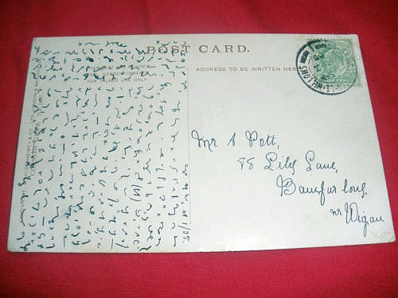
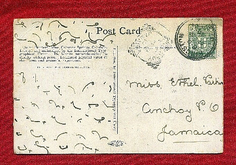
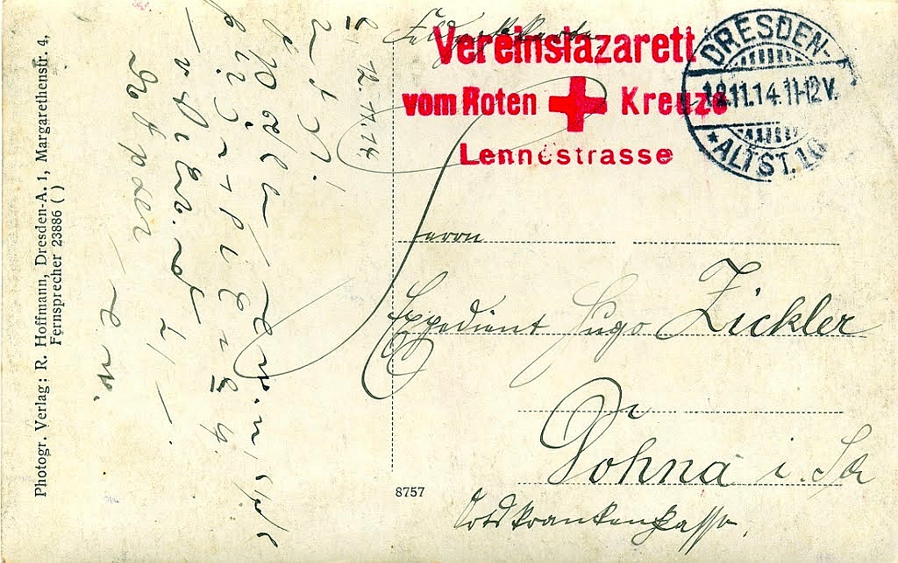
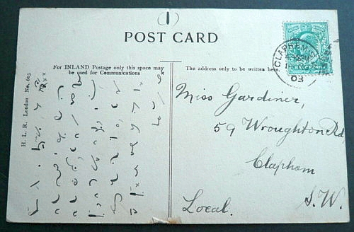
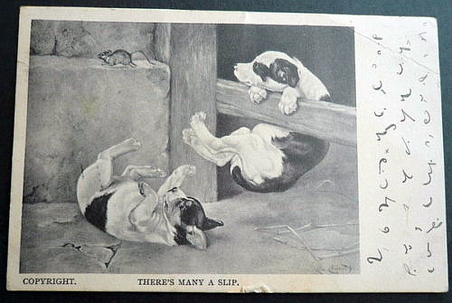
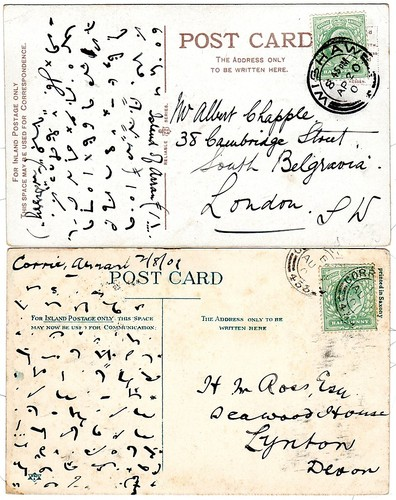

Kiedyś już chyba o tym pisałem. Ale przybyło mi w kolekcji linków, więc
aktualizuję. O powszechności stosowania stenografii warto pisać przy
każdej okazji. Tajemna sztuka szybkiego pisania w krajach cywilizowanych
naprawdę dotyczyła większości wykształconej warstwy społeczeństwa. Nie
dotyczyło to Polski, o czym coraz lepiej się przekonuję czytając
historyczne materiały źródłowe, tj. sprawozdania z kongresów
stenograficznych, gdzie wciąż narzeka się na brak zainteresowania wśród
Polaków, na niechęć władz do wspierania stenografii... Tymczasem za
miedzą, po lewej i prawej, a także na dole i górze, stenografia
zdobywała wciąż nowych zwolenników. Jest to z pewnością towar podobny do
komputera: nie możesz się przekonać o jego wartości (roboczej,
rozrywkowej oraz innej), zanim sobie takiego nie sprawisz. Zanim go
sobie nie sprawisz, świetnie sobie radzisz bez niego. Ale kiedy już go
sobie sprawisz, nie potrafisz zrozumieć, jak mogłeś bez niego żyć.

<!-- {width="320" height="300"}]({filename}/wp-images/uploads/2012/03/feldpost.jpg)
  Poczta frontowa? -->
  


<!-- 
  Pocztówka z [lazaretu oficerskiego](http://farm4.staticflickr.com/3247/3088274113_2207da7ce3_b.jpg) -->

  

<!-- {width="320" height="210"}]({filename}/wp-images/uploads/2012/03/kalovary.jpg)
  To podobno jest widok na Karlove Vary -->
  


<!--  [{width="320" height="203"}]({filename}/wp-images/uploads/2012/03/villetrieste.jpg)
  pozdrowienia z Triestu -->



<!-- 
  ta chyba jest do Legnicy -->



Ciężko jest przerwać zbieranie pocztówek, szczególnie, że to nic nie
kosztuje: po prostu mam nastawione wyszukiwacze internetowe na Ebay i
jak coś się trafia, to skrzętnie zapisuję. To nie jest cała kolekcja,
część gdzieś mi się już zapodziała, może już opublikowałem, nie pomnę.
Te pocztówki oczywiście również skasuję z dysku, skoro już znajdą się na
blogu.

Tak czy owak widać, że mnóstwo ludzi posługiwało się stenografią: aby
napisać pocztówkę obie strony połączenia muszą posługiwać się tym samym
kodem, to po pierwsze. Po drugie, widać rozrzut czasowy i geograficzny
w.p. pocztówek. Widać różne systemy stenograficzne, które musiały być w
jakiś sposób powszechne. Komentarz na Flickr.com co do jednej z
powyższych pocztówek jest mniej więcej taki, że po "Kochany Hugo" reszta
jest dobrze zabezpieczona kodem stenograficznym. Czy mogło być tak, że
stenografia zabezpieczała prywatność pisma? Nie do końca. W
przedwojennych Niemczech większość obywateli kończyła szkoły, w których
obowiązkowym przedmiotem była stenografia. Oczywiście większość wkrótce
o niej zapominała, ale nie wszyscy. Osoby sobie bliskie potrafiły
odczytać wzajemnie nawet mocno poskrótowane teksty, opatrzone mnóstwem
prywatnych znaczników. Ale z pewnością nie było tak, że pismo to
pozostawało tajemne, ponieważ np. na froncie (a także w lazaretach)
obowiązywała cenzura korespondencji ze względu na tajemnicę wojskową. Z
tego wniosek, że cenzorzy również musieli umieć przeczytać pismo
stenograficzne.

A zatem na podstawie tylko jednej z tych pocztówek można założyć, że
angażowała aż trzech stenografów. Dodajmy, że większość pocztówek
lądowała w śmieciach niedługo po przeczytaniu, a w ciągu następnych bez
mała 100 lat resztę spotkało mnóstwo innych zdarzeń losowych i mamy
wynik: wciąż po świecie krążą setki i tysiące pocztówek zapisanych
pismem stenograficznym.

No, i nie zapominajmy o naszym, skromnym wkładzie w pocztówki
stenograficzne ;-)
