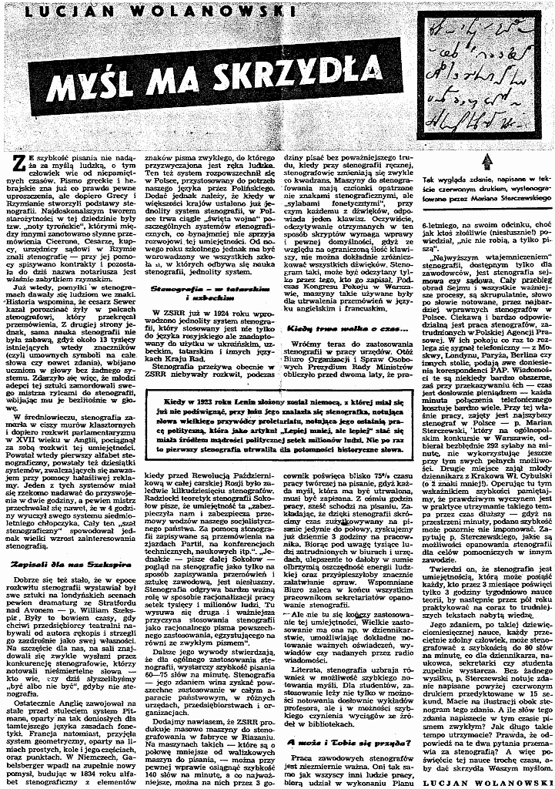

W ramach porządkowania swoich zasobów przeryłem się jeszcze raz przez
różne skrawki papieru, które otrzymałem od Pani Ety, spadkobierczyni
Władysława Cybulskiego, niegdysiejszego wielokrotnego mistrza Polski w
stenografowaniu. I znalazłem wydartą stronę z "***Przekroju***". A
właściwie wykrojoną, bo to była taka specjalna ongi gazeta, kulturalna i
na poziomie, nie to co dziś. Wycinek stary, bardzo stary, bowiem z 13
maja 1951 roku. Kto chce, może sprawdzić w archiwach gazety, bo zapisano
nawet numer wydania: 318. Żeby móc przeczytać, trzeba kliknąć w obrazek prawym przyciskiem myszy i wyświetlić w nowej karcie przeglądarki, a w razie czego zapisać sobie na dysku, bo starałem się zrobić jak
największy obrazek, ale jednocześnie niezbyt ciężki. Zatem w
rozdzielczości przeglądarkowej ma on z 80cm szerokości. Powinno
wystarczyć. Miłej lektury, chyba da się przeczytać.

