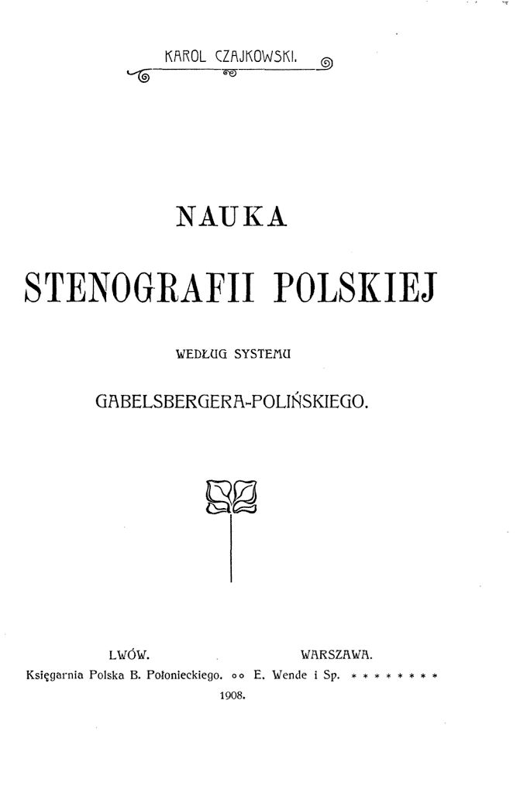

Na archive.org opublikowałem onegdaj *Nauka stenografii polskiej* Karola
Czajkowskiego, podręcznik wydany w 1908 roku. Osoby uczące się metody
Polińskiego bardzo sobie chwaliły tę książkę, więc dzięki pomocy z
drugiej strony hiperkontynentu, oto nowa wersja, dedykowana do druku,
lekka, czarno-biała, wyczyszczona i bez brakujących stron: [Nauka
stenografii polskiej według systemu Gabelsbergera-Polińskiego autorstwa
Karola
Czajkowskiego](https://archive.org/details/NaukaStenografiiPolskiejWedlugSystemuGabelsbergera-polinskiego).
Częstujcie się, bardzo proszę!

