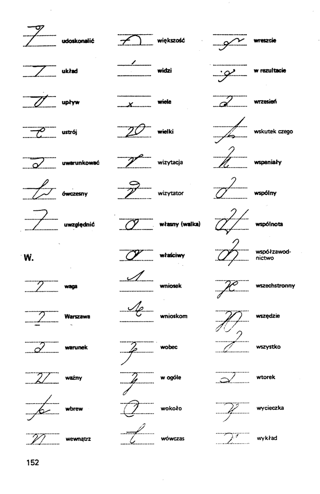

Wyszperane w Stenografie Polskim nr 3(97), V-VI 1965, rok XIX:

*Wybitny i znany teoretyk stenografii z jednego z krajów
zachodnioeuropejskich, zwrócił się do naszego Stowarzyszenia o
przysłanie mu fotografii i danych biograficznych twórcy Jednolitego
Systemu Stenografii Polskiej (JSSP). W nadesłanym liście wymienił nawet
jego nazwisko. Prosił o zdjęcie i życiorys... "Mister Jednolitego".*

Pozostawię to bez komentarza.

