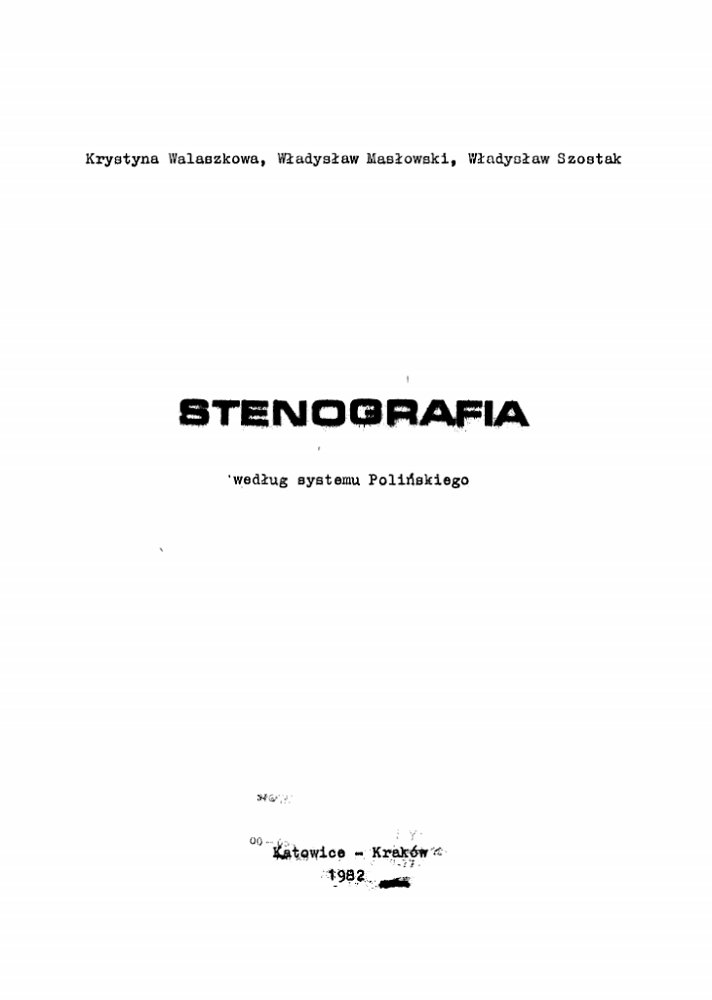

Dziś mianowicie zapraszam do skosztowania najnowszego, nóweczka, prosto
z drukarni omalże, podręcznika do systemu Polińskiego, wydanego w roku,
uwaga, uwaga, 1982! Tadaaammmm! Mówiłem, że prawie nowy?

[**Oto on**](https://stenografia.pl/podreczniki/maslowski/maslowski_steno_polinski_1982.pdf).
Tylko uwaga, duży! 75MB w czerni i bieli. 250 stron A4 samej czystej
nauki stenografii! Dla najostrzejszych dawaczy! Zastanów się, zanim
pobierzesz! Nie biorę odpowiedzialności za fakt, że w efekcie
nieprzemyślanej decyzji zaczniesz stenografować!

Smacznego!

