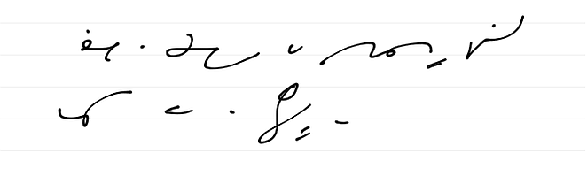

Nie wiem, czy już o tym pisałem, ale wreszcie, z ogromnym opóźnieniem,
znalazłem okazję, żeby sprawdzić [to, co przeczytałem, podzieliłem się i
wyraziłem entuzjastyczne przypuszczenie onegdaj (albo
wcześniej)](../2011-11-12_ipad-przyszloscia-przeszlosci/).

Dostępne mi Ipady, nie wiem, jak przestarzałe względem najnowszych, po
prostu nie mają rysika! Pisanie po ekranie długopisem to skazanie się na
konieczność ponownego, szybkiego zakupu tej kosztownej zabaweczki. Jak
na razie projektanci naszykowali ją dla palcujących małpiatek, bo umówmy
się, ta ekranowa klawiatura to jakieś nieporozumienie jest. Nie mogę
znaleźć dysputy, na podstawie której napisałem poprzednią notkę, więc na
razie nie sprawdzę, do czego doszli stenografowie z Ameryki. U nasz, w
Polszcze, na Ipadzie pisać się nie da. W każdym razie na tych dwóch, na
których to sprawdziłem.

Przykro mi.
