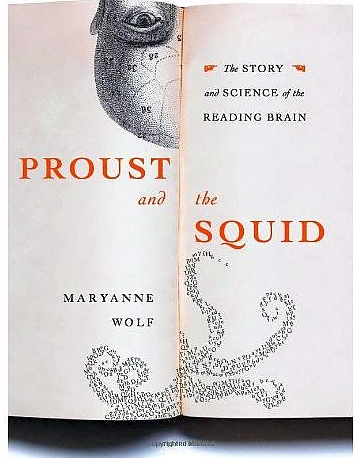
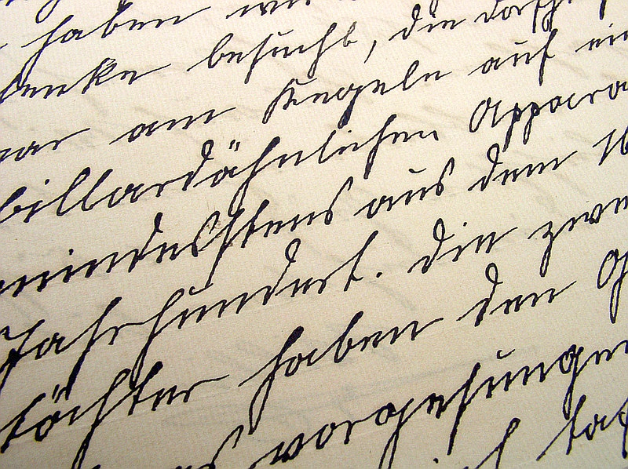
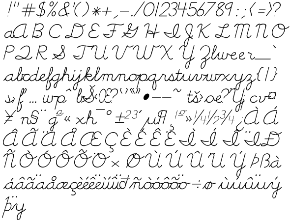
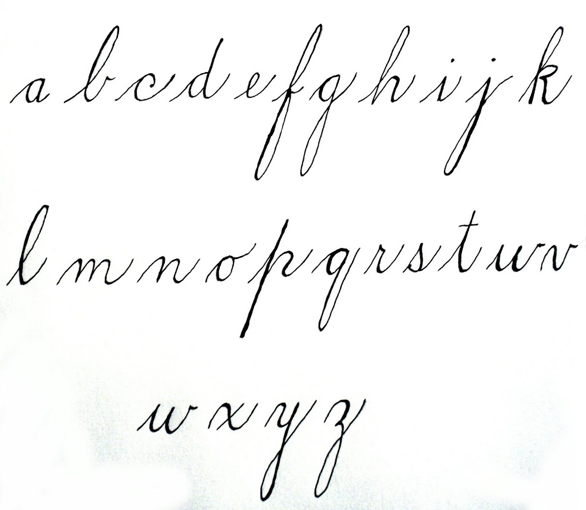
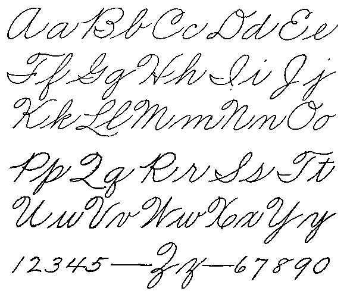
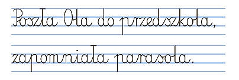
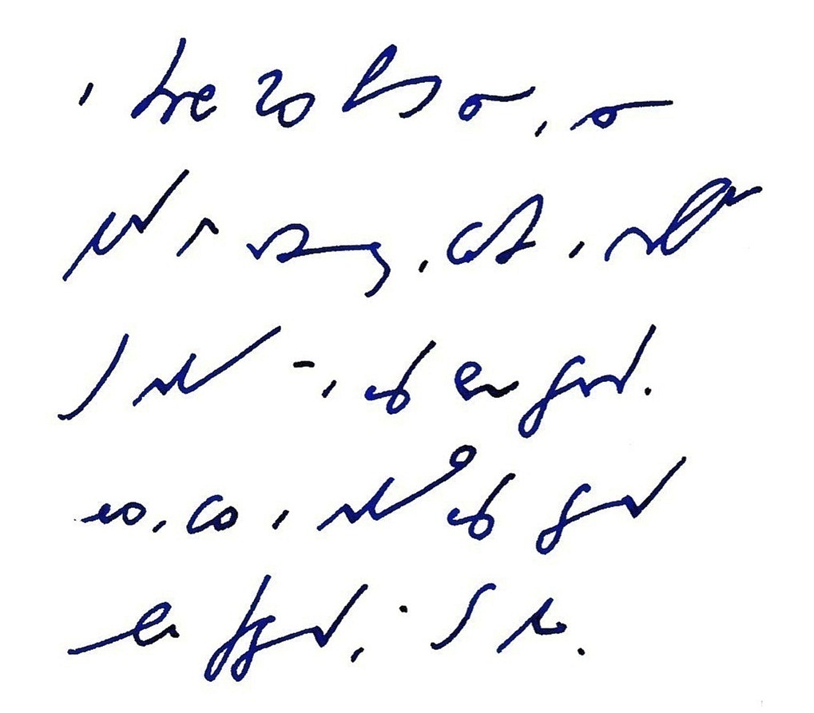

Dyskusja nad zakończeniem kariery pisma odręcznego w amerykańskich
szkołach trwa. Pisałem już o tym wcześniej. O kwestii pisma odręcznego.
Że aktywizuje nasze szare komórki w o wiele wyższym stopniu niż
klepanina w klawirę. Dziś czytam
[artykuły](https://www.miller-mccune.com/culture-society/handwriting-is-history-6540/)
przeciwniczki
[pisma](https://articles.chicagotribune.com/1996-03-20/news/9603200169_1_handwriting-palmer-method-spencerian)
odręcznego, Pani Anny Trubek - że to wręcz mózg zmienia!

Najsampierw przedstawię jej argumenty (pokrótce), ale nie będę się
powstrzymywał od komentarzy. Otóż twierdzi ona, że pismo nie jest naszą
przyrodzoną zdolnością, lecz wyuczoną - w końcu istnieje, wg danych
archeolololologicznych zaledwie od 6000 lat, a nowoczesny człowiek
(prawie) myślący od 200 tysięcy. Porównując te dwie liczby możemy
zauważyć, że zdążyłby zawalić cywilizację techniczną co najmniej pięć
razy od swego powstania do dzisiaj, gdyby był naprawdę myślący... Ale do
rzeczy.

Otóż starożytni Sumerowie jako pierwsi zaczęli uczyć swoje dzieci
wyciskać znaki klinowe - metoda powolna i mało efektowna, ale wtedy, jak
wiadomo, ludzie mniej się spieszyli. W każdym razie dokonała się
rewolucja w ich mózgach - zostały przystosowane nie tylko do pisania,
czyli symbolicznego formułowania myśli, ale też do czytania, czyli
translacji symboli na idee. Mózg został zmuszony do stałej,
nieprzerwanej pracy translatorskiej. Zaczął się rozwijać na planie
myślenia abstrakcyjnego.

Ale czym to się różniło od dzisiejszego pisania odręcznego, trudno
powiedzieć, trzeba by dzieciaki znowu nauczyć pikać patykiem w miękkiej
glinie...

Alfabety greckie, a wcześniej fenickie, jeszcze ten proces
zintensyfikowały. Bo Egipcjanie i Chińczycy zostali przy symbolach
ideograficznych, gdy tam powstały dźwiękonaśladowcze alfabety literowe -
czyli myślenie skręciło od obrazowania do zapisywania dźwięków, jak na
taśmie magnetofononononowej. Trudno ocenić, czy to lepiej, czy gorzej,
korelacje między cywilizacją techniczną i pismem mogą być (i zapewne są)
pozorne.

Nie są natomiast pozorne związki pomiędzy zmianami w kształcie liter i
kwestiami religijnymi i ideololologicznymi. Mnisi średniowieczni
stworzyli uncjałę, by odciąć się od pogańskiego i dekadenckiego
starożytnego piśmiennictwa. Purytanie tworzyli własne czcionki (a zanim
czcionki, to miedzioryty) i własne systemy pisma odręcznego różniące się
w szczegółach, ale stanowiące ideolologiczną deklarację.

Ci sami mnisi narzekali na wynalazek prasy drukarskiej, która ich
zdaniem miała zakończyć erę książki: unikalnego dzieła sztuki,
napisanego bezbłędnie w skryptorium. Zamiast tego miały się pojawić
obskurne, pełne błędów zecerskich pseudodzieła, obniżające ogólny poziom
intelektualny, przeciwnie do zamierzeń.

Później umiejętności i talenty kaligraficzne stały się wyznacznikiem
klasy osobniczej. Wielu uczyło się czytać, niewielu potrafiło pisać.

Po wojnie secesyjnej Remington dla utrzymania sprzedaży wyprodukował
maszynę do pisania. Pomijając już jej funkcjonalność, biznes nie chciał
jej kupować, bowiem... nie akceptował dokumentów nie napisanych
odręcznie! Ale dopiero w 1890 roku maszyna do pisania dorobiła się
powrotu karetki (czyli tego śśźźźźbrumg! i od nowego wiersza), czyli
osiągnęła podstawową funkcjonalność. 15 lat później w USA bardziej
dziwił brak maszyny do pisania w biurze, niż jej obecność.

Z niewiadomych powodów ludzie są strasznie przywiązani do pisma
odręcznego, choć znaczna większość łapie za długopis już tylko w celu
złożenia odręcznego podpisu na kwitach i umowach. Później albo w ogóle
nic nie pisze (i nie czyta), albo klepie w klawisze. Jak ja teraz.

Pani Trubek jako argumentu używa przykładu swojego syna, który cierpi na
dysgrafię, czy też dysleksję, a może lenistwo tylko i nie może się
nauczyć pisać litery "G", a im bardziej uczyciele go naciskają, tym
dzieciak bardziej cierpi. I boi się pisać. Zmuszanie dzieci do pisania w
kajetach to niepotrzebna brutalność, twierdzi p. Trubek, przedstawiająca
się jako uniwersytecki wykładowca (czego?). Uważa, że do pisma jesteśmy
przywiązani w sposób romantyczny, pismo rzekomo wyraża naszą osobowość,
tożsamość.

Czy zaprzeczy ktoś, że tak jest? Ja nie mam zamiaru. Kartka pocztowa
odręcznie napisana cieszy mnie stokroć bardziej niż tysiące emaili z
najlepszymi życzeniami. Pismo odręczne wznosi komunikację na poziom
osobisty. Korespondencja moich zmarłych Dziadków z ludźmi z całego
świata jest ciepła, czuła i pełna ekspresji. Emaile nie zdejmują maski z
naszych pokręconych emocji, pisane są na szybko, są często lakoniczne,
pozbawione cech ludzkich - choć w wymianie informacji spisują się
stokroć lepiej, przecież nie niosą ze sobą żadnych treści niewerbalnych.
Emoty tego nie zastąpią.

Podobno w badaniach wyszło, że nauczyciele skłonni są przyznać lepsze
stopnie za ładnie napisane wypracowanie, niż za ten sam tekst wklepany
na klawiaturze.

Dalej Pani Trubek opowiada o mnichach średniowiecznych, o skryptoriach -
że mianowicie tam uczono się pisać w sposób wystandaryzowany. I dalej
tak było aż do w. XVIII, kiedy dopuszczono pewną indywidualizację
charakteru pisma, zgodną z osobowością. Mogę tu dodać, że jestem
posiadaczem kopii listów i książek z drugiej połowy wieku XIX. W
porównaniu z dzisiejszymi bazgrołami pismo ówczesnych to szczyt
standardu, zależnie od regionu świata może się różnią, ale niewiele.
Precyzja do ułamka milimetra. A dopiero w XVIII wieku przyszło ludziom
do głowy rozpocząć badania nad grafologią i grafopsychologią.

Wynalazek maszyny do pisania przyniósł ulgę dysgrafom. M.in. Herny
Jamesowi, który zanim nie sprawił sobie klawiry, musiał dyktować swoje
utwory sekretarce, co biło go po kieszeni. Tutaj Pani Trubek wskazuje na
Heideggera jako winowajcę kontrreformacji pisma odręcznego - podobno
bardzo chwalił. A tymczasem w szkołach uczono dzieci pisać pismem, które
miało być możliwie podobne do liter z maszyny do pisania. Może w USA, u
nasz nie pomnę.

Cóż, nie w piśmie odręcznym rzecz, sądzi Trubek, lecz w umiejętności
wyrażania myśli. Są ludzie, którzy pisząc odręcznie trzy razy zapomną,
co właściwie chcieli napisać, podczas gdy dyktując szybkopisarce
znakomicie sobie poradzą. Chcemy więcej czasu na myślenie, mniej na
pisanie, pisze Trubek. Tylko czy dowodzi to konieczności zakończenia
nauki pisma odręcznego, czy może konieczności wprowadzenia stenografii i
stenotypii w szkołach? Lepiej mieć przecież kilka rozmiarów śrubokręta w
walizce z narzędziami, niż tylko jeden, prawda? Czy nie rozwija bardziej
nauka kilku języków niż jednego? A czy nie jest tak samo z systemami
zapisu? Dziś wiadomo, że nauka pisania, w jakikolwiek sposób, podobna
jest do nauki języka-nie-tak-bardzo-obcego. Ortografia, interpunkcja nie
istnieją w mowie. Wyłącznie w piśmie.

Pani Trubek wychwala bezwzrokowe klepanie w klawirę. Palce ustawione na
klawiszach stukają omalże bez udziału świadomości, która może się
skoncentrować na budowaniu treści. Muszę się z nią zgodzić. Ale czy nie
było tak samo kiedyś, kiedy większość tekstów powstawała odręcznie? Gdy
pisał Dickens, Updike, Mickiewicz, Słowacki, Steinbeck?

Pani Trubek przyznaje, że zaszły pewne zmiany w prozie (taki rodzaj
literatury), które korelują z umasowieniem maszyn do pisania. Można
sądzić, że komputery też takie zmiany powodują. Pani Trubek przyznaje,
że przepisywanie na komputer odręcznych notatek babci, skrobanych na
odwrotach kopert pocztowych przyniosło jej głębokie doświadczenie
piszącej ręki. To właśnie mam na myśli mówiąc o osobistym poziomie pisma
odręcznego. Ono przenosi treści niewerbalne. Nie wiem, jak to robi, ale
robi.

Czy pismo odręczne odchodzi w przeszłość? Podobno przejście od heroldów
do pisma zajęła Sumerom ponad półtora tysiąca lat. Grecy ze swoim
alfabetem robili niewiele przez prawie pół tysiąclecia, zanim kultura
przekazu ustnego została zastąpiona przez przekaz pisany. Zatem Trubek
twierdzi, że jeszcze wiele mazutu Odrą popłynie, zanim pismo odręczne
odejdzie w cień historii. Ale z pewnością odejdzie. Znaczy, tak ona
myśli.

Ostatnie, nad czym rozwodzi się Pani Trubek, to systemy rozpoznawania
mowy - że niby nie tylko zabiją pismo, ale też wyprą kiedyś przestarzałe
klawiatury. Będziemy dyktować inteligentnym systemom eksperckim, które
interpunkcję do tekstu wstawią na podstawie dogłębnej znajomości naszego
głosu, intonacji, rozpoznania nastroju... Może, w niektórych
zastosowaniach tak się stanie. Ale zwróćmy uwagę, że klawiatury
dotychczas, mimo starań różnych wynalazców, nie wyparły pisma odręcznego
z naszego życia: wszędzie oczekuje się naszych dziecinnie prostych do
podrobienia podpisów, a to w bankach trzeba odręcznie (sic!!!) pisać
oświadczenia i podania, a to znowuż akurat do pisania jest tylko
długopis-reklamówka i serwetka z McDonalda, a to kurier UPS odbiera nasz
podpis odręczny na służbowym kwitowniku elektronicznym... Klawiatury
wzięły sobie część tortu, ale nie zabrały całego. Pismo albowiem,
szanowni Państwo, zmusza nas do uporządkowania myśli, zanim wyrzygamy je
z siebie. Mowa-trawa, pismo-grunt. Słowa mają skrzydła, łatwo wylatują,
nieopatrznie wypowiedziane stają się źródłem kłopotów. Chcemy tego, żeby
dokumenty o znaczeniu prawnym były opatrywane naszymi emocjami? Bo łatwo
jest podyktować zjadliwą odpowiedź na złośliwy email od banku żądającego
zapłaty zaległej raty. Kiedy musimy wklepać go (czy też napisać)
samodzielnie, może w trakcie przyjdzie opamiętanie.

A podobno wystarczy jedna dobra burza słoneczna, żeby tą całą
elektronikę szlag jasny trafił... Może jednak nie zapominajmy sztuki
odręcznego pisania? A czytelników tej strony zachęcam do zachowania
sztuki pisania skróconego, czyli stenografii.
