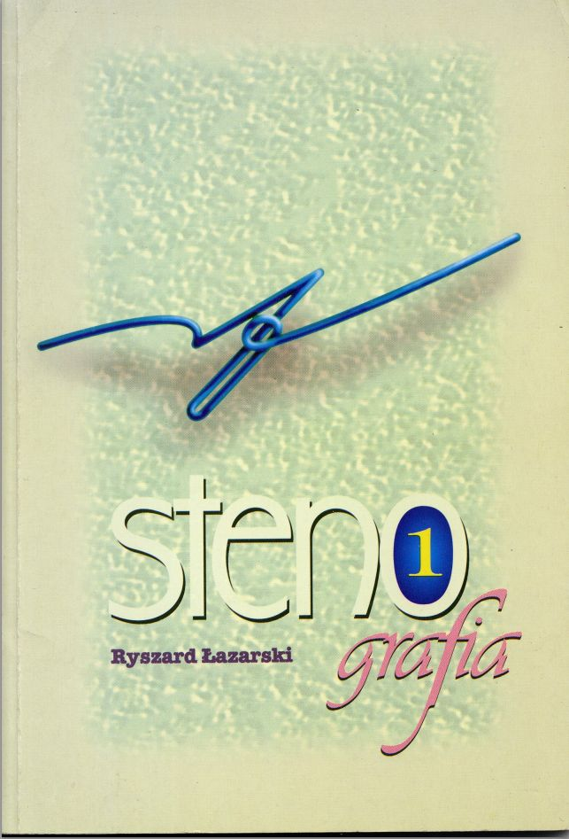

Łohoho! Dziś też mam prezent. Najnowszy, prawie nowy, podręcznik do
JSSP. Z roku 1994! Nóweczka! Ponieważ jest obszerny i dobrze obrobiony
przy pomocy świetnego programu, który miałem na komputerze i nawet nie
wiedziałem ([Scan Tailor](http://scantailor.sourceforge.net/)). Dzięki
temu programu książki dają się zapisać głównie jako czarny tusz na
białym papierze, więc nie zajmują więcej miejsca, niż to bezwzględnie
konieczne. W związku z tym wyciągam ich DPI do 600, bo dzięki temu
lepiej się czyta te stenograficzne zawijaski.

**[>>Częstujcie się, komu ochota i wola.<<](https://www.stenografia.pl/podreczniki/jssp/jssp_1994_okladki.pdf)**

Smacznego!
