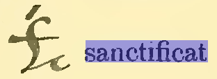
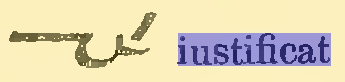
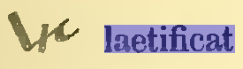
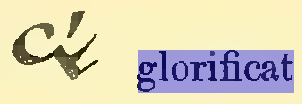
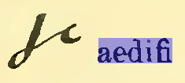
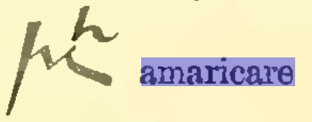
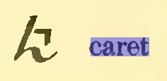
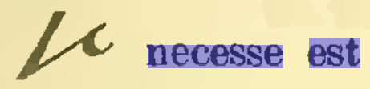
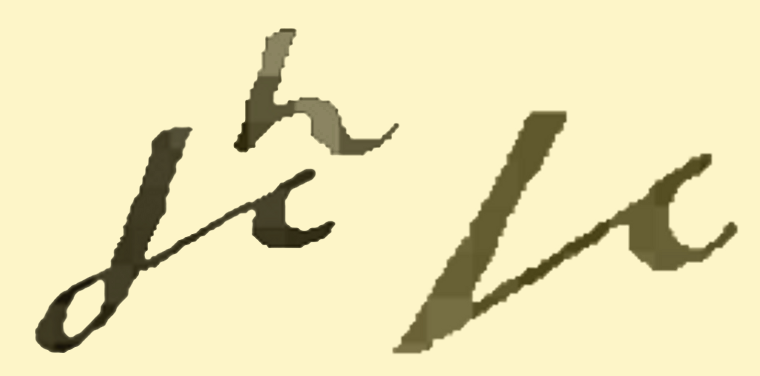
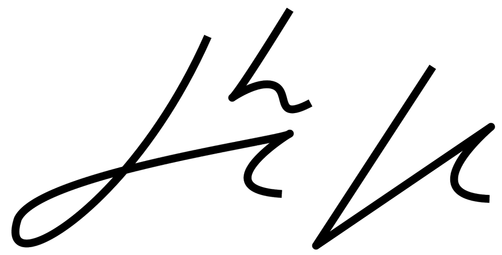

W swoich poszukiwaniach nie zaniedbuję zamierzchłej przeszłości. W
planach mam oddzielne opracowanie, oczywiście popularne, nie naukowe, na
temat not tyrońskich, czyli pierwszej poważnej stenografii w dziejach
Europy, a może i świata. [Kto ciekaw, parę słów na ich temat umieściłem
onegdaj w jednym z rozdziałów strony, tym o starożytnym
Rzymie](../../historia_powszechna/starozytny_rzym/).

A ostatnio trafiłem na prawdziwy cymes: 
**[Comentarii Notarum Tironianarum autorstwa Wilhelma Schmitza](https://archive.org/details/commentariinotar00schm)**,
 wydane w
roku 1893 w Lipsku. Książka prawie cała po łacinie, jak przystało na
omówienie niszowego zagadnienia z tego języka - po co ciekawscy mają się
plątać pod nogami, skoro zrozumieć mogą to tylko Wtajemniczeni? Ale
mniejsza z tym. Najciekawsza i tak jest jej druga część, a przy tym
najgłówniejsza, czyli tablice stenograficzne. Można na nich obejrzeć,
jak wyglądał ten system, czy nie system... No, nie system, bo podejście
logiczne, pragmatyczne, matematyczne, ergonomiczne, ustępowało na rzecz
czystej pamięciówki - większość wyrazów to znaczniki. Da się odnaleźć
także znaczki dla form gramatycznych, przypadkiem czasem podobne do
swoich brzmieniowych odpowiedników, np. -care podobnie wygląda w słowie
***amaricare*** (coś jakby "*gorzknieć*", jeżeli od *amaritus*) 

-----
**Wstawka 2021-05-25**: tak sobie podczas obróbki tego wpisu pomyślałem, że *amaricare* z pewnością pochodzi od słowa "miłość", czyli znaczyłoby coś jak "umiłowanie".

------

i *carena* (doprawdy nie mam pojęcia, co by to mogło znaczyć). Zatem taki
system-niesystem, ale pierwszy, powszechnie używany i to całkiem długo.

Zapragnąłem sprawdzić, czy z materiału w tej książce da się czerpać. I
tak postanowiłem napisać notami tyrońskimi nazwę mojego starego blogu, z
czasów budowy (i odbudowy) domu: ***Aedificare necesse est***. Okazało
się to wcale nie tak trudne. Ponieważ jestem leworęczny w pisaniu i w
czytaniu, zacząłem od lewej, czyli przypadkiem od pierwszego słowa.
Niestety, formy zadanej nie znalazłem, ale włączywszy przeszukiwanie po
cząstkach wyrazów, snadnie znalazłem:

No, to już mamy na czym budować. Widać, że znaki te mają wspólną cząstkę
"*aedi*", przy czym mnie interesuje części "*aedifi*", ale nie
"*ficat*". Ha, wygląda na to, że w większości zastosować, owa "*ficat*"
to kreseczka lekko ukośna. Powtarza się w książce np. dla słowa
"*letificat*".

Za to patrzajcież, patrzajcież, brzuszek na końcu znaczka może być
oznaczeniem owego "*fi*". Żeby był odwrócony w inną stronę, nazwałbym go
mądrze *cedyllą*, ale że jest akurat w tę - zasługuje na międzynarodowe
miano *ogonka*.

Powtarza się ów ogonek dla słowa "sanctificat", ale, ponieważ nie jest
to do końca logiczny system, a może to znaczniki-w-znacznikach, reguła
ta straszy dla słów np. "*iustificat*", gdzie nie widać onego brzuszka
"*fi*",

albo wręcz w ogóle wyłamuje się z szeregu, jak "*laetificat*", tak
podobne do zgodnego z regułą "letificat", że aż dziw - jakie reguły
kazały tak różnić się graficznie dwóm tak podobnym wyrazom,

lub "*glorificat*", które w ogóle nie trzyma się znalezionej przeze mnie
reguły zapisu. Czyli zapewne jest wspomnianym znacznikiem wśród
znaczników?

Czyli znaleźliśmy już część potrzebnego nam pierwszego wyrazu napisu
***Aedificare*** - *aedifi*. Powinna ona wyglądać tak:

<!--  -->

<!-- Oczywiście ten rysunek został przeze mnie przerobiony. Nie znajdziecie takiego przykładu. -->

Szukamy dalej. Potrzebna nam jest cząstka "-care", która tworzy tzw.
słowa odimienne, czyli z np. rzeczownika lubo przymiotnika robi
czasownik. Jak wspomniałem wyżej, znalazłem np. wyraz "*amaricare*":

oraz "*caret*":

Wspólna cecha tych wyrazów jest łatwa do rozpoznania, nazwijmy ją
"dzyndzlem". Przy okazji widać, że jeżeli morfem "care" jest cząstką
wyrazu, dzyndzel jest wielki, a jeżeli formą gramatyczną, dzyndzel
zapisany jest jak znak diakrytyczny. A zatem pierwsze słowo nazwy i
głównego motta mojego starego blogu ***Aedificare*** powinno wyglądać
tak:

  
<!--  -->
  
<!-- Jak widać, to też własnopalcnie "poprawiłem" -->
  

Proporcje znaków zapewne nie muszą być aż tak ściśle przestrzegane.

Pozostała druga części napisu, czyli dwa wyrazy: ***necesse***
oraz ***est***. Z tym nie było problemu, najwyraźniej jest to związek
często w łacińskich dokumentach używany, bowiem obok samotnie stojącego
słowa "*necesse*" znalazłem frazeogram "*necesse est*" (który wygląda
zupełnie inaczej niż samotne "*necesse*"), który rozwiązuje drugą część
problemu, przepraszam, napisu:

W efekcie uzyskaliśmy składkę dwóch znaków o znaczeniu *Aedificare
necesse est*:

Ponieważ ten widoczek jest cokolwiek poszarpany, możemy podziwiać też
wersję wykonaną w "nowoczesnym programie do rysowania" czyli w Libre
Office Draw:

I to tyle na dziś. W następnym wpisie pokuszę się o zbudowanie takiegoż
napisu dla motta tegoż blogu, które brzmi \
"***
Nondum lingua suum, dextra peregit opus***".

Przy okazji ogłaszam
prosty konkurs o prostych regułach (wygrywa pierwsza poprawna
odpowiedź): **co znaczy motto tego blogu**? 

Rozwiązania proszę
publikować w komentarzach poniżej. Termin rozwiązania: za około 2
tygodnie, po co się spieszyć.  
Nagroda? Jaka nagroda? Nagrodą powinno być uczestnictwo w tym elitarnym
konkursie. Ale - oczywiście, będzie nagroda.
