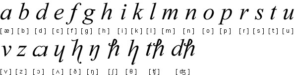

Czytam sobie 
[taki artykuł](http://pitmania.com/invent-your-own-universal-language/) z
Pitmanii i popadłem w zadumę aka przydum. Faktycznie, w angielskim
świecie działa X różnych stowarzyszeń, organizacji i prywatnych osób,
które na własną rękę i zbiorowo, wspólnie i pojedynczo, pracują nad
nowym sposobem zapisu tego języka - w taki sposób, jak on brzmi.
Albowiem współczesna ortografia angielska korzeniami sięga gdzieś do
Średniowiecza i tyle ma wspólnego z mówionym językiem, co... chiński ze
swoim pismem.

Otóż to!  
Jedną z podstawowych hipotez (a może tez) historyków języków jest, że
wynalazek pisma utrwala język, czyli spowalnia jego przemiany. Jest to
obserwowalne w krajach, w których mieszka duży odsetek analfabetów:
mówią oni zupełnie inaczej, niż ludzie wykształceni. Skrajnie można też
obserwować narody, których język i pismo nie mają bezpośredniego
związku, jak np. chiński - przemiany języka nie odnoszą się do
"alfabetu". Język sobie, pismo sobie.  

<!--  
  Visible Speech Aleksandra Grahama Bella -->



Odwrotnym przykładem jest język polski, który stał się dość trwały, tj.
zmiany, jakie w nim zachodzą, są niewielkie i powolne - ot jakieś tam
beczące "e" zniknęło sobie na początku XXw. parę wyrazów się
zarchaizowało - ale gdy czytam pisania z XIX wieku, nie widzę istotnych
różnic w ortografii. Gdzieś w połowie XIXw. ustalono na nowo polską
ortografię, która, choć modyfikowana, przecież już później nie była
znacząco zmieniana. Ale pisma z wieków wcześniejszych również są
czytelne - większe problemy sprawia sama czcionka, niż ortografia. Z
tego wnosić można, że warstwy piśmienne posługiwały się językiem dość
podobnym do współczesnego.  

<!--  
  Alfabet Benjamina Franklina -->



Tymczasem istnieje kilka narodków, których ortografia ma się do języka
jak pięść do nosa, a przecież nie posługują się pismem obrazkowym tylko
(teoretycznie) fonetycznym. Mam tu na myśli np. Francuzów, a przede
wszystkim Anglosasów, bo ten język znam, w przeciwieństwie do
francuskiego. Możemy zauważyć, że angielski różni się od ortografii.
Wracając do początku wywodu, liczni geekowie postulują przemiany pisma w
kierunku jego ufonetycznienia. Ale - zwróćmy uwagę - ci sami postulanci
zdają sobie sprawę, że angielski australijskiemu nie równy, a ten
amerykańskiemu. Wiedzą, że w samym Londynie występuje kilka gwar tego
języka, w tym niektóre zupełnie niezrozumiałe, przynajmniej dla
obcokrajowca. Gdzieś tam słowo "***can't***" wymawia się "*kant*", gdzie
indziej "*kąt*", a jeszcze gdzie indziej "*kient*". A zatem o jaką
głoskę chodzi w tym prostym, jednosylabowym słówku? Skąd się to wzięło?  

<!--  
  Shavian, alfabet Bernarda George'a Shawa -->



Otóż odważę się tu zahipotetyzować propozycję (czy też zaproponować
hipotezę), że **angielski minął tajemniczą, magiczną granicę związku ze
swoją ortografią**. Gwary powstają tam spontanicznie co kwartał i w
każdym kwartale miejskim, bo i tak cały świat anglosaski zapisze dane
słowo tak samo, nie zważając na jego wymowę.  
A zatem można odważyć się kontynuować hipotezę, że jeżeli Anglosasi
dorobią się fonetycznej ortografii, dojdzie do rozdzielenia się języków
angielskich w różnych stronach świata - bo "kient" już nigdy nie będzie
się równać "kant". A zatem ortografia spaja cały świat anglojęzyczny i
pozwala mu się porozumiewać.  

<!--  
  Alfabet Gabelsbergera -->
  


Zatem postulaty onych fonetyzerów powinny zostać tam wyśmiane i zelżone,
a ich energia skierowana raczej na malutkie uproszczenie tej ortografii
o tyle, że pewne oczywiste grupy literowe mogły by otrzymać jakiś
pojedynczy znak. Tego to brakuje i w polskiej ortografii - ale, jak
kiedyś policzyliśmy, daje niewielkie korzyści ilościowe, bo zaledwie pół
procenta.

A, zapomniałem powiedzieć: bowiem oczywiście pismo, zarówno nauka
czytania, jak i pisania, przypomina naukę nowego języka. Stąd gramotni
są o wiele bystrzejsi od analfabetów.

A jak to się ma do stenografii, tematu onego bloga? A średnio. Po prostu
angielskie stenografie wszystkie są "fonetyczne", tylko każda inaczej.
