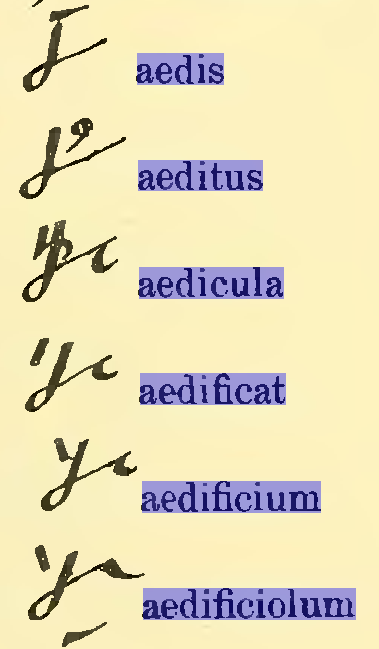

Bardzo przepraszam wszystkich Czytelników blogu. Kropnąłem się i
wyskoczył zupełnie nieprzygotowany wpis. To rujnuje moje plany,
niestety. Tak czy owak, należy się parę słów wyjaśnienia.

Po pierwsze primo, [tydzień temu spróbowałem zapisać notami
tyrońskimi](../2012-05-15_comentarii-notarum-tironianarum-napisy-i-konkurs/) tytuł mojego starego blogu
budowlanego: **Aedificare necesse est**. Drogą dedukcji, niczym Herkules
Poirot, nie przymierzając, doszedłem do takiego oto rezultatu:

<!-- 
  
  aedificare necesse est
  
-->



Dumny i blady przystąpiłem do realizacji obietnicy, że teraz spróbuję
zapisać motto niniejszego blogu, które brzmi (co każdy może łatwo
sprawdzić na górze strony): **Nondum lingua suum, dextra peregit opus**.
Z powodu kropnięcia się nie ma już dobrego suspensu, żeby prezentować
skomplikowaną drogę rozumowania, którą doszedłem do takiego oto napisu:

<!--   
  
  nondum lingua suum dextra peregit opus
  
-->



Ale!

Ale mianowicie mogę tutaj zdradzić przed Państwem (znaczy, przed
Czytelnikami, nie przed państwem polskim), że w poprzednim napisie jeden
z Czytelników wykrył błąd metodologiczny. I ja po przemyśleniu skłonny
jestem się skłonić do jego uwagi. A chodzi o te końcowe dzyndzle.
Zdaniem tego Czytelnika w słowie "aedi" i pochodnych, które, jak wiemy,
wyglądają tak:

W przypadku 3 przedostatnich zaprezentowanych słów dzyndzel ów nie
znaczy "*fi*", jak w "*aedifi*", lecz "*c*", "*ci*" itp. (a właściwie
etc.). Przykłady pokazane [w poprzednim wpisie na ten
temat](../2012-05-15_comentarii-notarum-tironianarum-napisy-i-konkurs/) potwierdzają tę hipotezę. Cóż,
nie jestem łacinnikiem, jeżeli się jakiś trafi, to może wyjaśni, czy ono
tajemnicze "*fi*" w ogóle coś zmienia. Bowiem z tego by wynikało, że
napis powinien wyglądać tak:

Czyli zrównałem tutaj morfem "aedi" z "aedifi". Cóż, w żadnym dostępnym
mi słowniku łaciny nie znalazłem słowa "aedicare", za to "aedificare"
tam występowało.

  

