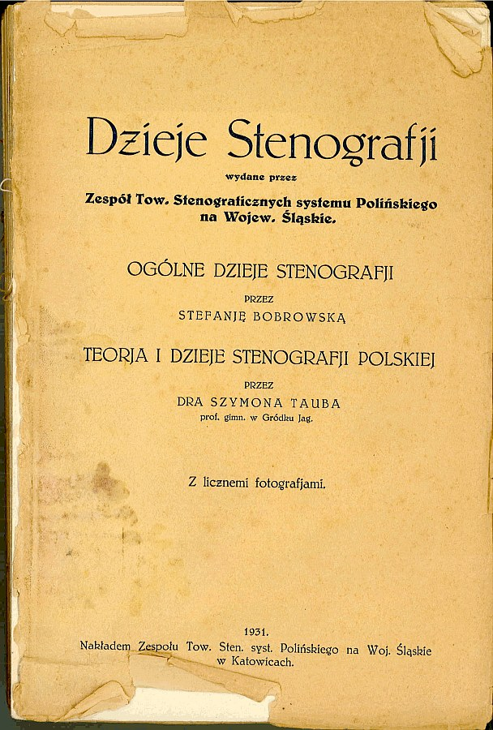

Witajcie po przerwie, kochani Czytelnicy (i Czytelniczki, o ile któraś z
Pań nie chce się zaliczać do Czytelników)!

Dałem sobie na luz, bo wraz ze zbliżającymi się wakacjami zaczęło mnie
ogarniać zmęczenie materiału. Ponad pół roku skanowania białych kruków,
towarzystwo skanera, starych książek, próba utrzymania w tym jakiegoś
porządku - odbiło się to na moim zdrowiu psychicznym w postaci
ogarniającego umysłowość spleenu. Dwa miesiące przerwy od blogowania, od
prowadzenia strony www, jak sądzę, dobrze mi zrobiło.

Za to teraz mam kupę materiału, którym zamierzam się z Wami stopniowo
dzielić, w miarę, jak będę sklejał poszczególne książki lub czasopisma
we w miarę estetyczne PeDeeFy. Wierzcie mi, choć historia, skąd to
wszystko wziąłem, jest nie do wiary...

Mam nadzieję, że po takim prezencie wybaczycie mi kilkumiesięczne
milczenie. Naprawdę musiałem odpocząć.

Ale przecież nie zapomniałem o Was! I dlatego zaczynam z grubej rury,
jako że przerwa była długa i z pewnością po mnie płaczecie rzewnymi
łzami (łzyma? Jeśli po jednej z każdego oka?):

**[Tadaaam!](https://archive.org/details/DziejeStenografji)**

Otóż na zachętę zapraszam do lektury absolutnego hiciora, czyli

  

**[Dzieje Stenografji autorstwa Szymona Tauba i Stefanii Bobrowskiej](http://archive.org/details/DziejeStenografji)**

KROPKA.

Dzieło ogromne, przynajmniej objętościowo. Dla mnie podstawowe ongi
źródło informacji na ten temat, czyli historii stenografii - przede
wszystkim polskiej. Część dotycząca historii stenografii światowej
spokojnie może zostać uzupełniona, podobnie jak dzieje stenografii
polskiej po roku 1930, czego się już ta książka nie tyczy z oczywistych
powodów, skoro wydana została w roku 1931.

Zwrócić pragnę uwagę Kochanych Czytelników na styl, tj. język książki,
wyrażony przez ortografię, interpunkcję i stylistykę. Mnie jako żywo
kojarzy się z zapisem stenograficznym. Nie jestem specjalistą od
ortografii przedwojennej, ale sądzę, że książka aż roi się od
pseudo-błędów ortograficznych polegających np. na sklejeniu często obok
siebie występujących wyrazów, np. *nie ma*, czyli w wypadku autorów:
***niema***...

Ale przecież jest! Zachęcam do lektury.

Smacznego!

