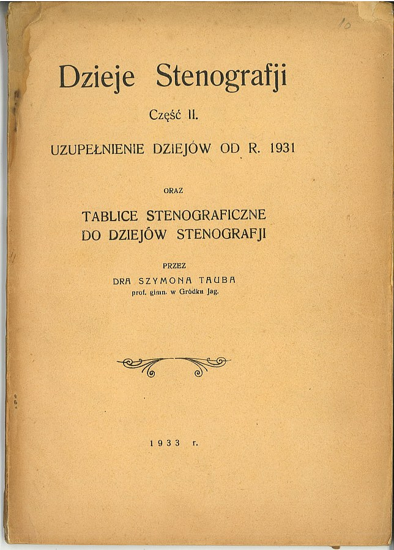

W poprzednim odcinku serialu pt. Dzieje Stenografji pokazaliśmy Kochanym
Czytelnikom dzieło wiekopomne i ze wszech miar ogromne. Miało ono pewną
istotną wadę, która w dzisiejszych czasach lekturę taką dyskwalifikuje w
oczach wielu, szczególnie słabo przyzwyczajonych do czytania: nie
zawierała obrazków, mimo obietnic z okładki, gdzie napisano *z licznemi
fotografijami*. Nieładnie, prawda?

Cóż, kiedy zetknąłem się z tą książką po raz pierwszy, a było to w
Bibliotece Narodowej, nawet nie podejrzewałem, że jej Autorzy popełnili
coś na kształt suplementu, czy uzupełnienia, które miało zaspokoić głód
wiedzy licznych czytelników. Dziś, po licznych skanowaniach już wiem
dobrze i niniejszym prezentuję Wam, Moi Kochani Czytelnicy,

  
  
  

**[Dzieje Stenografji Część II.](http://archive.org/details/DziejeStenografjiCzescIi)**

Czytanie tego może być cokolwiek trudniejsze, bowiem niektóre z
alfabetów Autor rozłożył na dwóch stronach, czyli na tzw. rozkładówce.
Ale, mam nadzieję, dacie sobie radę.

Zapraszam zatem do uzupełniania wiedzy, którą niewątpliwie chciwie
pochłaniacie już od tygodnia. Wpatrzcie się w literki pieczołowicie w
kamieniu wytrawione przez Szymona Tauba, który bez kozery zasługuje na
miano Najbardziej Oddanego Stenografii Polskiego Stenografa W Dziejach
Polskiej Stenografii.

**[Smacznego!](http://archive.org/details/DziejeStenografjiCzescIi)**

