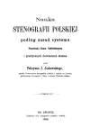

Dziś z prawdziwą przyjemnością prezentuję Czytelnikom prawdziwego
Białego Słonia (w odróżnieniu od kruków, które tylko hałasują, srają i
śmierdzą, słonie bywają pożyteczne) wśród polskiego dorobku
stenograficznego - oto...

... ooOOoo...

[Felicyana Yackowskiego](../../historia_polska/jackowski/)
obszerne opracowanie jego osobistego, autorskiego systemu. Pisałem już o
nim (jak w [linku](../../historia_polska/jackowski/)),
ale jeszcze się nie chwaliłem, że zeskanowałem z obszernych zasobów jego
książkę. Dotychczas miałem tylko jego Wzorki, czyli prezentację
szczegółowych zagadnień z pisania jego analfabetem.

**[&gt;&gt; Stąd można pobierać! &lt;&lt;](https://archive.org/details/NaukaStenografiiPolskiej_408)**

Choć oceniony przez współczesnych surowo (za wartości
techniczno-estetyczne systemu, jak i za temperament autora), przecież
zawierał jedną ciekawą innowację, na tamte czasy rewolucyjną: nie
stosował cieniowania, czyli pogrubiania kresek jako symbolizacji litery!
Cieniowanie w jego piśmie pozostało po prostu ozdobnikiem.

A na początku książki obszerny rozdział o historii stenografii, pisany
ponad pół wieku przed Taubem - więc też interesujący.

Smacznego!
