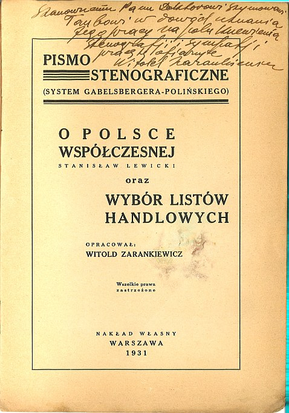
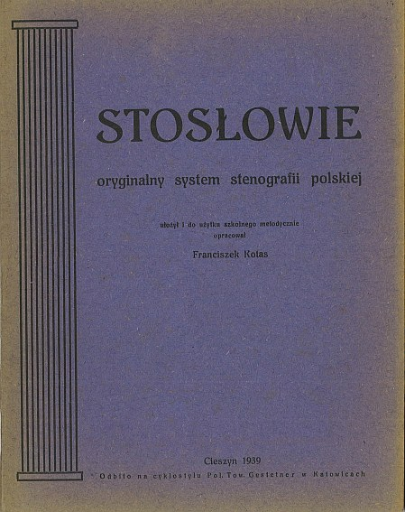

Przepraszam kochanych Czytelników. Miałem ruszyć z kopyta, ale
sie-mi-nie-udaje-sie. A to z przyczyn rodzinnych. Znowu przeprowadzki,
trzeba meble targać. A początek roku, dzieci muszą się nauczyć odrabiać
lekcje, a tu jabłka obrodziły na drzewach, no motywacji nie ma, żeby te
ostatnie wolne chwile spożytkować jeszcze na stenografię. Co ja poradzę?
No co ja poradzę? Tyle planów stenograficznych niezrealizowane, ale to
już kiedyś mówiłem, że spieszyć się nie mam zamiaru. To nie jest temat
typu rzeka, kiedyś się wyczerpie, a ja żyć długo zamierzam. I po drodze
jeszcze parę innych rzeczy dokonać, nie tylko stenografię mam na
rozkładzie.  
A jakie to plany? A takie na przykład:

-   filmy ze stenografowania
-   stenotypia dla języka polskiego (taka prawdziwa, nie oszukana)
-   książka o historii stenografii (z najnowszymi dziejami)
-   czcionki stenograficzne

A poza tym wciąż i wciąż opublikowanie w Internecie i zadbanie, aby nie
zniknęło na wieki, dorobku polskiej stenografii.

Zatem dziś znowu tzw. wrzutka, czyli dwie pozycje:

**[O Polsce współczesnej (Stanislaw Lewicki) oraz Wybór listow handlowych](https://archive.org/details/OPolsceWspolczesnejstanislawLewickiOrazWyborListowHandlowych)** 
opracowane
przez Witolda Zarankiewicza - uwaga, uwaga! Z odręczną dedykacją dla
Szymona Tauba, znak, że książka z kolekcji tego wielkiego stenologa -
teraz w Internecie! Dla uczących się stenografii Systemu Polińskiego
będzie to z pewnością ciekawa lektura.

**[Stosłowie Franciszka Kotasa](https://archive.org/details/Stosowie)**,
system opracowany przez niego i podany do wiadomości w roku 1939, zatem
nie ewidencjonowany w "
**[Dziejach stenografii](https://archive.org/details/DziejeStenografji)**
". Co można o
tym powiedzieć? Czy ktoś wie, co to było i jak działał **cyklostyl**?

Smacznego!

I przepraszam za długie milczenie. Mam nadzieję, że po raz ostatni.

