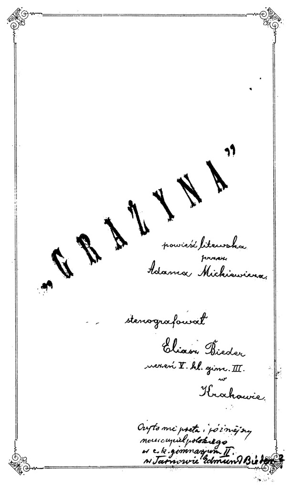
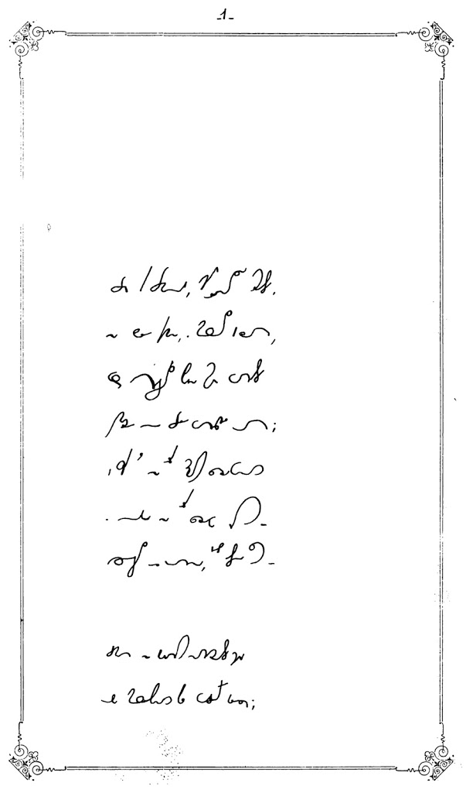
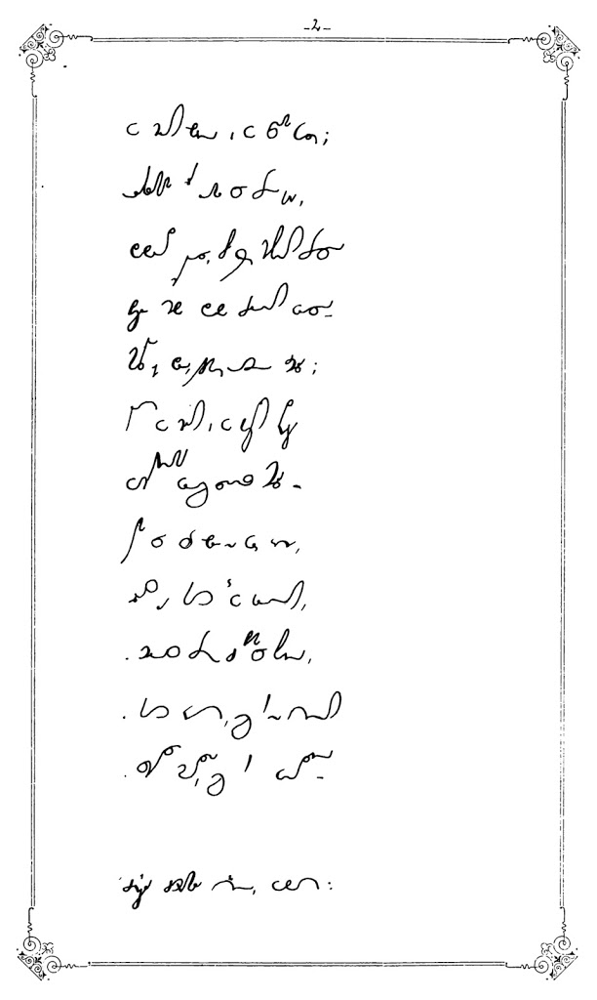

Kto się uczył ze mną w klasie, w liceum, ten zrozumie, co znaczy tytuł
tego wpisu. A dla tych, co się nie orientują, zapraszam na smaczny
kąsek, czyli 
["Grażynę" Adama Mickiewicza](https://archive.org/details/GrazynaAdamaMickiewiczaStenografowanaPrzezEliaszaBiedera),
czyli
[książeczkę](https://archive.org/details/GrazynaAdamaMickiewiczaStenografowanaPrzezEliaszaBiedera),
która, jak wskazują notatki wykonane przez jej niegdysiejszego
posiadacza, Szymona Tauba, została ręcznie napisana przez Eliasza
Biedera (prawdopodobnie) w roku 1894 z okazji Wystawy Krajowej we
Lwowie. Stenografowie zapewne chcieli się tam pokazać - to się pokazali.
A lat temu wiele później Szymon Taub krążył po lwowskich antykwariatach
i wykrążył tę książeczkę. A później przekazał ją wraz z najcenniejszymi
zbiorami ze swojej biblioteki Władysławowi Chrapuście i (prawdopodobnie)
został zamordowany wraz z całą rodziną, jak wielu innych polskich
Żydów.  

  **[>>Tutaj<<>>](http://archive.org/details/GrazynaAdamaMickiewiczaStenografowanaPrzezEliaszaBiedera)**

Spoglądając na kaligrafowane linie stenografii Systemu Polińskiego,
pozwólmy sobie na chwilę rozproszyć się, zamyślić i posłać kilka
ciepłych życzeń bodaj najbardziej oddanemu propagatorowi i badaczowi
polskiej stenografii.

  **[Kto chce porównać stenogram z poematem, to bardzo proszę.](https://wolnelektury.pl/katalog/lektura/grazyna.html)**

  **[Tutaj](http://archive.org/details/GrazynaAdamaMickiewiczaStenografowanaPrzezEliaszaBiedera)**

Dziś nie będzie "Smacznego".
