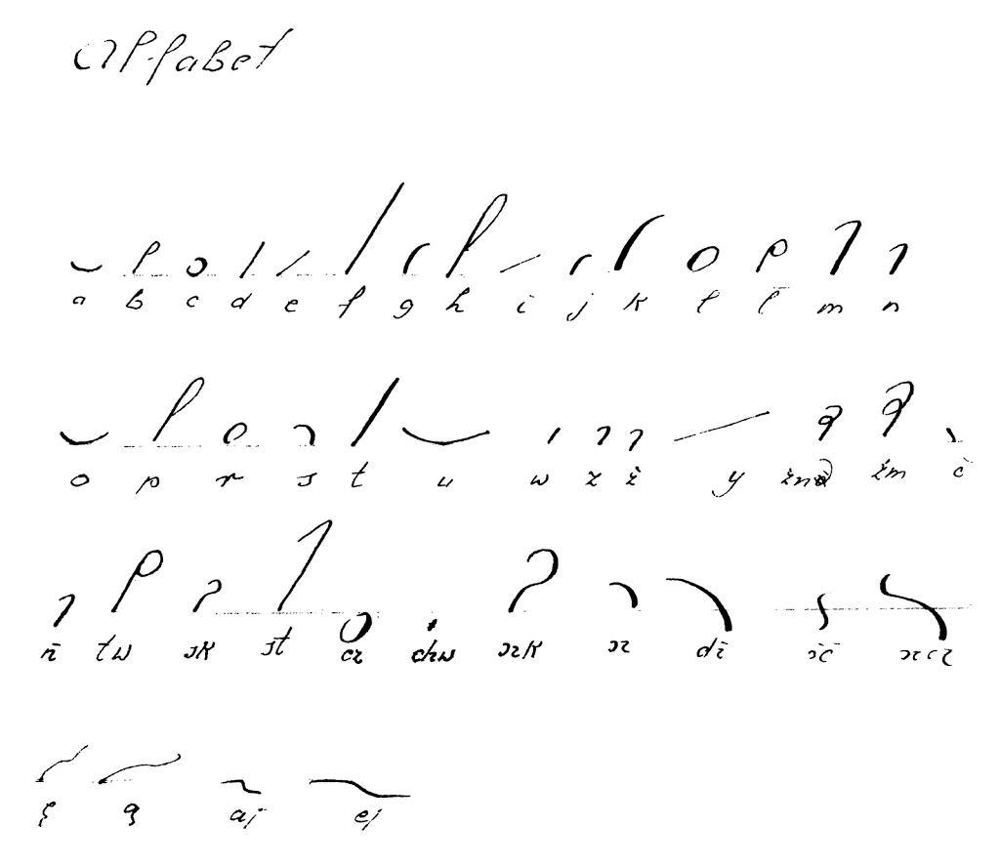
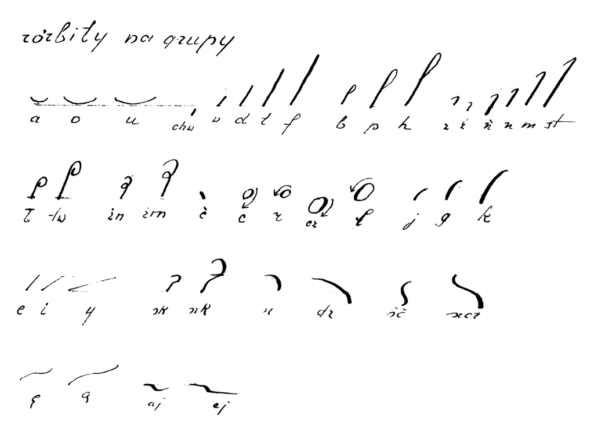

Witam.
Dziś rarytet. System F.K. (nie dowiedziałem się jeszcze, co znaczą te
inicjały) Ożarowskiego w kilku linkach poniżej - prawie wszystko, co
(zgodnie z wiedzą Szymona Tauba i Władysława Chrapusty) zostało w tej
sprawie wydane.

System ten jest podwójną ciekawostką w dzisiejszych czasach. Po pierwsze
primo, jest to jedyny przekład Rollera na polski. A w ogóle dostępność
systemu Rollera jest niewielka (znalazłem podręcznik do stenografowania
w Volapueku, ale nie po niemiecku). Po drugie primo, system ten okazuje
się interesujący dla umysłów ścisłych, matematycznych. A to dlatego, że
jest prosty i bardzo regularny, o czym z pewnością będziecie mogli się
przekonać podczas lektury opublikowanych podręczników.

Najsampierw, dla zapoznania z historią tego arcyciekawego systemu,
poniżej prezentuję wypiski z "[Dziejów stenografii](http://archive.org/details/DziejeStenografji)" (zwracam uwagę na stenograficzny styl poniższych zdań i niejednokrotnie brak
redakcji, więc Wy już nie musicie zwracać na to uwagi):

s.113.
Roller-Ożarowski wykształcił nielicznych stenografów, z których
kilku utrzymało się w biurze Rady miasta Warszawy (1918);

s.116.
§§§. Ożarowski i kilku zwolenników (czek) jego systemu
pracuje w biurze Rady Miejskiej w Warszawie.

s.159.

Dalej powstają przekłady systemów
wypisujących samogłoski w Warszawie, jako to Rollera
przez Ożarowskiego (1904), (w rękopisie pozostał podobny
przekład Sobczyńskiego w Szydłowie 1905),
(...)
W r. 1914 wychodzi 2 wydanie Ożarowskiego (Roller),

s.160.
Wszystkie jednak te systemy nie obejmują szerszego
terenu, ich wpływ jest minimalny, sięga co najwyżej do
kilku szkół w tej miejscowości, gdzie autorzy systemów
przebywają. Próbował także Ożarowski w Warszawie i na
prowincji rozpowszechniać swój system, stara się o biuro
stenograficzne sejmu, ostatecznie jednak udało mu się dla,
kilku swoich zwolenników, względnie zwolenniczek uzyskać
posady stenografów (ek) w Magistracie warszawskim
i po kilku latach swej działalności znika z areny.

s.166.

Inne systemy wykazują znikomą ilość wydawnictw i całkiem
małą działalność. Roller-Ożarowski **(1 podręcznik w 2**
**wydaniach, 2 Czytanki, 1 Dyktator, 1 numer czasopisma,**
**kilka stenografek w Warszawie, 1 wystawa sten.)**. Roller-
Sobczyski (1),

s. 405.
Jako pierwsze biuro stenograficzne, ale nie sejmowe,
powstało u progu niepodlegości Polski biuro stenograficzne
Rady Miasta Warszawy. W r. 1917 postanowiła Rada Miejska
w Warszawie wprowadzić stenograficzne sprawozdania
ze swych posiedzeń. Zwrócono się podobno do Gumińskiego,
ale ponieważ warunki wynagrodzenia postawione przez niego
były w stosunku do drugiego oferenta Ożarowskiego
(system Rollera) o wiele wyższe, oddano biuro Ożarowskiemu.
Kierował niem początkowo sam Ożarowski, potem
siostra jego Brzozowska, wreszcie jest dotychczas kierowniczką
tego biura uczennica jego Janina z Tomaszewskich Herdanowa.
Podobno i w biurze sten. Rady Miasta Łodzi miał pierwotnie
by stosowany system Ożarowskiego, potem Polińskiego.

s. 437.
Powtórzyć tu tylko można, że słabe rozpowszechnienie
wśród reszty systemów zyskał jedynie Ożarowski (Roller),
którego uczennica p. Tomaszewska-Herdanowa jest kierowniczką
biura stenograficznego Rady miasta Warszawy.
Uczniowie nie chwalą sobie tego systemu.

W poniżej zaprezentowanych linkach jest także odręczny przykład "Ojcze
nasz" ręką Tomaszewskiej-Herdenowej (nie zaś "Herdanowej", jak błędnie
zapisał Taub). Chętnie bym się dowiedział więcej o tym człowieku. Może
kiedyś wypłynie więcej danych.

A na razie zapraszam do lektury, podziwiajcie, zapoznajcie się...
Smacznego!

- [Samouczek Stenografii Polskiej w 5-ciu lekcyach, wydany w 1904r.](https://archive.org/details/SamouczekStenografiiPolskiejW5-ciuLekcyach)

<!-- -->

- [Niesamowita podobno popularność pierwszego wydania (i
wyczerpanie nakładu) kazały Autorowi uczynić w 1914r. II wydanie
systemu pod postacią książeczki pt. "Wykład
Stenografji Polskiej"...](https://archive.org/details/WykladStenografjiPolskiej)

<!-- -->

- [...i zeszytu do ćwiczeń pt. "Wzory
Stenografji Polskiej".](https://archive.org/details/WzoryStenografjiPolskiej)

<!-- -->

- [Janina z Tomaszewskich Herdenowa na ręce (przypuszczalnie) Szymona
Tauba popełniła zapis stenograficzny Modlitwy Pańskiej, zgodnie
z tradycją.](https://archive.org/details/OjczeNaszSystememOzarowskiego)

