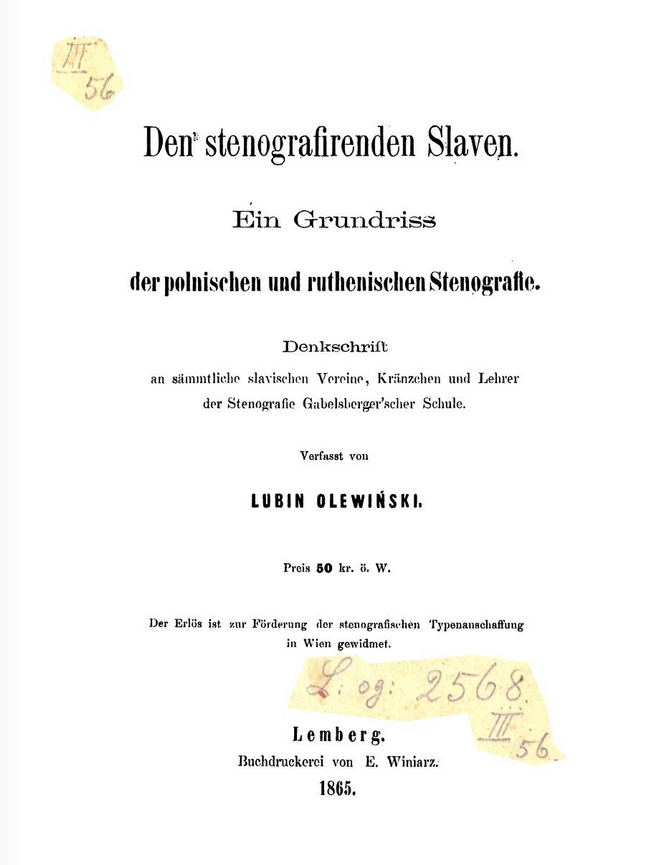

Tak. Trochę mnie nie było. Koniec roku, trzeba biurko posprzątać. Dzieci
chore, ja chory, chandra jesienna mnie dopadła. Jabłka zamarzają na
gałęziach, zbierać się nie chce, nieurodzaj - klęska, urodzaj - jeszcze
gorzej.

Poza tym zajęło mnie w wolnym czasie składanie trudniejszej książeczki.
I nie po polsku. Lubin Olewiński, jakoś tak w okolicach publikacji
swojego systemu w roku 1865, najsampierw [postanowił popełnić rozprawkę
na temat stenografii w językach słowiańskich. **Oto
ona**](http://archive.org/details/DenStenografirendenSlaven). Kto
umie po niemiecku, może to przetłumaczy, bo ja nie umiem :-(.

Składanie trwało długo, bo musiałem ręcznie generować, strona po
stronie. Wyszedł ciężkawy ten PDF, ale chciałem zachować notatki
ołówkowe, które zeskanowałem razem z oryginałem. Przypuszczam, że są
autorstwa Chrapusty, ale mogą też być i Tauba. Obaj znali języki
obce, obaj lubili poprawiać świat cały i mieli wiedzę, żeby poprawiać.

**[Stąd też można pobrać.](http://archive.org/details/DenStenografirendenSlaven)**

Smacznego.
