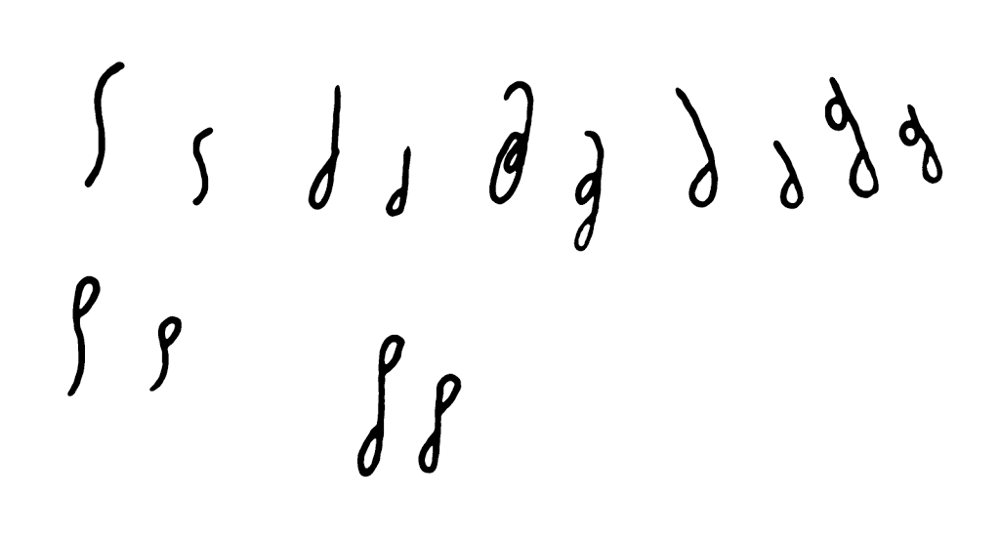

O nie, Kochani Czytelnicy. W żadnym wypadku nie zamierzam tutaj zawracać
Wam głowy współczesną polityką polską, czy światową. To robią inni.
Jeżeli w tytule zapodałem coś o zadumie, to dlatego, że naprawdę jestem
zadumany - ale na temat stenografii! I tym chcę się z Wami najsampierw
podzielić, zanim pojawi się (poniżej) skan z tradycyjnych życzeń
świątecznych.

Otóż w ostatnich tygodniach mózg mój (który to jest doskonałym
urządzeniem służącym do myślenia, zaopatrzonym, po ostatnich apgrejdach
w wielowątkowość i dynamiczną alokację zasobów obliczeniowych oraz
algorytm przetwarzania rozproszonego w tle, nawet w stanie uśpienia)
wyrzucił koncepcję rewolucyjnej zmiany w systemie, nad którym pracuję
już z górką od roku. Chodzi o
system [**Ste*Mi***](../2011-06-09_stemi-podglad/), mój
autorski, **[o którym już pisałem](../2011-06-09_stemi-podglad/)**.
Hmm... Dawno temu pisałem. Tamta prezentacja jest już dawno nieaktualna.
Trochę się zmieniło przez te półtora roku... 

Posługuję się nim dość sprawnie, na tyle już mi z nim dobrze, że
praktycznie nie używam literek łacińskich za wyjątkiem notowania wyrazów
obcych. *No, nie powiem, żebym musiał często pisać odręcznie, ale zdarza
się*. Ale do rzeczy.

Otóż bardzo mnie bolało (i pisałem o tym, że boli, że oczekuję
propozycji), że nie mam lepszej propozycji na literę "T", która
przedstawiona jest wężykiem pisanym z góry na dół.

<!-- 

  T d, CZ dż, SZCZ żdż/dżdż, TRZ drz, STRZ zdrz  
 ST zd, *i ostatni, którego tu nie było*
-->



Jak widać na załączonym obrazku na górze po lewej. Oto znaczki, których
przeróbka wyłoniła mi się ostatnio z głębin podświadomości i spowodowała
stan rozstroju komórkowego, bo człowiekiem ogólnie mało decyzyjnym
jestem i jak takie coś mi się w głowie szykuje, to zaraz mam mnóstwo
"ale". W każdym razie ona literka "*Td*" (bo mały wężyk to litera "*d*")
bardzo mnie bolała, choć nawet nieźle mi się nią pisało. A to dlatego,
że nie dość, że się wyłamywała z ogólnego, ładnego schematu literkowego
(taka ni w pięć, ni w dziewięć), to jeszcze nie zawsze się dobrze pisała
i trzeba było na nią wymyślać różne "myki". A że nikt przez dwa lata nie
przysłał mi dobrej propozycji, to zużyłem sporo zasobów na wymyślenie
onych "myków" - i w końcu nawet nabrałem pewnej biegłości, że w sumie,
poniekąd, niestety, a może jednak, ale w końcu może jakiekolwiek zmiany
w systemie były by zbędne...? Faktem jednakowoż jest, że ono "*T*" było
rozwiązaniem dość rozpaczliwym, przeczącym na całej linii podstawowej
idei mojego systemu, czyli prostocie przed innymi jego (niewątpliwymi)
zaletami. Różne sztuczki trzeba było odpalać, żeby uruchomić wyraz z
"*T*", a to cząsteczkę doczepić przed, a to po, a to zmodyfikować... No,
nagle użycie tej jednej (a właściwie dwóch, bo jeszcze "*D*") głoski
było trudniejsze niż reszta systemu razem wzięta. Zgodnie z regułami
współczesnego marketingu sam siebie przekonywałem, że *it's not a bug,
it's a feature*, ale chyba jestem zbyt inteligentny na tak cienką
argumentację. Ale - no przecież - system dawał się używać, czego dowodem
jest parę kilo papieru zapisanego przeze mnie stenograficznie.

A tymczasem procesor (czyli mózg) działał, a na nim pikał niespiesznie
proces rozwiązywania problemu. I w końcu go rozwiązał. Wcześniej jeszcze
 wypluł rozwiązanie pośrednie, mianowicie widoczne na obrazku powyżej
znaczki "*SZCZ*", "*TRZ*", "*drz*", "*STRZ*" oraz "*zdrz*", z którymi
również miałem wcześniej niejakie problemy. A niedawno pojawiła się
koncepcja. I dziś wydaje się tak prosta, że aż nie rozumiem, jak mogłem
tego wcześniej nie widzieć? Ile razy rozpisywałem sobie grafikę systemu
(nie będę tutaj teraz wyjaśniał, o co chodzi, bo to materiał na osobny
artykuł) i nic z tego nie wychodziło? Od razu powiem, że nie używam w
nowym rozwiązaniu żadnego znaczka, którego nie znałyby wcześniejsze
systemy! Używam tego, który na obrazku powyżej opisany jest jako
"*ostatni, którego tu nie było*".

<!-- 
  [{width="640" height="112"}]({filename}/wp-images/uploads/2012/12/stara01.png)
  strach, troska, torebka, kaskader, skałkowa, braków, prętów, kosztowny, *SZT*
-->



Na początek pierwsza partia wyrazów, które zilustrują problematykę.
Widać tu różne znaki **Ste*****Mi**,* z przewagą "*T*" zastosowane w
wyrazach, jak w podpisie pod rysunkiem. Teraz będą te same wyrazy, ale z
nowym "*Td*":

<!-- 
  [{width="640" height="115"}]({filename}/wp-images/uploads/2012/12/nowa01.png)
  strach, troska, torebka, kaskader, skałkowa, braków, prętów, kosztowny, *SZT-SZT?*
-->



Widać łatwo, jaki znak zastąpił zespół "*Td*". Niegdysiejsze "*CZdż*".
Nowe zastosowania liter każe rozmyślać o wprowadzeniu nowych, tj. dobrze
znanych, ale jeszcze nie w **Ste*Mi***, rozwiązań graficznych. Zwracam
uwagę na wyraz "*torebka*" - zastosowałem tam wyokrąglenie "brzuszka"
dla symbolizacji głoski "*O*", czyli tzw. wokalizacji symbolicznej przez
zmianę kształtu litery. Dotychczas symbolizacji nie stosowałem
nagminnie, gdyż inny postulat **Ste*Mi*** brzmi: łatwe do pisania dla
niewyszkolonych w kaligrafii. Ergo, ma nie stawiać dużych wymagać wobec
niewyćwiczonej ręki, aby możliwie jak najszybciej (jak najwcześniej od
rozpoczęcia nauki) można go było skutecznie używać.

Kolejna partia wyrazów do porównania:

<!-- 
  [{width="640" height="116"}]({filename}/wp-images/uploads/2012/12/stara02.png)
  postrzelony, traktor, dyrektor, monitor, kret, zgred, trep
-->



I w nowej wersji:

<!-- 
  [{width="640" height="120"}]({filename}/wp-images/uploads/2012/12/nowa02.png)
  (traktor, traktor) postrzelony, traktor, dyrektor, monitor, kret, zgred, trep
-->



Tu widać, że rozwiązanie świeże - nie mogę się zdecydować, jak rozwiązać
nowe problemy - bo jak się wprowadza zmiany, to jakkolwiek świetne by
one nie były, przecież jednak wywołują one zupełnie nowe, czasem (nie w
tym wypadku) niespodziewane problemy. Tutaj mam kłopot, jak opracować
ładne i wygodne złączenie
(tj. [ligaturę](http://pl.wikipedia.org/wiki/Ligatura_(pismo))) "*T*" i
"*K*" do wspólnego "*KT*". Bo wspólne "*TK*" już jakieś mam. Mam nawet
"*TW*", które zmusiło mnie do co najmniej pięciominutowego namysłu. Jak
widać, na razie zastosowałem taki dziwny "zadziorek" - jest to niezgodne
z regułami **Ste*Mi***, a do tego łamie rytm pisania, muszę coś w tym
miejscu wymyślić.

<!-- 
  [{width="640" height="148"}]({filename}/wp-images/uploads/2012/12/stara03.png)
  sympatia, gestia, kwestia, kwesta, poszczę, post
-->



<!-- 
  [{width="640" height="158"}]({filename}/wp-images/uploads/2012/12/nowa03.png)
  sympatia, gestia, kwestia, kwesta, poszczę, post
-->



Jak widać, w niektórych zastosowaniach nowe litery są znacznie prostsze.
Niezwykle często występujące złożenie głosek "ST" jednak tym razem nie
ma tak szybkiej do napisania reprezentacji. z drugiej strony, wydaje się
ona pewniejsza i łatwiejsza do odczytu.

Na koniec jeszcze prezentacja paru literek:

<!-- 
  [{width="400" height="227"}]({filename}/wp-images/uploads/2012/12/nowa04.png)

  Td, CZdż, SZCZżdż, TRZdrz, STRZzdrz  
 STzd i *3 zestawy, jakie na razie wypadły*
-->



Można porównać ten najniżej się znajdujący rysunek z tym najwyżej się
znajdującym. Wydaje mi się (powtarzam: wydaje mi się), że zmiana ta,
zamiast zmniejszyć, zwiększy wydatnie zapas niewykorzystanych znaków,
dzięki czemu będzie z czego później budować znaczniki czyli znakowe
skróty wyrazowe dla stenograficznego WARP-2 (bo WARP-1 osiągamy
przechodząc z literek łacińskich na stenograficzne, to chyba
oczywiste?).

No dobrze, ale o czym to ja? Na czym polega moje zamyślenie? A
mianowicie na tym, że nie wiem, CZY TO ZMIANA NA LEPSZE, czy może na
gorsze? Czy wprowadzać zmianę "Td", czy pozostać przy tym co już
poznałem? A dodajmy, że przecież niektóre "myki", które powstały przy
okazji poprzedniego "Td", przecież są niezłe i, czemu by nie, można by
je zostawić.

No, myślę.

A życzenia jednak będą w następnym wpisie, a co.

