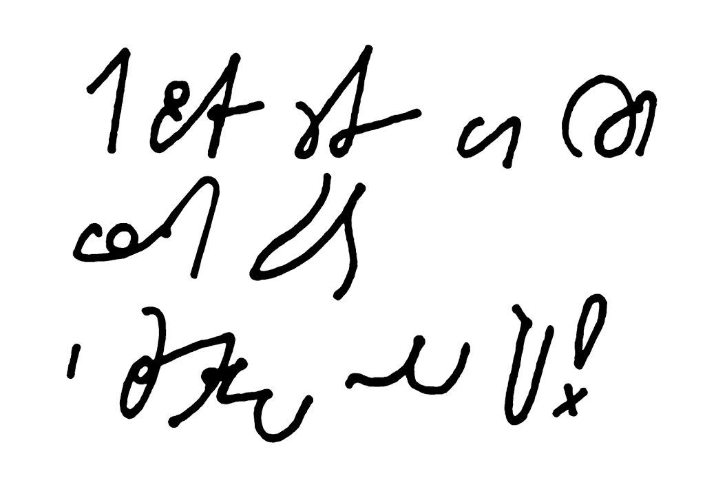
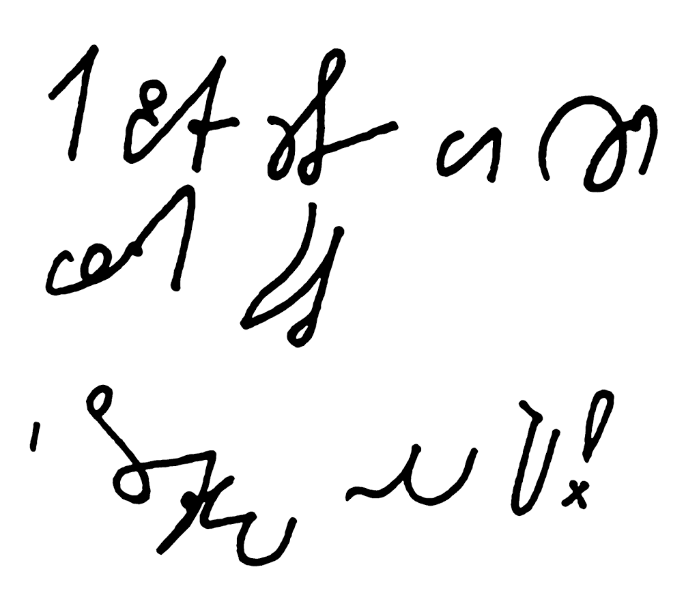

Ponieważ poprzednio się rozpisałem, życzenia dostają tradycyjnie swój
oddzielny, świąteczny wpis. Dylemat z poprzedniej notki na razie
pozostaje aktualny, więc życzenia wklejam w dwóch wersjach, a Wy
oceńcie, która z nich jest zgrabniejsza, logiczniejsza, sensowniejsza, a
co najważniejsze, która z nich jest cieplejsza, milsza i
świąteczniejsza:

Wersja **Ste*Mi*** stara:

Jak zwykle życzę Wam Wszystkim \
 Wesołych Świąt \
 i Szczęśliwego Nowego Roku!

Wersja **Ste*Mi*** nowa:

Jak zwykle życzę Wam Wszystkim \
 Wesołych Świąt \
 i Szczęśliwego Nowego Roku!

Życzę Wam, dokładnie jak w zamieszczonych wyżej życzeniach, a nawet
bardziej. Żeby nam się i w ogóle. Żeby przestali gadać o tym głupim
kryzysie, żeby sobie w końcu poszedł. Żeby kredyty hipoteczne szybko się
spłacały, a raty nie bolały. Żebyśmy mogli wyjeżdżać na narty zimą i na
żagle latem. Żebyśmy zdrowi byli bez wspomagania
farmakolololologicznego. Żeby wreszcie zbudowali Windę Orbitalną. Żeby
książki staniały, a honoraria autorskie wzrosły. Żeby było więcej
dobrych pisarzy. 
A kiedy już się to wszystko spełni, żebyśmy dalej mieli jakieś fajne
życzenia, na zapas, na następny rok. 
Do siego.

