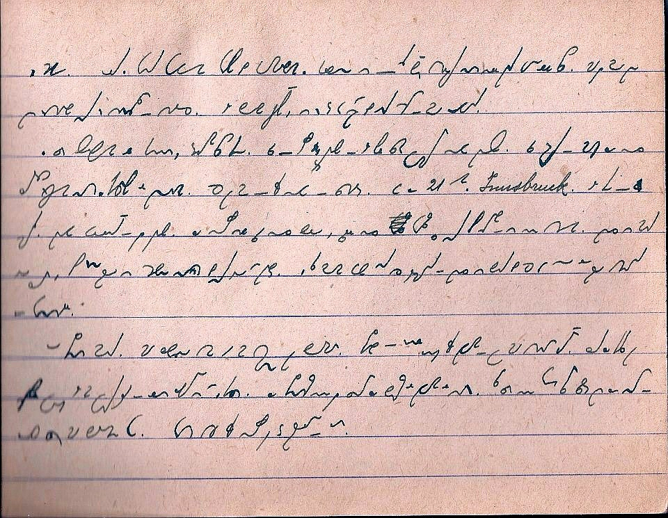
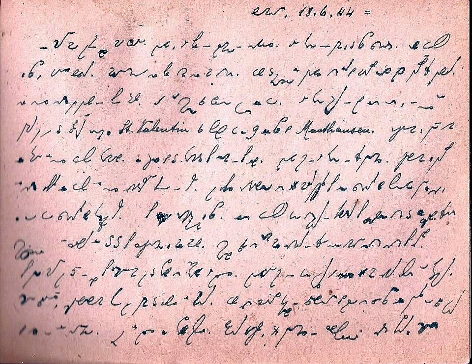

Obudziliście się już? To na rozluźnienie:

Przeszukiwanie sieci czasem owocuje ciekawymi efektami. Stenografią 
posługiwali się zwykli ludzie. Niektórzy używali jej na co dzień, tak po 
prostu. Nieznany mi zapaleniec z Włoch na Facebooku opublikował serię 
stron z "Dziennika więziennego" Francesco Rovida, schwytanego przez 
Niemców 16 czerwca 1944 w Genui (Genova Campi) z setkami hutników. 
Czterdziestoletni Rovida, żonaty z Palmirą Canepą (którą w pamiętniku 
nazywa "Iliuccia"), ojciec rocznej córeczki Rafaelli, tego dnia poszedł 
do pracy w hucie, której był dyrektorem. Około godziny 18 miał umówione 
spotkanie z żoną, ale się już z nią nie zdołał zobaczyć. Niemcy otoczyli 
fabrykę i wszystkich pracowników załadowali do pociągu, który podążył do 
Mauthausen. Franciszek Rovida, który opanował wcześniej sztukę 
stenografii systemu Gabelsberger-Noe, prowadził dziennik, w 
którym skrupulatnie zapisał swoje dramatyczne przeżycia. Materiały te 
zostały opublikowane na fejsowych stronach Stenoklubu Gabelsberger-Noe 
dzięki synowi autora, dziś pracownikowi naukowemu z Uniwersytetu w 
Pawii. 

Umieszczę tu tylko 2 strony, kto ciekawy, niech sobie zaprenumeruje 
**[WSZYSTKO](https://www.facebook.com/pages/Stenoclub-Stenografia-Gabelsberger-Noe-shorthand/102172943241253)** (o ile ma konto na twarzościance). 

#### Strona 7 z notatnika "Dziennik więzienny" Francesco Rovida: 

 
 

*Il treno e ripartito da Trento e giunge a Bolzano dove sono visibili gli 
ingenti danni fatti dai bombardamenti. Il Brennero e l'ultima stazione 
italiana prima di entrare in territorio austriaco. La temperatura cala 
in modo sensibile, piove e fa freddo. Ormai e notte e i prigionieri 
improvvisano un giaciglio sul treno. Ma i pensieri piu tristi turbano il 
sonno. "La notte cala sui nostri dolori, sulla nostra tristezza, su 
quanto ci attende che non conosciamo*

**W wolnym tłumaczeniu wspomaganym Translatem:** \
Koleją z Trento do
Bolzano, gdzie przybywszy zobaczyć można ogromne szkody wyrządzone przez
bombardowania. Brennero jest ostatnią włoską stacją przed wjazdem na
terytorium austriackie. Temperatura spada znacznie, pada deszcz i jest
chłodno. Nocą więźniowie improwizują łóżko w pociągu. Ale smutne myśli
nie dają spać: "Noc okrywa nasz ból, smutek, nie wiemy, co nas czeka"...

*Dopo tre giorni ininterrotti di viaggio il convoglio arriva a Mauthausen. Il cielo e plumbeo, piove e fa freddo. I prigionieri stanchi, con i vestiti inzuppati, sono incitati a fare in fretta dai loro aguzzini italiani e tedeschi, vengono messi in fila e condotti al campo di concentramento. Passando per il paese la gente li squadra con sorrisi beffardi. "Finalmente siamo al termine del nostro viaggio tremendo...". Purtroppo il nostro autore in quel momento non sa che il viaggio e appena iniziato.*

**W wolnym tłumaczeniu wspomaganym Translatem:** \
Po trzech dniach
nieprzerwanej podróży konwój dociera do Mauthausen. Niebo jest ołowiane,
pada i zimno. Więźniowie zmęczeni, w mokrych ubraniach, nakłaniani do
pośpiechu przez oprawców, Włochów i Niemców, stają w kolejce do obozu
koncentracyjnego. Uśmiechnięci, całym oddziałem przechodzą przez wieś.
"Wreszcie koniec naszej długiej podróży...". Niestety, nasz autor nie
wiedział, że jego podróż dopiero się zaczyna.

**I tym raczej smutnym akcentem witamy Nowy Rok. Oby lepiej nam poszło niż
pokoleniom, które musiały doświadczyć wojny.**
