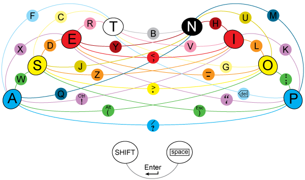

Jak śledzącym pilnie ten blog wiadomo, interesuję się różnymi aspektami
stenografii. Dość dużym, ostatnio przeze mnie zaniedbanym rozdziałem
jest
[**stenotypia**](http://blog.stenografia.pl/search/label/stenotypia),
rozumiana nie w sposób, w jaki Państwo Łazarscy starali się to pojęcie w
Polsce ugruntować (tj. stenotypia to sztuka stenografowania a potem
szybkiego przeklepania stenogramu na klawiaturze), lecz zgodnie z istotą
rzeczy. Czyli po grecku patrząc *stenos* - ścisły, inaczej skrócony i
*typos (typhos?)* - tłoczyć, dziś, stukać w klawiaturę. Dziś chciałem
wspomnieć raczej o tachytypii (czyli *tachys* - z grecka "szybko", patrz
"tachograf"), choć stenotypia w dosłownym rozumieniu staje się jej
bardziej rozwiniętym, przyspieszającym znacznie rozdziałem, którego nie
sposób lekceważyć, kiedy się chce szybko wprowadzać tekst.  
Ale do rzeczy, o czym to ja...? A, o
[**ASETNIOP**](http://www.telix.pl/artykul/asetniop--klawiatur-dla-tabletow--wideo--3,51562.html)
- nowy hicior wśród komputerowo-tabletowych geeków. Sprawa dopiero się
rozwija i grozi jej także śmierć w kołysce - z różnych artykułów w
Internecie można wyczytać, że autor rozwiązania zamierza zostać
milionerem na bazie korzyści ze sprzedaży tegoż. Osobiście przypuszczam,
że wątpię, czy mu się to uda (dajcie mu bogowie!), bowiem rozwiązanie
to, jak wiele innych, polega na tym, że trzeba się czegoś nowego
nauczyć, a to, jak wiemy, od razu odcina 90% rynku, jako że przeważająca
większość potencjalnych klientów nie zamierza się niczego nowego w życiu
nauczyć. Ale rozwiązanie i tak jest ciekawe, nawet w towarzystwie
innych, dość ostatnio intensywnie powstających w różnych miejscach
świata.  

Problem wprowadzania tekstu do komputera istnieje od czasu wynalezienia
tegoż komputera. Dziś odrobinę zmienia się pole, gdyż coraz mniej
sprzedaje się komputerów (w rozumieniu tajemniczego połączenia głupiego
ekranu z klawiaturą i myszą), a coraz więcej tabletów i temu podobnych
(w rozumieniu tajemniczego ekranu, który reaguje na dotyk).
Dotychczasowe wynalazki w formie różnego rodzaju klawiatur (linkować mi
się nie chce, ciekawi bez trudu znajdą mnogość rozwiązań, niektóre
opisywałem na tym blogu) stają się tylko potencjalną przystawką do
tabletu, a to od razu rolę ich zmienia, umniejsza i utrudnia
wykorzystanie - a zatem i sprzedaż. Ludzie chcą mieć możliwość
wprowadzania tekstu (oczywiście, ten odsetek, który w ogóle jakiś tekst
chce wprowadzać) możliwie bez majtania się z jakimiś dodatkowymi
ustrojstwami. A jeżeli już jakieś ma być, to żeby działało intuicyjnie i
tak jakby samo. A tak dobrze to na razie jeszcze nie ma i zapewne długo
nie będzie.  

I tak wracamy do różnistych rozwiązań, które ohasłowałem na początku
jako ASETNIOP. A jest to wynalazek, który właśnie się rodzi. Można na
stronie koncepcyjnej
[**przećwiczyć**](http://asetniop.com/keyboardTutorial.html), jak to
działa po angielsku: najczęściej występujące literki mają swoje
przypisane klawisze (konkretnie 2x4, czyli tyle, ile mamy palców u dłoni
nie licząc kciuków), a te występujące rzadziej przypisane są do
kombinacji uciśnięć (nazwijmy to **akordami**), wg takiego oto
schematu:  

<!--  

-->

<!--  Schemat ASETNIOP -->

Proste? To dodajmyż do tego rozwiązania typu stenotypicznego, obejmujące
zestawy akordów trójpalcowych, a wedle życzenia klienta, to czemu nie,
też czteropalcowych, a potem jeszcze niech domyślny program rozpoznaje
sekwencje akordów i proponuje całe fragmenty zdań - i mamy stenotypię
jak się patrzy. Prezentacje filmowe, jak poniżej

<object class codebase="http://download.macromedia.com/pub/shockwave/cabs/flash/swflash.cab#version=6,0,40,0" data-thumbnail-src="http://2.gvt0.com/vi/w3MfXMkctQ4/0.jpg" height="266" width="320">
<param name="movie" value="http://www.youtube.com/v/w3MfXMkctQ4&amp;fs=1&amp;source=uds"></param><param name="bgcolor" value="#FFFFFF"></param><param name="allowFullScreen" value="true"></param>
<embed width="320" height="266" src="http://www.youtube.com/v/w3MfXMkctQ4&amp;fs=1&amp;source=uds" type="application/x-shockwave-flash" allowfullscreen="true">
</embed>
</object>

pokazują, że można w ten sposób dość szybko klepać, mimo, że na
klawiaturze wydaje się to o niebo wygodniejsze - ale to ma związek z
innymi słabościami ekranu dotykowego, tj. konkretnie **brakiem
czegokolwiek do dotykania na tym ekranie**. Kiedy kładziemy palce na
klawiaturze, dotyk przekazuje nam mnóstwo informacji nt. położenia
palców. Dzięki temu możemy pewnie i bezbłędnie wybierać właściwe
klawisze. Na ekranie dotykowym nie ma tak dobrze - jest cały płaski i
gładki. Podobnie jak w różnych wynalazkach typu
[**rękawicy**](http://asetniop.com/platforms.html#gloves), czy
**[laserowych wyświetlaczy pól klawiaturowych](http://asetniop.com/platforms.html#projection)**,
kluczem do sukcesu jest właściwe położenie palców na płaszczyźnie, ew. w
przestrzeni. Czyli bardziej gest niż akord. W tym wypadku ekran dotykowy
dostarcza nam ową płaszczyznę, której nie ważymy się tknąć, bo każde
muśnięcie zostaje odczytane jako wprowadzenie tekstu. W tak
restrykcyjnych warunkach ważne jest, aby pole odczytu naszego dotknięcia
było możliwie duże (tj. duże "klawisze"), a zarazem, aby takich pól było
możliwie mało (maks. tyle, ile palców). I tak oto mamy wynalazek.

W tej chwili jest to dość chrome, do tego ograniczone do angielskiego
(wybrane literki mają się nijak do polskiego, tak samo domyślna
autokorekta czasem nie pozwala wprowadzić jakiejś typowo polskiej
kombinacji, np. "pi"). A przecież kluczem do sukcesu jest bardzo prosta
sprawa: ODCZYT PO ZAKOŃCZENIU SYGNAŁU, a nie w trakcie nadawania. Czyli
nie wtedy powinien program interpretować, co właściwie wcisnęliśmy,
kiedy właśnie wciskamy, a kiedy skończymy wciskać. W ten sposób, dopóki
choć jeden palec dotyka ekranu, komputer czeka, jaki akord zamierzamy
ułożyć. Kolejność się nie liczy, bo komputer widzi to tak (palce to
numery):  
nic nic nic 1 nic nic nic 12 nic nic 1435 nic nic... itd. Interpretuje
tylko wciśnięte numery i zamienia w zadane znaki, słowa, związki
frazeologiczne.

Czyli ta mała zmiana filozofii rozpoznawania sygnałów, dziś dość prosta
do zaprogramowania, daje nowe, nieograniczone pole do popisu wynalazców
akordowych systemów wprowadzania tekstu (i nie tylko tekstu).

Na bazie tej koncepcji i 
[w pobliżu](http://www.indiegogo.com/Qii) niej
powstaje dziś 
[**X wynalazków**](http://www.gizmag.com/liquidkeyboard-said-to-ease-touch-typing-woes-on-tablets/17691/picture/128954/)
w różnych częściach świata - tablety rewolucjonizują (kto powie to bez
zająknięcia?) problem wprowadzania danych. Kto zwycięży - to się dopiero
okaże. Być może żaden, jeżeli ludzie będą mieć do wyboru darmowe, ale
niewygodne i drogie, ale wymagające nauki i zmiany przyzwyczajeń -
rozwiązanie.

Niestety, nie znalazłem jeszcze w Internecie żadnego idealisty, który by
łaskawie udostępnił tę właśnie, bazową, podstawową funkcjonalność, wraz
z jakimś sensownym systemem konfiguracyjnym, który pozwoliłby - no, nie
każdemu, ale w miarę z komputeryzacją oblatanemu - użytkownikowi
zaprojektować i wypróbować własny, autorski system klepania akordowego.
Wciąż czekam na coś takiego i nie tracę nadziei, że się objawi - to
dopiero da pole do popisu we wszystkich językach świata, odblokuje bez
mała dwustuletni korek w postaci klawiatury QWERT i sprawi, że będzie
tak fajnie, że aż.

Może ktoś coś wie na ten temat? Czekam na info.
