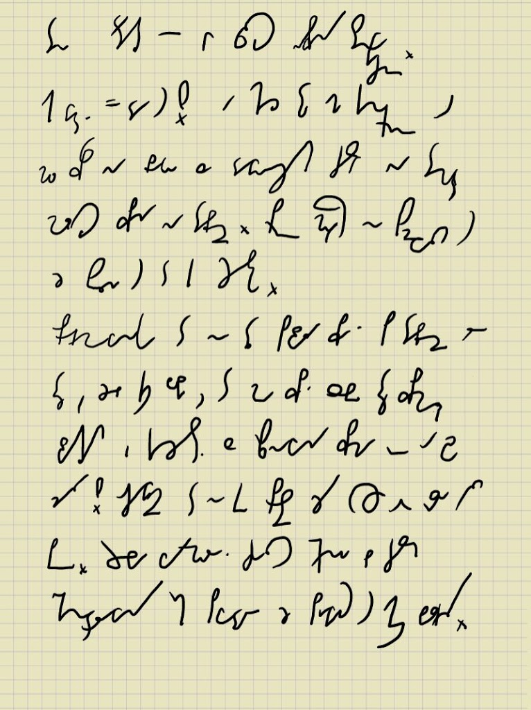
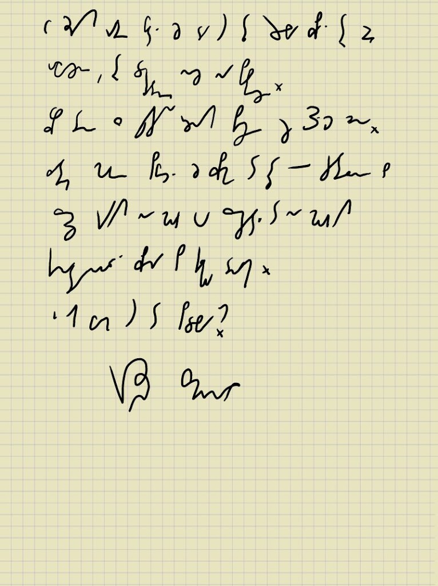

Ten artykuł jest w całości napisany stenograficznie.
Jak widać - da się! A chodzi tu mi konkretnie o
mój wpis na blogu z dawniejszych czasów na temat
możliwości pisania na tablecie. Prawdę mówiąc nie spodziewałem się,
że spełni się to tak szybko.
Oprogramowanko to nie tylko pozwala pisać po tablecie, ale
też, jeżeli ktoś lubi, to może pisać sobie też pismem
zwykłym i korzystać z rozpoznawania pisma które o dziwo
działa! Oczywiście to nie takie proste, żeby wszystko od razu było
piękne. Trzeba wyregulować czułość ekranu bo czasem
niekontrolowany ruch powoduje, że pojawiają się jakieś bazgroły.

W każdym razie widać, że da się, tylko trzeba pisać trochę bardziej
uważnie, trochę dokładniej niż na papierze.
Wpis ten z przyczyn różnych piszę już 3-ci dzień.
Zatem mogę powiedzieć, że pismo to też jest czytelne, bo
przecież gdybym nie mógł go przeczytać to nie mógłbym
kontynułować pisania po kilku dniach.
I jak Wam się to podoba?

Krzysztof Smirnow

