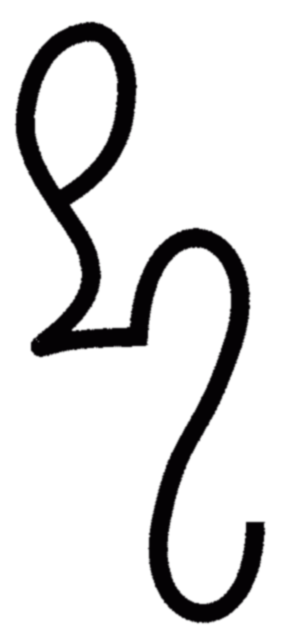
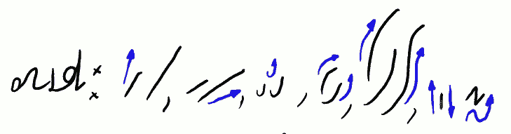

Zainspirowany pojedynczym (sic!) zapytywaniem do poprzedniego wpisu,
postanowiłem wrzucić próbkę dokumentu systemowego mojego systemu
**Ste***Mi,* który uprawiam z powodzeniem od lat kilkorga. Jak napisałem
poprzednio, wciąż brak mi metody składania głosek SZW-SZF, odpowiednio
też ŻW, co skutkuje też na takie rzadzizny jak DRZW, TRZW, ale w
stenografii dałoby się użyć też do SZEW-SZEF, -SZÓW, SZOW-SZOF, może i
SZAW-SZAF itp. Czyli boli. Może ktoś będzie miał pomysł?

## Zaczynamy kurs Ste*Mi*

System swój nazwałem **Ste*Mi*** (z wywijaniem czcionką dla
utrudnienia). Pierwsza sylaba nazwy to hołd wobec stenografii. Druga
sylaba to podziękowanie dla Mierosława Sucheckiego, którego system,
stworzony pod koniec XIXw. zainspirował mnie do porzucenia prac nad
metodami geometrycznymi i podjęcia badań nad metodą kursywną.

<!-- 

Symbol systemu **Ste*Mi***
-->



Zacznę od krótkiego objaśnienia:
Na obrazkach i w tekście wystąpią 3 kolory -
czarny, czerwony i niebieski.Czarny to kolor zwykłego
przekazu. Czerwony to żądanie uwagi i
koncentracji. Niebieski to
objaśnienia.

<!-- 

 *Skoro już mój system interesuje 1. osobę, może warto się wziąć za pisanie dokumentu systemowego? No to zaczynamy:* 
-->



Co jakiś czas pomiędzy osobisty bełkot blogowy, który tu nazywać się
będzie kursem **Ste*Mi***, wplatać będę inspirujące kawałki napisane
systemem. Jest to ćwiczenie dla mnie i dla Szanownych Czytelników.
Pozwala np.ocenić, czy system działa. Zanim przekażę dość wiedzy, żeby
na jej bazie robić konkretne przykłady.

<!-- 

* Samogłoski: A Y , E Ę, U (U), O (O), Ą (Ą) (Ą), I (I)*
-->



To chyba wszystkie samogłoski?

<!-- 

 *Spółgłoski: K G , P B ,H M , F(F) W(W) , S Z L , R* 
 *T D , Ś Ź , Ć DŹ , SZ Ż , CZ DŻ , C DZ Ł* 
-->



To nie są wszystkie spółgłoski systemu! Niektóre pozostawiłem na Lekcję
Drugą. 

Zwróćcie uwagę na sparowanie spółgłosek: w większości wypadków udało mi
się ustanowić towarzystwo dla dźwięków podobnych z podobnych znaków. W
stenografii walczą dwie tendencje. Jedna, to opisana przeze mnie wyżej,
druga mówi, że *znaki najszybciej pisane przypasować do najczęściej
występujących głosek (w uproszczeniu, metoda Franciszka Ksawerego
Gabelsbergera)*. Postanowiłem wybrać zasadę *dla dźwięków podobnych
znaki podobne (metoda Wilhelma Stolze)*, gdyż uważam, że dzięki temu być
może tracę nieco na prędkości pisania, ale zwiększam czytelność i
zmniejszam wymagania kaligraficzne systemu.

Jak widać, system jest fonetyczny, tj. ma opracowane znaki dla głosek
języka polskiego, nie zaś odpowiedniki liter naszego alfabetu. Korzyść z
tego jest np. taka, że nie ma problemów z ortografią, gdyż jest tylko
jedno Ż, jedno U itp. Występują inne niuanse, o czym będzie więcej w
dalszych częściach, ale wszystkie one podporządkowane są podstawowym
celom: czytelności oraz szybkości pisania.

Tu zwracam uwagę, że w moim systemie postawiłem dwa cele, w odróżnieniu
od samej szybkości, która jest celem większości systemów
stenograficznych. A stało się tak dlatego, że dążeniem moim było
stworzyć nie tyle sztywny system, co rodzaj narzędzia (po angielsku
zwanego framework), metody do zbudowania sobie własnego systemu do
pisania stenograficznego. W swojej podstawowej postaci zaś **Ste*Mi***
ma pozwolić zapisać każde słowo polskie w brzmieniu identycznym z
naturalnym. Od tej reguły, oczywiście, zdarzają się nieliczne wyjątki,
ale to naprawdę wyjątki.

<!-- 

Samogłoski się wznoszą, a spółgłoski opadają!*
-->



 To jest podstawowa reguła tworzenia znaków systemu. Jest to też
podstawowa wskazówka, jak należy znaki od siebie odróżniać w pierwszej
kolejności, zarówno podczas pisania, jak i odczytu.

Do zobaczenia w lekcji nr 2.
