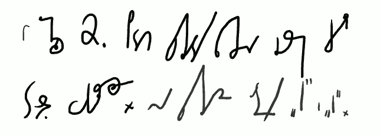
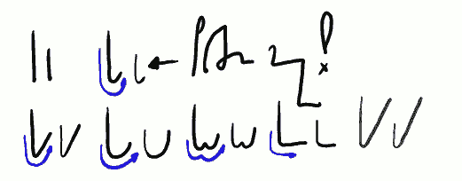
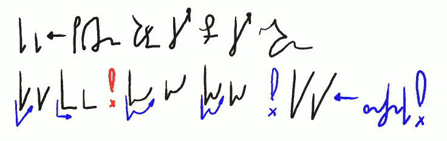
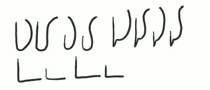
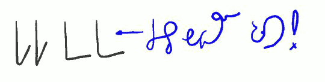

Witam w lekcji drugiej kursu **Ste*Mi***.

<!-- 
 
*W lekcji 2. podam przykłady łączenia głosek czyli tzw. wokalizacje. Na przykładzie litery "K" i "G".*
-->



Kiedy spółgłoska łączy się z samogłoską, moment ten nazywamy
**wokalizacją**. Powstaje prosta sylaba. Sylaba składa się z nagłosu
(zwykle, ale nie zawsze), głosu i (czasem) wygłosu. Nagłos to spółgłoska
zaczynająca sylabę, głos to samogłoska wokalizująca (czyli
udźwięczniająca) sylabę, wygłos, to spółgłoska zamykająca sylabę.
Czasem w nagłosach i wygłosach występują tzw.
grupy spółgłoskowe, czyli dźwięki złożone z kilku spółgłosek, na
przykład PRZEZ (PRZ+E+Z), WIERCH (W'+E+RCH).
Czasem w głosach występują tzw. grupy
samogłoskowe, czyli dźwięki złożone z kilku samogłosek, na przykład JEM
(IE+M), WEJŚĆ (W+EJ+ŚĆ).
Powyższe zalecam zapamiętać, żeby potem nie było zdziwienia, kiedy
traficie na tekst typu "TW nagłosowe pisze się identycznie jak
wygłosowe".

<!-- 
 
*K G(K G) &lt;- Połączenie miękkie!*
*KA GAKO GOKU GUKE GEKY GY* 
-->



Zwracam uwagę na wskazanie powyżej!
Niektóre spółgłoski (K, G, H, M, N, P, B) mają dwie metody wokalizacji:
miękką i ostrą. Połączenie miękkie, wbrew intuicji, oznacza wokalizację
pozbawioną uczestnictwa głoski I.

<!-- 
 
* KI GI &lt;- Połączenie twarde czyli ostre czyli jotowane* 
*KIA GIAKIE GIE!KIO GIOKIU GIU !KIY GIY &lt;- znaczniki!*
-->



Połączenie ostre czyli jotowane oznacza, że
w wokalizacji uczestniczy samogłoska I (i). Podobnie jak T w
spółgłoskach (o czym później), I pełni specjalną rolę pośród samogłosek,
gdyż nie tylko może wokalizować, ale też zmiękczać spółgłoski i w ten
sposób tworzyć nowe (K', G', H', M', Ń, P', B'). Warto wiedzieć,
że złożenia w polskiej ortografii liter np. K oraz I to zdaniem
fonetyków w rzeczywistości spółgłoska K' (K miękkie) oraz np. samogłoska
I (czemu nie?). Tłumacząc przykłady zwykle będę się posługiwał jednak
ortografią polską, zapis udający fonetyczny stosować będę tylko wtedy,
kiedy będzie mi się to wydawało potrzebne.
Uwaga! Pierwsze znaczniki: 
KIY = kiedy, GIY = gdy.

<!-- 
 
 

*KĄ KĄ GĄ GĄ KIĄ KIĄ GIĄ GIĄ* 
*KĘ GĘKIĘ GIĘ*
-->



Szczegółowe opisy poszczególnych liter, dla lepszego zrozumienia samej
idei pisania systemem **Ste*Mi***, pojawią się w dalszych lekcjach, na
początek chcę przekazać podstawowy zestaw informacji, abyście mogli od
razu cieszyć się zabawą w pisanie. Powyżej pokazuję (widać to było też w
lekcji nr 1), że np. wokalizację z Ą można pisać na co najmniej 2
sposoby, zależnie od potrzeby. Pismo stenograficzne to nie jest po
prostu stawianie liter obok siebie. Kształty znaków podążają za
dźwiękiem, powinny być rozwiązywane intuicyjnie.

<!-- 

*KA KIAKIĘ KĘ &lt;- często obowiązuje dowolność!*
-->



Wyżej pokazałem różnicę w odczycie wokalizacji KA i KIA. Jednak każde
dziecko (i dorosły) wie, że poza marką koreańskiego samochodu, sylaba
KIA występuje w języku polskim niezwykle rzadko. Zatem otwiera się pole
do pewnej dowolności twórczej: zależnie od
ochoty, gustu, umiejętności, czy wreszcie humoru, wokalizację KA można
pisać ostro i miękko. Zwykle i tak będzie to znaczyć właśnie KA.
A to dlatego, że aby napisać stenograficznie np. słowo
[autarkia](http://pl.wikipedia.org/wiki/Autarkia_(ekonomia)), trzeba je
najpierw znać! Oprócz tego oczywiście kontekst również ratuje sytuację.

Tu pojawiła się istotna kwestia związana z pisaniem stenograficznym:
Praktycznie nie da się pisać stenograficznie
(dotyczy to też systemu SteMi) pojęć, słów, których nie znamy! Brak
znajomości danego słowa skutkuje niemal nieprzekraczalną barierą
nieczytelności.
Na szczęście zawsze zostaje nam jeszcze stare, powolne tzw. pismo
długie, czyli nasze codzienne literki.

Powyżej wykazana dowolność dotyczy samogłosek A, E, Ą, Ę, czasem Y. Nie
dotyczy O, rzadko U.

Do zobaczenia w lekcji nr 3.
