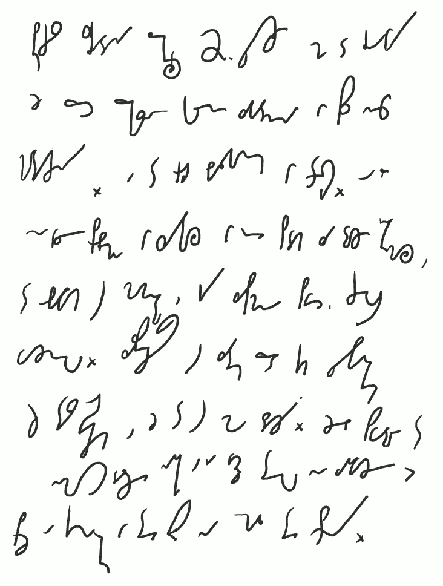

Jak zapowiedziałem wcześniej, pomiędzy lekcjami będę wstawiał dodatki
pisane czystym tekstem. Poniżej zatem uwaga techniczna do kursu napisana
pismem tzw. nieskróconym, czyli poza zastosowaniem gotowych i
oczywistych w użyciu znaczników nie posługuję się w nim żadną metodą
skracania słów i zdań.

 

*Podczas składania Lekcji 2. przyszło mi do głowy*

*że przecież przekazuję kolejne zagadnienia w sposób nieco* 

*chaotyczny. A to grozi bałaganem w treści. O ile*

*nie widzę problemu w sytuacji w której podam za dużo informacji,*

*to obawiam się momentu, gdy zapomnę powiedzieć czegoś* 

*ważnego. Zabezpieczając się zatem przed takim przypadkiem* 

*już teraz oświadczam, że to się może zdarzyć. Jeżeli spowoduje to* 

*niemożność dalszej nauki a ja wciąż tego nie zauważę bardzo* 

*proszę o kontakt w tej sprawie na email tej strony.* 

Jednocześnie przepraszam za interpunkcję. Jak widać, podczas
stenografowania nie ma ona takiego znaczenia i umysł mój ją odruchowo
pomija.

Do zobaczenia w lekcji 03.
