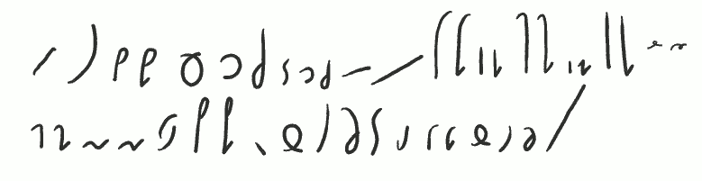

Witam w lekcji nr 03 kursu **Ste*Mi***.

Lekcję tę zaczniemy od małej powtórki, czyli listy podstawowych liter
alfabetu **Ste*Mi***:

-----------------

*Lista podstawowych znaków czyli liter:* \
*A E I O U Y Ą Ę* \
*K GKI GIP BPI BIH MHI MIN Ń* \
*F WFI WIT D* \
*S Z LR SZ Ż* \
*C DZ ŁĆ DŹCZ DŻ* \

-----------------

A oto znaki **Ste*Mi*** w kolejności, w jakiej przyzwyczailiśmy się
recytować je w szkole podstawowej:

-----------------

*A Ą B B' C Ć CZ D DŹ DŻ E Ę F F' G G' H H' I J(I) K K' L Ł* \
*M M' N N' O(O) P P' R S Ś SZ T U W W' Z Ź Ż Y* 

-----------------

Jak widać, kiedy postawi się je w "tradycyjnej" kolejności, podobieństwa
już nie są tak bliskie...

Skoro jest to powtórka, to zaznaczę raz jeszcze: **Ste***Mi* jest systemem sylabicznym. To znaczy, że
kiedy już wyłożę tu podstawy pisma, bez problemu będzie można nauczyć
się pisać z prędkością przeliczalną wg wzoru: 1 sylaba = 1 znak. Czyli
na pierwszym etapie nauki systemu zgłębiamy sztukę budowania sylab
języka polskiego. Jest to odmienne podejście od szkolnego. Niezbędne
wobec utrwalonych głęboko nawyków.

Kiedy zaczniecie pisać w **Ste***Mi,* najpierw nauczycie się dzielić
wyrazy na sylaby. Bo w wersji tak zwanej nieskróconej, czyli takiej, w
której technik czysto stenograficznych używa się bardzo rzadko lub zgoła
wcale, systemu **Ste***Mi,* poszczególne znaki buduje się sylabami.
A to dlatego, że myśląc, jak napisać "Brzęczyszczykiewicz", czy może
"Wzdręgaprztyśćnicki", układamy wyraz sylaba po sylabie. Czyli najpierw
zastanawiamy się, jak napisać "Brzę-", potem łatwe "czy", "szczy",
"kie", "wicz". "Wzdrę-", "ga", "prztyść", "nic" i wreszcie "ki". I
zrobione. Jeżeli powoli nam idzie, możemy te sylaby postawić jedna za
drugą, bez łączenia ich w jeden wyraz. Mózg nasz i tak się połapie, a
nawet będzie mu łatwiej to później odczytać.

Powyższa wskazówka ma zastosowanie także do pisania wyrazów, które
dopiero poznajemy, ewentualnie wyrazów obcojęzycznych, których napisania
uniknąć nie możemy.

Poniżej pierwsze grupy spółgłoskowe:

-----------------

*Pierwsze grupy spółgłoskowe:* \
*ŚĆ SZCZ ST SP(SP) ! ZB SK ZG SF ZW* \
*KSZ GRZ PRZ BRZ TRZ DRZ STRZ ZDRZ WSZ WRZ !* 
*wszech-zawsze*

-----------------

Grupy spółgłoskowe, czyli wielodźwięki (polifony?) ze spółgłosek. Bardzo
często występują w naszej Mowie Ojczystej i nic na to nie poradzimy.

*ŚĆ (teść, ścierka, ściółka)* powstało z
powiększenia *Ć* lub połączenia *Ć z Ś*, albo...

... Technikę tworzenia znaków alfabetu **Ste***Mi* omówię w dalszych
rozdziałach (lekcjach).

Znak *SZCZ (deszcz, szczelina)* to nieco
powiększone SZ oraz dodatkowy zawijas podczas kreślenia pętelki.

Znak *ST* (bardzo często występuje!: *test, stacja, stolica*...) 
to pętla *S* przed napisaniem *T*. 
Tak samo tworzy się nie pokazaną grupę *ZD*.
Znak *SP* (Sparta, wesprzeć, wyspa) to powiększona pętla *P*. 
Można ją powiększać wg uznania, byle piszący
(lub inny adresat) mógł to później odczytać. 

Uwaga! Grupy SP używa się także do zapisu brzmienia *ŚP* (pośpiech, śpiew)!

Uwaga! Grupa *ZB* (zbierać, pozbyć) pisze się inaczej, tj. *Z* "dokleja" się do *B*,
co widać na malutkim przykładzie powyżej.

Tą samą metodą łączy się grupę *SK* (skok, troska) oraz *ZG* (zgasić,
rózga). Podobnie, choć nie identycznie, łączy się grupy *SF* (*SW* - swój,
swędzi) oraz *ZW* (zwada, pozwany).

Innymi słowy, grupy spółgłoskowe starałem się zdefiniować tak, aby były
możliwie podobne do zgrabnych i czytelnych połączeń odpowiadających im
głosek składowych. Jednocześnie wybrane zostały różne sposoby łączenia
(zlewanie - *ŚĆ, ST, ZD* powiększanie i zniekształcanie - *SZCZ, SP*,
dopisywanie - *ZG, SK, ZG*, nadpisywanie - *SF, ZW*), a to dlatego, aby
ułatwić później odczytanie stenograficznych bazgrołów. Im więcej
informacji zostanie ukryte w znakach, tym łatwiej później czytać.
Zapamiętać zatem należy, że w przeciwieństwie
do pisma długiego, w systemie **Ste***Mi* istotne jest nie tylko, jak
wygląda litera, ale również w jaki sposób łączy się z następną.

Poniżej omawiam wyjątkową (choć nie całą) grupę grup spółgłoskowych.
Widać ją też na ilustracji powyżej, ale teraz patrzymy się poniżej:

-----------------

*KSZ GRZ PRZ BRZ TRZ DRZ STRZ ZDRZ WSZ WRZ* !  *wszech-zawsze*

-----------------

Nazwijmy to roboczo i z rosyjska "*uszypiaszczeniem*". Czyli mówimy o
grupach spółgłoskowych, gdzie głoska łączy się z *SZ* (bezdźwięczne), lub
Ż* (dźwięczne).

Uwaga! Warto zwrócić uwagę, że zwykle w języku
polskim połączenie głoski bezdźwięcznej z dźwięczną skutkuje
ubezdźwięcznieniem takiej grupy spółgłoskowej! Będzie to miało
wpływ na możliwości twórczego łamania ortografii
systemu **Ste***Mi* podczas szybkiego pisania, bez szkody dla
czytelności. Im lepiej znamy nasz język, tym łatwiej w nim pisać i
czytać.

Metoda *uszypiaszczenia* grupy lub głoski
polega na pochyleniu jej w lewo, tj. przeciwnie do
kierunku (poprawnie byłoby "zwrotu", ale nikt tak nie mówi) pisma. Stopień pochylenia zależy od uznania piszącego.

Powyżej pokazane sąniektóre litery, które podlegają tej regule. Tak
samo zapiszemy np. *CHRZ* (chrzan) i *MSZ* (msza)/*MŻ* (mżawka). 
Brzmienie *MŻ* grupy występuje znacznie
częściej. Stosuje się ją też do powiązanych grup spółgłoskowych,
czyli np. *SKRZ* (skrzek, skrzyp), *ZGRZ* (zgrzybieć, zgrzew), *SPRZ*
(sprzedać wesprzeć), *ZBRZ* (zbrzydnąć), *WSTRZ* (wstrzelić, wstrzyknąć).

Zapisanie w tabeli wszystkich grup spółgłoskowych jest zadaniem na
oddzielną lekcję tego kursu.

Uwaga! Jeżeli podczas pisania wyrazu sądzimy,
że uszypiaszczona (lub dowolna inna) grupa może się stać nieczytelna
(np. w wyrazie "komża" lub "Łomża"), zawsze możemy użyć mniej wygodnego
w zapisie, lecz znacznie czytelniejszego połączenia przez zestawienie
(np. *M+Ż* w wyrazie "komża" lub "Łomża").

Na końcu zestawienia, po czerwonym wykrzykniku, widać dwa nowe
znaczniki: *-WSZECH-* i *ZAWSZE*. Wyraz "zawsze"
jest nieodmienny i nie skleja się z innymi. Łatwo ten znak
zapamiętać i używać. Znacznik *-WSZECH-* używany jest przede wszystkim dla
oddania (po dopisaniu końcówki gramatycznej) słowa "wszystko". Przy
zastosowaniu zgodnym z brzmieniem (np. powszechny, Wszechświat), pisze
się go bez sklejania z resztą sylab wyrazu. Sylaba poprzedzająca (np.
PO-) zawsze pisana jest oddzielnie. Sylaba następna (np. *-NY*) może być
pisana łącznie, jeżeli nie zagraża to czytelności wyrazu (w wypadku
słowa "powszechny" nie zagraża).

Do zobaczenia w lekcji czwartej!
