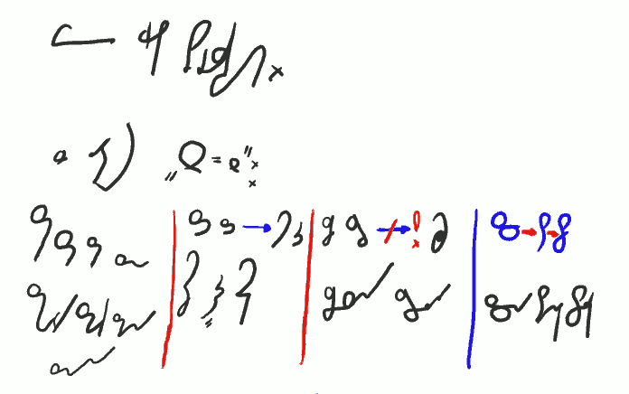
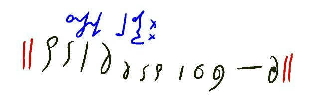
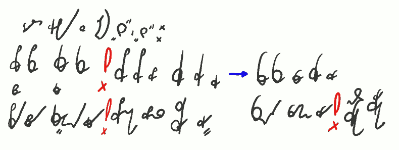

I tak zaczyna się lekcja czwarta. Mam nadzieję, że czytelnicy tego blogu
wiedzą, że obrazki te można powiększać. Inaczej mogą być trochę
niewyraźne. Dokładam starań, ale brak mi recenzenta. Tak czy owak,
pochodzą z ekranu tabletu, po którym kreślę rysikiem. Tak jest znacznie
szybciej, niż gdybym pisał po papierze, skanował, później obrabiał.
Znaczy, obrabiać i tak muszę, ale też mniej.

------------------

 

*Więcej grup spółgłoskowych.* \
*Z literą "S - Z":* \
*SH(Sch) SM ZM ZN  |  SĆ ZDŹ **-&gt;** ŚĆ ŹDŹ  |  SCZ STRZ **-&gt;** !SZCZ  |  SC **-&gt;** ST **-&gt;** STO* \
*schody smak zmiana znana  |  ścisz Ździś ściek  |  sczesany strzelała  |  scena stanik stolik*

------------------

Powyżej zatem jeszcze trochę grup spółgłoskowych. Jak widać, większość
znaków łączę w taki sposób, że zestawiam ich kreski, gdzie kończy się
poprzednia, zaczyna następna. Ale nie jest to obowiązkowe. W dalszych
lekcjach pokażę też zagadnienie utrzymania linii pisma. Niektórym może
na tym zależeć.

Mnie za to zależy, aby system nie narzucał piszącemu zbyt wielu reguł. A
zatem kwestię, czy ktoś chce pisać w linijkach, czy może hasać po
kartce, pozostawiam samym piszącym.

------------------

 

*Znaczniki 1-literowe:* \
*|| stan to tak już że do zdanie go co coś jest jeszcze ||*

------------------

Stenografia nie byłaby stenografią, a jedynie jeszcze jednym, trudnym do
opanowania alfabetem, gdyby nie zawierała choćby bazowego zestawu
znaczników. Powyżej trochę większa porcja, niż w poprzednich lekcjach.
Zwróćcie uwagę, że w większości są to słowa nieodmienne! Jednym z
poważnych "problemów" polskiej stenografii jest właśnie odmiana wyrazów.
Mnogość różnych końcówek i form, z jednej strony pozwala Polakom wyrazić
bardzo delikatne niuanse i różnice znaczeniowe, z drugiej, powodują, że
mamy znacznie więcej pisania od np. Anglików. Anglosasi, jak już raz
opanują dany obraz słowa, do końca życia używają go w ten sam sposób. Po
polsku każde słowo ma kilkanaście form podstawowych i mnóstwo jeszcze
różnych pochodnych (typu mrówka - mrowić - mrowisko).

Powyżej podane znaczniki starałem się uczynić jak najbliższymi znanym
nam ze szkoły i innych miejsc skrótom. Mam nadzieję, że dzięki temu
narzut na pamięć nie jest zbyt wielki.

Zastanawiałem się długo, czy odwieczna metoda nauczania stenografii,
polegająca na sprzedawaniu znaczników od samego początku, jest dobra.
Teraz sądzę, że tak. Znacznik, raz opanowany, przyspiesza i zapis, i
odczyt, w miejscu, w którym zostanie postawiony. Stąd wniosek, że im
więcej znaczników, tym szybciej można stenografować. Moje badania
stenogramów polskich mistrzów potwierdzają taką konkluzję. Ale nie jest
to obowiązkowe dla wszystkich. W końcu, żeby szybko pisać, czasem też
trzeba szybko myśleć ;-).

------------------

 

*Dalej grupy z literą "S" i "Z":* \

*PS PS KS KS **!** PIS PIZ BIZKIS KIZ GIZ **-&gt;**FS(WS) WZ FIS WIZ* \
*BZ      GZ* \
*psy bzy Ksawery gzy **!** pisanka biznes skisła Giza wstała wzajemnie wiza **!** nazwisko urwisko*

------------------

 Wielkim problemem dla polskiej stenografii jest również fakt, że niemal
wszystkie głoski łączą się ze wszystkimi. Tak to przynajmniej wygląda
dla nieuzbrojonego oka. Powyżej pokazałem nawet złączenia KIZ i GIZ,
które zapewne wystąpią w pojedynczych wyrazach - ale przecież również te
wyrazy powinniśmy móc zapisać! A może przesadzam?

W tej chwili przeraża mnie perspektywa stopniowego przedstawiania, po
kolei, wszystkich polskich grup spółgłoskowych. Mam nadzieję, że nie
będzie to konieczne - niektóre połączenia liter są oczywiste,
przynajmniej dla mnie ;-).

Zwróćcie uwagę na ostatnie słowo po czerwonym wykrzykniku. NAZWISKO - aż
się prosi, żeby użyć znacznika. I myślę, że tak w praktyce się stanie.
Ale system SteMi ma pisać każde polskie słowo. A NAZWISKO okazało się
dla niego szczególnie trudnym wyzwaniem. Przynajmniej, dopóki ja trzymam
w przedniej łapie pisak - muszę przedłużyć literę W, aż w praktyce staje
się F - wtedy wszystko się mieści zgodnie z regułami. To jedna z
przyczyn, dla której utrzymałem sparowanie podobnych głosek w podobnych
znakach.

Do zobaczenia w lekcji piątej!
