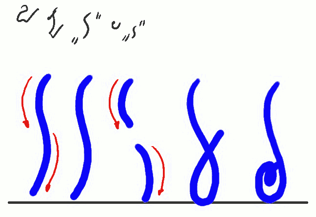
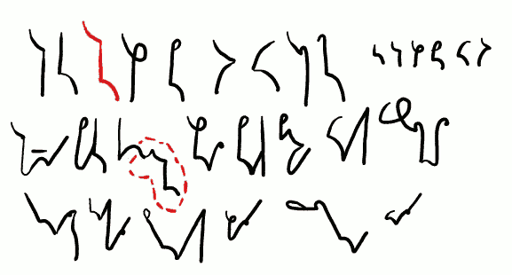
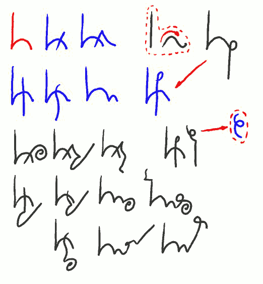
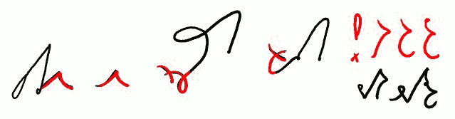

Witam. W lekcji piątej. Dziś zajmiemy się szybko literą i głoską T.

-------------------

Dziwna litera "T" lub "D" \
**T T T TO TI(TJ)** \
(**D D D DO DI(DJ)**)

-------------------

Zwracam uwagę na dwa ostatni znaki: *TO* i *TI*. Zastosowane rozwiązania,
szczególnie *TO*, nie powtarzają się w systemie. Znak *TI* zbudowany jest
zgodnie z regułą, którą przedstawię w następnych lekcjach.

Litera *T* jest specyficzna w zbiorze znaków
SteMi. W całości pisze się jak smukły, pionowy wężyk. Ale Niemiec
(przepraszam, pies, oczywiście, pies) pogrzebany jest w łączeniach *T* z
innymi spółgłoskami. Do tego celu dzielimy ją na pół i okazuje się, że w
rzeczywistości składa się ona z dwóch, pochylonych nieco w lewo,
łuczków.

Tutaj zrobię przerwę i powiem coś na temat miar pisma. Pojęcia linii
pisma, miary pisma, powstały zapewne gdzieś w okolicach Średniowiecza,
kiedy kończyły karierę swoją skryptoria, czyli miejsca, gdzie książki
przepisywano ręcznie, a zaczynały pojawiać się drukarnie (co osobnego
wyjaśnienia chyba nie potrzebuje). Zatem po raz kolejny uzupełnimy tutaj
swoją wiedzę, na początek przy pomocy wikipedii, która powie nam, co to
jest [**linia bazowa pisma**](http://pl.wikipedia.org/wiki/Linia_bazowa).

Oprócz linii bazowej, zwykle w piśmie występują także linia środkowa,
górna i dolna. Odległość pomiędzy liniami bazową i środkową stanowi
miarę pisma (x-height). Stąd w wielu podręcznikach stenografii mówi się
o znakach dwumiarowych (w przypadku SteMi to głoski bezdźwięczne za
wyjątkiem *Ć*), jednomiarowych (w przypadku SteMi to liczne głoski
dźwięczne) oraz np. półmiarowych (w przypadku SteMi to niektóre głoski
dźwięczne). Może się okazać, że strzeli mi do głowy, żeby użyć tego
słownictwa przy dalszych objaśnieniach. Z punktu widzenia powyższego,
litera T jest dwumiarowa, a listera *D* - jednomiarowa.

Takoż z punktu widzenia powyższego pierwsze objaśnienie dotyczące linii
pisma: system SteMi należy uznać za bezliniowy. Czyli taki, który nie
trzyma się linii pisma kurczowo, a zarazem położenie znaków względem
linii nie wpływa na ich odczyt. Oczywiście, jest to kolejna sprawa,
którą pozostawiam do uznania użytkowników systemu. Jeżeli kiedyś uda mi
się zaprojektować czcionkę do SteMi, siłą rzeczy będzie musiała być
dowiązana do linii bazowej. Ale w piśmie odręcznym nie ma takiego
obowiązku.

-------------------

*TK KT **TKT**Lekcja TP PT TW(TF) WT(FT) HT TH GD DG DB BD WD DW* \
*tkanina pakt kon(takt) deptał ptak bitwa wtyk westchnął* \
*kształt gdakała prztyk dbała przechrzta wdała*

-------------------

Powyżej widać grupy spółgłoskowe, czyli (uwaga, nowe słówko!) *FIKSY*, bo tak nazwałem wszelkie złożenia znakowe, dla których nie stosujemy zamian. 
Tak to należy pisać i już. 

Zwracam też uwagę
na wyrazy przykładowe. Wyraz "*tkanina*" zawiera nie tylko fiks T*K*, ale
też tzw. echo. Jeżeli w wyrazie występuje podwojone brzmienie i
dla dobra czytelności trzeba je zapisać,**można** to
zrobić przez oznaczenie tego miejsca kreseczką poziomą nad znakiem, lub
równoległą do podwajanego znaku/fiksu. Dotyczy to szczególnie sylab z
"*nie*", "*nia*" itp. i wyrazów takich jak np. 
**tkanina, dzianina, pisanina, odpocznienie, wytchnienie, ale też lekko, miękko, zzuć, ssać**. 

Nie ma przeszkód by twórczo wykorzystywać tę regułkę także dla
wyrazów, które dawno temu zawierały "*nienie*", ale już nie zawierają, jak
np. **rozumienie, mienie**.

Drugim oznaczonym miejscem jest fiks *TKT*, samotnie i w wyrazie
**kontakt**. Wyraz ten jest dość często używany dziś we wszystkich
odmianach, więc zapewne doczeka się jakiegoś znacznika. Na razie
doczekał się stałego skrócenia i pisze się **KONTKT**, przy czym początkowe
*KON-* to również fiks oznaczający...

-------------------

**KON** kontra kontrakt (**K+ON**) *KONP/KOMP* \
*komórka komputer komun/komuni kompr-/kompara-* \
*kontrakcja kontraktowy kontraktor kompara+tystyka (TST) -tysta, -tyst-, -tast- test tekst* \
*komórkowy komputerowy komunikacja dekomunizacja* \
*komputeryzacja komunalny komunizm* 

-------------------

... i tu właściwie trzeba by zacząć następną lekcję, zanim się skończyła
poprzednia. Zatem tylko zaznaczę przez pokazanie serii słów i
znaczników, jak się używa fiksu *KON*. A przy okazji pojawił się fiks
*TST* i zagadnienie niejednoznaczności,
ale jeszcze zostanie to omówione w przyszłości.

Tak, coraz więcej zagadnień przenosi się do przyszłości.

-------------------

*przykł**ad od drż**ących **trw**ałych  **! -tew/tow- -two/stwo-listwo*** \
*brzytew obrzydlistwo*

-------------------

Na koniec prezentacja kilku innych słówek i fiksów, które pokazują, jak
należy stosować literę *T*. W przypadku słowa "*przykład*" nie jest to
obowiązkowe. Słowo "*od*" przybrało taką formę na stałe, także wtedy,
kiedy występuje razem z innymi (np. odbębnić, odrobić). "*Drżących*" i
"*trwałych*" pokazują, że mogą występować grupy więcej niż 2 spółgłosek. A
przy okazji sygnalizują kolejne zagadnienie do omówienia w przyszłości:
oznaczanie R przez przekrzyżowanie.

Po czerwonym wykrzykniku mamy grupę *TW*,
którą w stenografii od razu adaptujemy (co nie jest, powtarzam, obowiązkowe)
do sufiksu *-TEW* (kotew, brzytew) 
i prefiksu *TOW*- (towar, towarzystwo), 
i co tam nam jeszcze do głowy wpadnie. 
Oczywiście, adaptujemy to też do 
*-TÓW* (gotów, lotów itp.), 
ale także do 
*-DW*, który o tyle się różni, 
że staramy się (niezbyt usilnie) napisać go mniejszym. 
Z *-DW* mamy znowuż *DEW-* (dewastator, dewiant), 
*-DÓW* (godów, lodów, schodów, przewodów), 
*DOW-* (dowód, dowieść) i temu podobnych.

Dalej mamy fiksy 
*-TWO/STWO/CTWO* (brzytwo, Litwo, żydostwo, matactwo) i
*-LISTWO/LSTWO* (obrzydlistwo, nauczycielstwo), 
jako uzupełniający.
Podstawowy jest oczywiście *-TWO/STWO/CTWO*. 
Wszelkie utrudnienia języka polskiego, jak np.
*-listwo*, *-ństwo*, *-rstwo*, *-lstwo* możemy zapisać przez fiks *-TWO*, albo
dorabiać wcześniej brakujące znaczki. 
Wszystko zależy od tego, kto będzie to musiał później odczytać.

Do zobaczenia w lekcji szóstej!

### Dotychczas ukazały się lekcje:

- [01](../2013-02-28_kurs-stemi-lekcja-01/)
- [02](../2013-03-04_kurs-stemi-lekcja-02/)
- [0201](../2013-03-08_kurs-stemi-lekcja-02-dodatek-01/)
- [03](../2013-03-12_kurs-stemi-lekcja-03/)
- [04](../2013-03-16_kurs-stemi-lekcja-04/)

