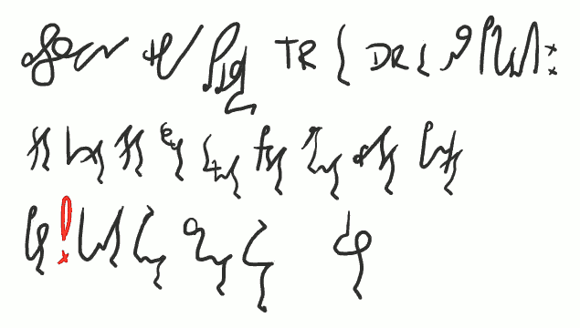
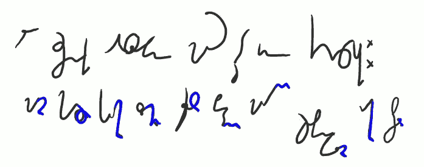
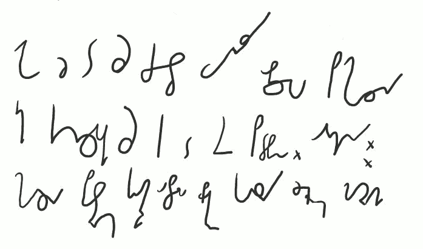

Witam w lekcji szóstej. Po ciężkim materiale poprzednio, dziś dla
rozrywki porcyjka nieduża i łatwa do przyswojenia:

---------------------

*Zastosowania grupy spółgłoskowej TR DR oraz pochodnych:* \
*traktor kontraktor atraktor destruktor Terminator Predator alternator wizytator pankrator* \
*pasterz**!**korytarz referendarz cmentarz refektarz kwestarz*

---------------------

Czyli mamy tu do czynienia z końcówką tworzącą czyniących z czynności.
Przy czym bardzo wiele wyrazów w tej grupie to starzy, odwieczni
imigranci do kraju języka polskiego, z różnych innych języków.
Zaadaptowani czasem tak, że trudno ich już odróżnić od macierzystych
wyrazów. Kto wie zresztą, czy w niektórych wypadkach ruch nie odbywał
się w drugą stronę?

---------------------

 

*Ale rzeczowniki odsłowne mają też inne końcówki:* \
*ma**cierz** har**cerz** ku**charz** zło**miarz** ślu**sarz** bed**narz** mary**narz** szopenfel**dziarz** ra**karz** sto**larz*** 

---------------------

Oczywiście, wyrazów tych jest bez liku. Pokazuję tu tylko kilka
przykładów, które pierwsze mi się przypomniały, byle miały inne
końcóweczki.

---------------------

 

*Jako że to są często wyrazy obcego pochodzenia* \
*ich końcówki są tak do siebie podobne. Odmiany:* \
*har**cerza** pa**sterzom** ku**charzowi** o sto**larzu** bru**karze** kor**sarzy** żeg**larzem** ma**cierzami***

---------------------

Jak widać, lekcja krótka, łatwa i przyjemna. Do następnego razu, czyli
do lekcji siódmej!

---------------------

### Dotychczas ukazały się lekcje:

- [01](../2013-02-28_kurs-stemi-lekcja-01/)
- [02](../2013-03-04_kurs-stemi-lekcja-02/)
- [0201](../2013-03-08_kurs-stemi-lekcja-02-dodatek-01/)
- [03](../2013-03-12_kurs-stemi-lekcja-03/)
- [04](../2013-03-16_kurs-stemi-lekcja-04/)
- [05](../2013-03-20_kurs-stemi-lekcja-05/)

