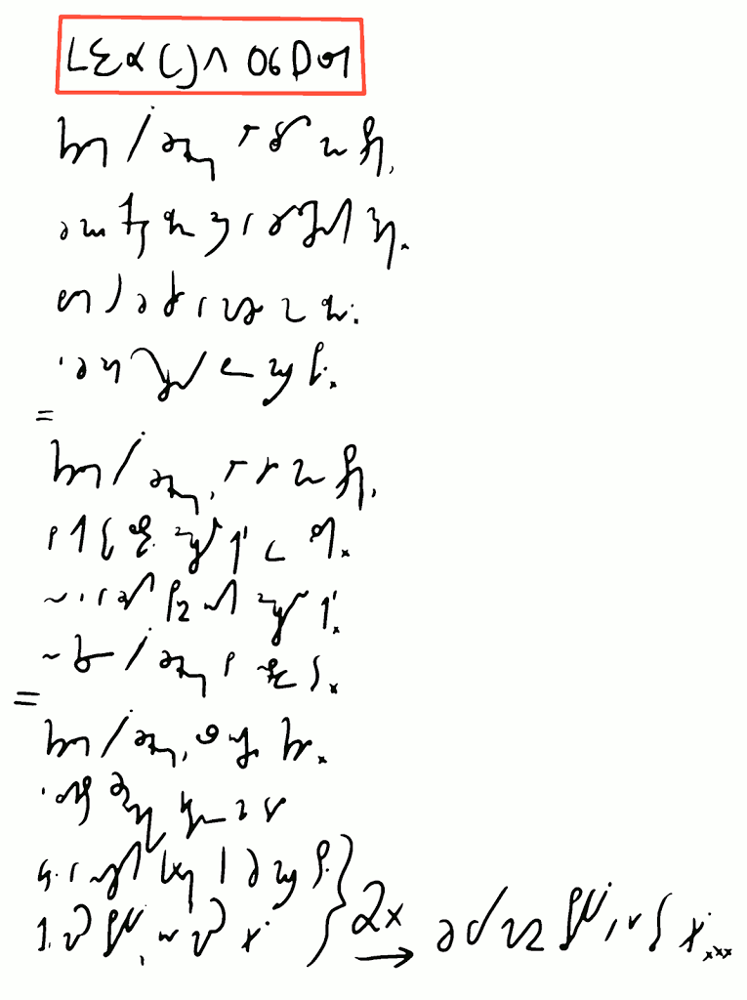

Dziś czytanka. Ładna piosenka autorstwa Andrzeja Koryckiego:

 

 

*Chciałem być żeglarzem, ale wziął mnie strach,* 

*Że mój okręt zginie gdzieś w żarłocznych mgłach.* 

*Bałem się, że człowiek w morzu może zgnić.* 

*I że rum ochrzczony będę musiał pić.* 

*=*

*Chciałem być żeglarzem, ale wziął mnie strach,* 

*Bo jak tu zostawić dziewcząt sto we łzach.*

*No i w każdym porcie innych dziewczyn sto.* 

*Nie chcę być żeglarzem, bo niezdrowe to.* 

*=*

*Chciałem być żeglarzem, los inaczej chciał.*

*I zamiast sztormiaka gitarę mi dał.* 

*Widać w naszych kartach tak już musi stać/ 2x* 

*Jedni mają pływać, inni mają grać./ -&gt; Że wy macie pływać, a ja tylko 
grać...* 

------------------------------

Do zobaczenia w lekcji siódmej!

------------------------------

### Dotychczas ukazały się lekcje:

- [01](../2013-02-28_kurs-stemi-lekcja-01/)
- [02](../2013-03-04_kurs-stemi-lekcja-02/)
- [0201](../2013-03-08_kurs-stemi-lekcja-02-dodatek-01/)
- [03](../2013-03-12_kurs-stemi-lekcja-03/)
- [04](../2013-03-16_kurs-stemi-lekcja-04/)
- [05](../2013-03-20_kurs-stemi-lekcja-05/)
- [06](../2013-03-24_kurs-stemi-lekcja-06/)
- [0601](../2013-03-28_kurs-stemi-lekcja-06-dodatek-01/)
