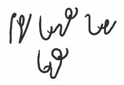
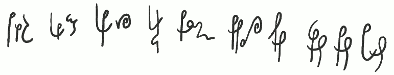

Zajęło mi to dużo czasu, bo znalazłem się w pewnym kłopocie (pomijając
wiosenne przesilenie nastrojów). Otóż, co nie wymyślę jakiegoś wyrazu na
przykład, to się okazuje, że to nie jest taki "goły" przykład, tylko od
razu zahacza o inne reguły, których jeszcze Wam nie podałem. Oczywiście,
co muszę zaznaczyć raz jeszcze i będę to powtarzał: **Ste*Mi*** jest
systemem otwartym, jego reguły nie są ustalone w sposób skończony,
stanowią raczej propozycję, niż nakaz. Jeżeli znajdziecie lepsze
rozwiązanie jakiegoś problemu, zostanie to do systemu włączone. Taki
stenograficzny OpenSource ;-).

Dziś lekcja trudna, bowiem dotyczy właśnie takiej "twórczej" reguły:
przekrzyżowanego R.

-------------

*Zastosowanie litery "R" przekrzyżowanej: \
trwała krwisty Piotrek atrakcja konstruktor konstrukcja kryształ barka \
kranik kastrat premier Brema krecha kręty zakręty pokrętny wyrwana*

-------------

 Przekrzyżowanie wydatnie skraca czas pisania, o ile jest dobrze
wyćwiczone. Poza tym jest bardzo czytelne. Głoskę "*R*" wstawiamy pomiędzy
krzyżujące się litery. Jest to raczej metoda, niż zasada. W
przeciwieństwie do twórców starych podręczników wolę po prostu pokazać
przykłady zastosowań, niż opisywać reguły, z których by wynikało, że
moim zdaniem zastosowanie przekrzyżowanego "*R*" pomiędzy *E i Ć/DŹ*
(śmierć, śmierdzi) nie ma sensu. Podobnie nie ma sensu krzyżować
czegokolwiek z *S/Z* oraz *C/DZ*. Myślę, że po pierwsze, Wam może to wcale
pasować (bo czemu nie? np. w wyrazie "*serc*"), a poza tym, jeżeli komu
nie pasuje, to po prostu tego nie używa i już. Ja używam tej metody tak
często, jak mogę, bo, jak powiedziałem wyżej - jest czytelna i szybka.
W powyżej pokazanych wyrazach, proszę wycieczki, pokazałem
wszechstronność zastosowania; zarówno w zapisie stenograficznym, jak i
budowaniu grup spółgłoskowych. Znaczy, krzyżujemy, gdzie się da i co się
da. Głoska *R* występuje dość często.

Mamy zatem wyrazy *trwała* i *krwisty*, gdzie mamy złożenia TRW i KRW.
Te grupy znajdą też zastosowanie w stenografii dla oddania końcówek
*-trów* i *-krów*, a dla odważniejszych też w rozpoczęciach takich jak
jak *traw-, trew-, tref-, kraw-* etc. w ale o tym będzie też w dalszych
lekcjach.

W słowie "*konstruktor*" jest błąd. Miało być *KON-ST+TR*, a nie
*KON-ST+KR*. Moja bardzo wielka wina. O końcówkach obcych już wspominałem,
będzie o tym więcej.

-------------

*porysowana miarę koloryt skarpetki wyręby kaloryfery parking stenografia \
 wyrywny wyrywana przeglądarka śmieciarka programowanie skrypt skryptowy programista*

-------------

Przypadkiem natrafiliśmy na jeszcze jeden "*knyf*" stenograficzny: litera
*P* może być czytana jako *PO*, która to sylaba, szczególnie na początku,
występuje dość często. Zatem wszelkie przekrzyżowania z *P* na początku
wyrazu sprawdzamy, czy przypadkiem nie czyta się *PO+R*. Litera *P* za to pisana oddzielnie (z odstępem mniejszym niż międzywyrazowy) zawsze czytamy jako *PO*.

Kolejna ciekawostka pojawia się przy wyrazach *wyrywny* i *wyrywana*.
Choć **Ste*Mi*** nie wymaga ścisłego trzymania się linii pisma, to
przecież nieliczne wyrazy w języku polskim mogą powędrować w górę lub w
dół kartki: *wyrywany, wyrazy, narysowany* itp. Dla zaoszczędzenia
miejsca zatem, jeżeli pojawia się złożenie *YRY*, możemy zapisać je jedną
kreską *Y* przekreśloną znakiem *R*, czyli krótką, ukośną kreseczką. Jak
zobaczycie niżej, mnie, jako leworęcznemu, zdarza się pisać ową
kreseczkę przechyloną w drugą stronę - ale nie ma to wpływu na
czytelność, bowiem przekrzyżowanie zawsze
oznacza *R* i tego należy szukać podczas deszyfracji tekstu.

-------------

*Karakorum Kraków Wrocław Krosno Skaryszew*

-------------

Powyżej kilka przykładów nazw własnych pisanych z przekrzyżowaniem.
Nazwy własne (co będzie też omówione w sposobach wspomagania
interpunkcji) oznaczamy dwiema kreseczkami pisanymi pod wyrazem. Jest to
jeden ze sposobów.

-------------

*karate marazm erem kara miara miary heretyk berek*

-------------

Nie wszystkie połączenia *XRX* (dowolna litera, *R*, dowolna litera - 
w notacji stenograficznej *X* oznacza dowolną głoskę/literę, 
*C* oznacza spółgłoskę *consonant*, 
*V* oznacza samogłoskę *vowel*) 
mają sens, by pisać je z przekrzyżowaniem. 

I tak np.
*ARA*, *XRĆ* czytelniejsze są, gdy użyjemy po prostu znaku *R*. Ale oprócz
połączenia *YRY*, specjalnemu przekrzyżowaniu ulegać może (pamiętamy:
wolność, każdy robi, jak chce) połączenie *ERE* i *ERĘ*, jak widać na
przykładzie poniżej.

-------------

*erem heretyk berek sferę*

-------------

Mnie w każdym razie tak pisać łatwiej, a i czyta się łatwiej. A to
dlatego, że *Ę* rzeczywiście pochodzi od *E*, zatem nawet pomyłka w długości
kreski w żadnym stopniu nie zmniejsza czytelności wyrazu.

-------------

*porosty koromysło choroba \
koromysło*

-------------

W poprzednich lekcjach wspominałem już o wokalizacji. Przypomnę: wokalizacja to udźwięcznianie spółgłoski przez
samogłoskę. W piśmie stenograficznym może to oznaczać (i tylko takie
sytuacje wymagają omówienia) zmianę kształtu znaku samogłoski.
Wokalizacja może być zagłosowa (czyli po samogłosce, np. *KO, KA, KE*),
lub przedgłosowa (czyli przed samogłoską, np. *OM, OH, OĆ, OSZ*
itp.). Sprawia to na początku problemy, tj. po kilkukrotnym
zapisaniu danego wyrazu ręka "zapamiętuje" sztuczkę i już się nie myli.
Możliwość wokalizowania niektórych znaków "z przodu i z tyłu" daje
zwiększenie czytelności tekstu wynikowego (jestem o tym przekonany z
praktyki), choć na początku sprawia pewną trudność.

Oto powyżej mamy przykład przekrzyżowania w słowie "koromysło" (skąd mi
akurat taki wyraz przyszedł do głowy?). W zapisie u góry widać literę *M*
bez zmienionego kształtu, połączoną z *O* lewoskrętnym. W zapisie na dole
widać literę *M* z wokalizacją przedgłosową. Przekrzyżowanie akurat może
tu sprawić kłopot i może sensowniej byłoby użyć tu po prostu literki.

-------------

*poróbstwo korbowód korporacja karkówka porozumienie propozycja a'propos wprost prost- **porost***

-------------

Oto zwracam uwagę na drugie zapisanie słowa
"porost" - rzadko stosowane słowo, więc na drugim-trzecim miejscu
w kolejce do rozwiązań. Pierwszy raz pisałem to ze dwa tygodnie temu.
Dziś - napisałem to inaczej.

Na koniec jeszcze odpowiedź na ważkie pytanie: po co w ogóle stosować
przekrzyżowanie (wiem, wiem, dla czytelności)? Oto istnieje poważne
zagrożenie, że malutki zadziorek litery *R (r)* pomyli nam się z malutkim
zadziorkiem litery *I (i)*. Jest to wystarczający powód, choć przecież nie
jedyny. Suma powodów sprowadza się do zaklęcia-mantry stenografów:
***czytelność***.

Do zobaczenia w lekcji nr 8.

-------------

### Dotychczas ukazały się lekcje:

- [01](../2013-02-28_kurs-stemi-lekcja-01/)
- [02](../2013-03-04_kurs-stemi-lekcja-02/)
- [0201](../2013-03-08_kurs-stemi-lekcja-02-dodatek-01/)
- [03](../2013-03-12_kurs-stemi-lekcja-03/)
- [04](../2013-03-16_kurs-stemi-lekcja-04/)
- [05](../2013-03-20_kurs-stemi-lekcja-05/)
- [06](../2013-03-24_kurs-stemi-lekcja-06/)
- [0601](../2013-03-28_kurs-stemi-lekcja-06-dodatek-01/)