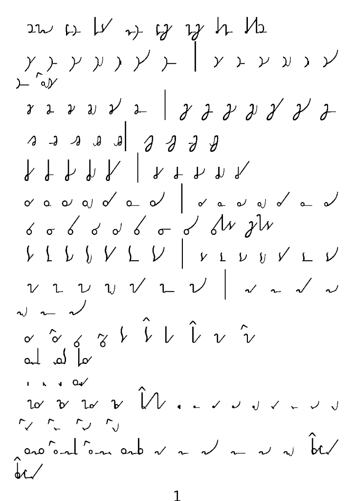
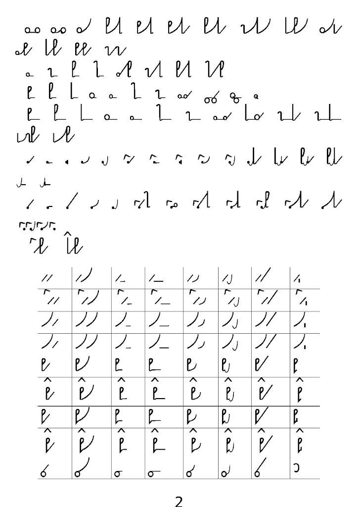
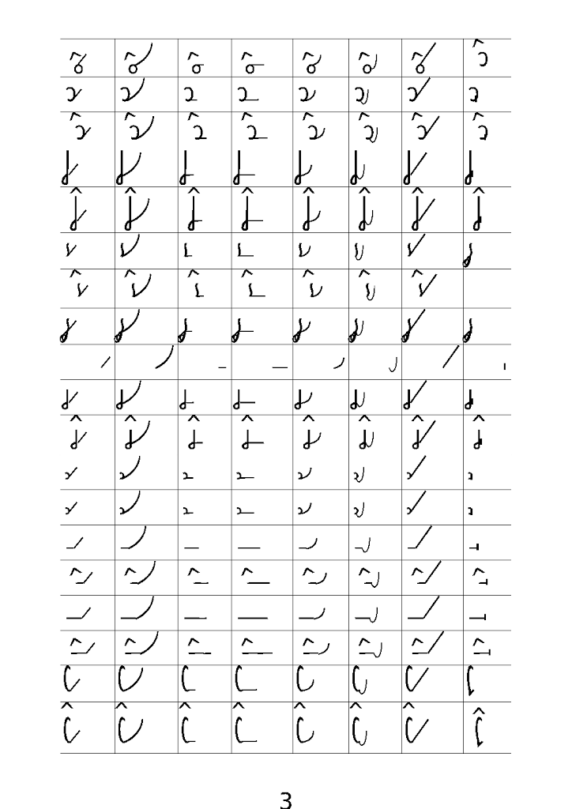
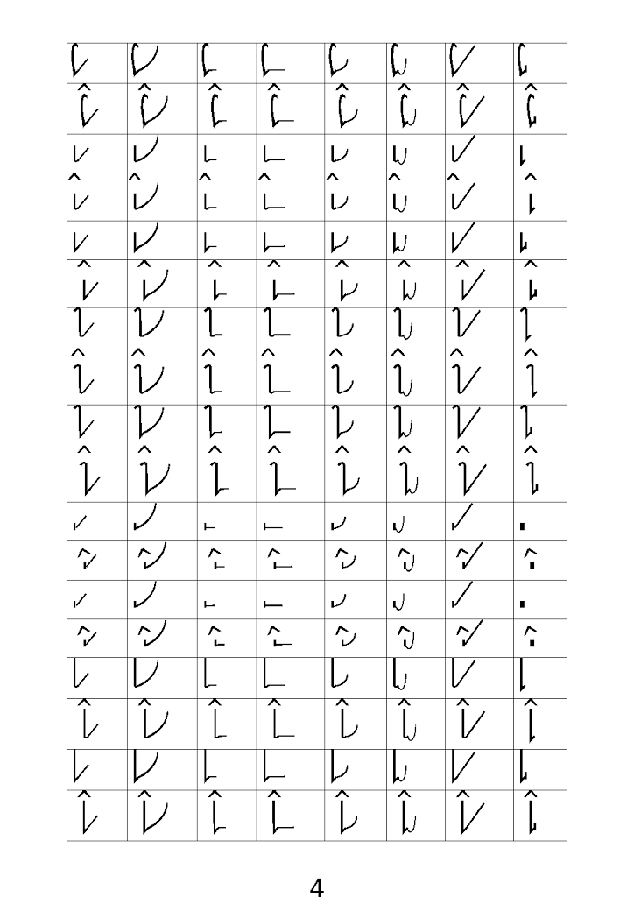
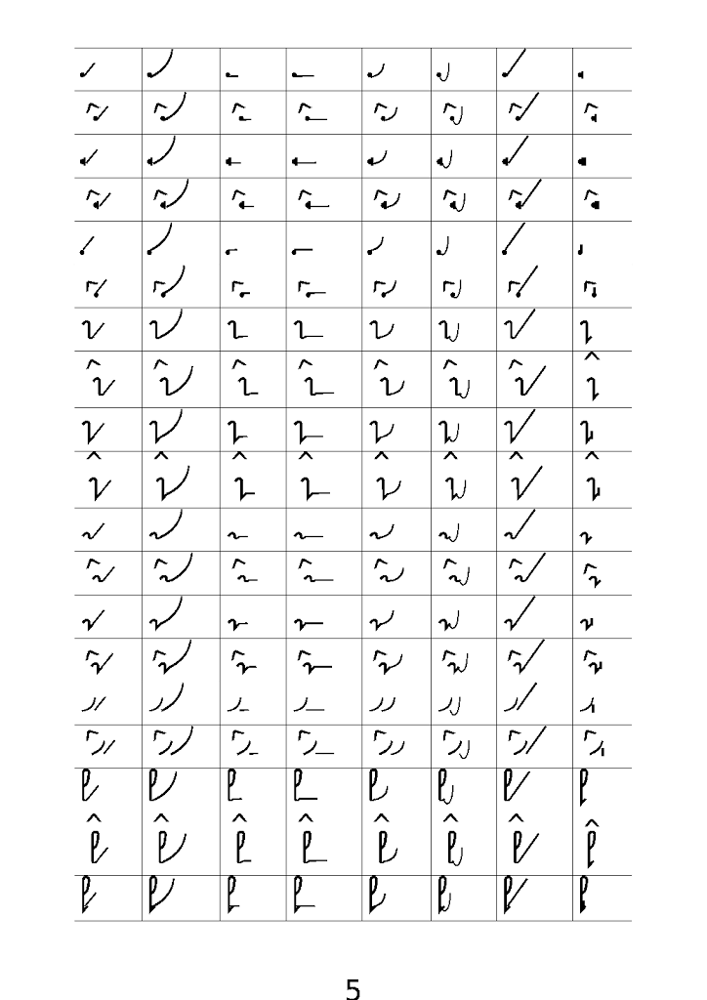
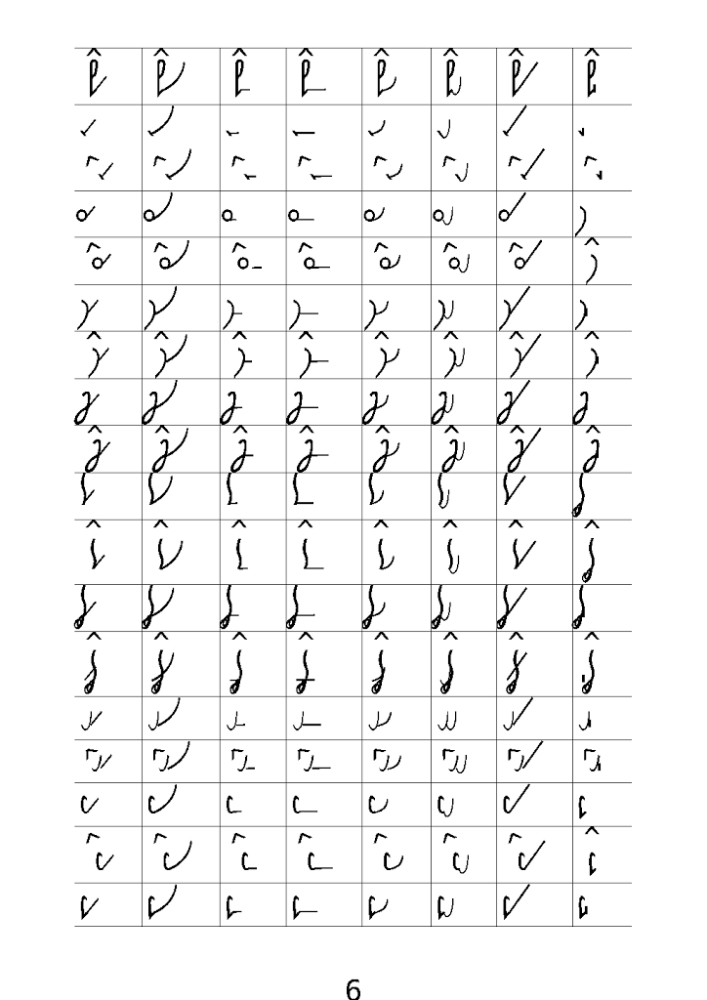
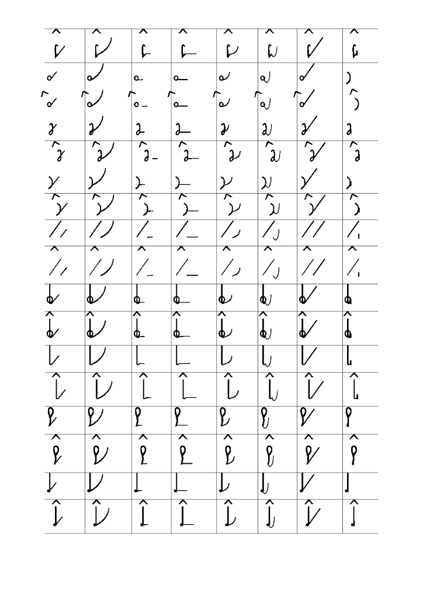

Zapewne pilni adepci systemu ***Ste**Mi*** zauważyli, że lekcje nie
pojawiają się często. Podobnie jak wpisy o innej tematyce. A to z
powodu, że mnie coś odwleka. Ale co, zapytacie?  
Nie zapytacie, bo rzadko tu zaglądacie. Ale ja i tak opowiem.  
Otóż lekcje stenografii, które publikuję, mają pewną wadę: uczą pisać,
ale nie uczą czytać. Boli mnie to również, ponieważ sam jestem adeptem
tego systemu i cierpię na brak materiałów edukacyjnych. Cóż sam
wymyśliłem ten system, skąd by się miały one wziąć?

 Można by je wyprodukować! Ale ile można ręcznie pisać - dla
pojedynczego człowieka praca tytaniczna, by nie rzec, syzyfowa...

 Ale jest na to rada! Tu pozwolę sobie zwrócić uwagę pilnych czytelników
na 
[bardzo starą notatkę nt. założeń projektowych nowego systemu stenografii](../../roznosci/brewiskrypt/)
,
gdzie w dziale "Zecerzy i graficy" napisałem już ze 3 lata temu o
zbudowaniu i rozwijaniu **czcionki stenograficznej**. Kiedy to pisałem,
nie miałem bladego pojęcia o tej sztuce, ale w końcu dojrzałem. Zapewne
jednym z powodów był brak jakiejkolwiek społeczności wokół projektu NPSS
(Nowego Polskiego Systemu Stenografii), czyli tego, co dziś nazywam
Ste***Mi***. Pozostało mi tylko nauczyć się czcionkarstwa samemu, co
niniejszym pilnie czynię.

 Na załączonych obrazkach możecie obejrzeć pierwsze efekty moich
usiłowań: podstawowe znaki, czyli jeszcze bez ligatur skracających,
jedynie odpowiedniki uproszczonego planu głosek polskich, który składa
się na podstawowy schemat alfabetu SteMi. W tabeli programik zestawia
każdą spółgłoskę z każdą samogłoską (CV) oraz samogłoskę z samogłoską
(VV). Ręcznie pisanie tego zajęłoby mi pół dnia...

 Te dziwne literki z "daszkiem" u góry to nowe oznaczenie Wielkiej
Litery, a zatem i wszelkich jej konsekwencji - czcionki elektroniczne
mają swoje prawa i z dwóch dostępnych mi metod wybrałem jedną, która
lepiej pasuje. Jest to niezwykle żmudna praca, muszę powiedzieć.
Najpierw trzeba precyzyjnie zaplanować geometrię poszczególnych liter,
które w czcionkarstwie zwane są glifami. Ponieważ stenografia jest
odpowiednikiem pisma odręcznego raczej niż druku, litery tam łączą się
jedna z drugą. To tworzy dodatkową trudność, która nie ma miejsca,
jeżeli projektujemy czcionkę drukarską.  Widać to na załączonych
obrazkach, że literki nie zawsze precyzyjnie się ze sobą łączą.

Aby to poprawić, kiedy już skończę generować wszystkie znaki (w tym
ligatury czyli złączenia wielu glifów, które odpowiadać będą też za to,
co w Ste***Mi*** nazywamy fiksami oraz znacznikami) użyję metody zwanej
kerningiem, czyli sterowaniem odległością między literkami (glifami). W
następnej kolejności będę musiał wygenerować warianty glifów, które
znajdować się będą na różnej wysokości względem linii bazowej, czyli
linii, na której stoją główne glify. Tak, tak, fonciarstwo to takie
klejenie z klocków. A kiedy już powstaną wszystkie znaki, jakie
zamiaruję użyć w czcionce, pozostanie mi zaprogramowanie reguł, wg
których będą się one wzajemnie zastępować. I to dopiero będzie sztuka!

Bo narysować literki, kiedy nie szukamy jakichś wyjątkowo estetycznych
rozwiązań literniczych, to nie jest bardzo trudno. Potrzeba odrobinę
cierpliwości i podstawowe wiadomości z dziedziny. Za to później, kiedy
literki stają się częścią systemu stenograficznego i zaczynają żyć o
wiele intensywniejszym życiem od zwykłych liter drukarskich, potrzeba
mnóstwo wzajem zależnych reguł, które zdołają to komputerowi
przetłumaczyć. Dlatego, również aby dla higieny rozumu zastosować jakiś
płodozmian, pilnie wkuwam 
[dokumentację Adobe dot. standardu OpenType.](http://www.adobe.com/devnet/opentype/afdko/topic_feature_file_syntax.html) 
Liczę
na bardzo konkretny efekt, który już częściowo osiągnąłem:  
Pisanie zgodnie z polską ortografią na klawiaturze komputera moją
czcionką pozwoli wyświetlić tekst w formie stenograficznej, ale po
polsku w treści. To znaczy, że PDF zapisany czcionką Ste***Mi*** będzie
wyglądał jak wędrujące mrówki (umówmy się), ale jeżeli zaznaczysz
narzędziem zaznaczania w Adobe Readerze owe fistaszki i skopiujesz, a
następnie wkleisz w dowolny edytor tekstu (np. Notatnik - a tak w ogóle,
to czemu jestem taki łaskawy dla Windowsów? Czy nie mogę powiedzieć
Texworks i gedit?), to dostaniemy piękny i czysty tekst podany zwykłymi
literkami. Czyli znakomity materiał edukacyjny - czytam te robaczki, ale
zawsze mogę sprawdzić, czy dobrze je czytam. Ba, ale to nie koniec!

Można też wziąć gotowy tekst, np. "
**[Elektrybałt Trurla**
" i
wkleić do specjalnego edytora (zwanego procesorem) tekstu, który potrafi
obsłużyć wyrafinowane reguły niezbędne dla ukazania czcionki
stenograficznej w całej krasie, przetworzyć na PDF i czytać
stenograficznie najwyższe dokonania literatury polskiej i światowej
(byle po polsku). I w ten sposób będziemy mieć prawie nieograniczoną
ilość materiałów edukacyjnych z dziedziny, o którą zawsze było trudno,
czyli tekstów do czytania. A jak już nie raz wzmiankowałem, przecież to
jest najbardziej drażliwa część treningu - uczymy się pisać i pisanie
jest dość przyjemne, szczególnie, kiedy dojdziemy już do pewnej wprawy.
Ale do czytania trzeba mózg stale wdrażać, a przecież nie otaczają nas
teksty w alfabecie SteMi, tylko zwykła łacinka. Od tego wprawy w
czytaniu nie przybywa. Zatem będę mógł składać teksty do czytania w
SteMi, ba, będę mógł je formatować pod czytniki ebooków. Już niebawem.
Zapraszam.
