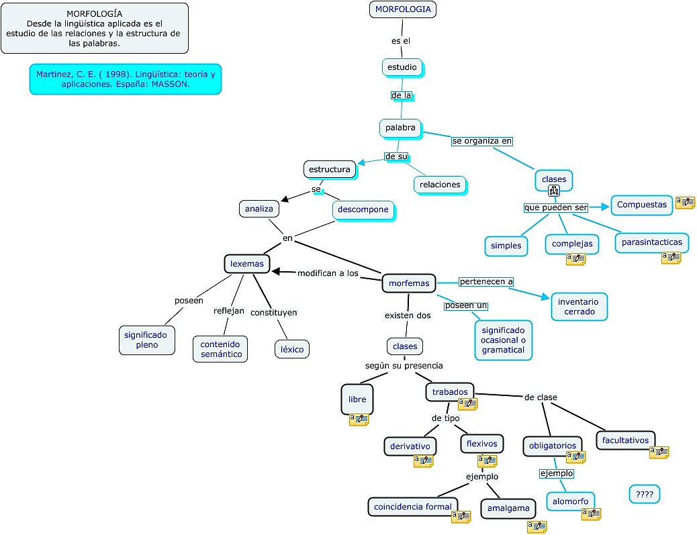

Widzę, że intensywność wpisów na tym blogu znacznie spadła. Ale nie
dzieje się tak bez przyczyny. Właściwie przyczyn jest kilka, a może
więcej, ale nie ze wszystkich gotów jestem się tutaj zwierzać ;-)

Zacznę i skończę na tym, że od jakiegoś czasu, w ramach płodozmianu
zająłem się pracą nad polską stenotypią, czyli techniką stenografowania
przy pomocy klawiatury.

Chyba już wspominałem o znakomitym projekcie amerykańskiej stenotypistki
[Mirabai
Knight](https://www.google.pl/search?q=mirabai+knight&oq=mirabai+kni&aqs=chrome.1.69i57j0.5011j0j4&client=ubuntu-browser&sourceid=chrome&es_sm=93&ie=UTF-8)
o nazwie [Plover](http://plover.stenoknight.com/)? Obserwuję go uważnie
od lat kilkorga i muszę powiedzieć, że nawet udało się uzyskać
mechanizm, który roboczo może spełnić potrzeby polskie, przynajmniej na
początku prac nad stenotypią.

Ale: nie istnieje polski system stenotypii! W związku z powyższym
postanowiłem taki zrobić. Nawiasem pisząc, chętni do pomocy mile
widziani. Dzięki światłym sugestiom jednego zainteresowanego już moje
prace posunęły się o cztery ziarnka piasku do przodu.

Kto czyta uważnie [kategorię
"stenotypia"](https://www.stenografia.pl/kategorie/stenotypia/), ten wie,
że zajmuje to moją głowę od co najmniej trzech lat. Ale dopiero w
ostatnim roku zaczęło zajmować bardziej, a to z przyczyny, że odręczny
system **Ste*****Mi*** osiągnął jaką-taką dojrzałość i mogę się nim
posługiwać dość swobodnie (swoją drogą postanowiłem nauczyć go swoją
prawą rękę, której do pisania dotychczas nie używałem - może to być
ciekawe doświadczenie). Przyszła pora na klawiaturę.

W następnych wpisach postaram się ująć w proste słowa kilka zagadnień,
jakie wymagają głębokiego rozważenia. Tutaj zacznę od jednej kwestii,
którą obsługuje ukryty głęboko podproces mojego mózgu (bez współpracy z
podświadomością ani rusz), czyli model techniczny pisania
stenotypicznego.

Pobrałem ze stron [SJP](http://sjp.pl/) słownik liczący ponad 2,5
miliona słów (sic!). Jest to plik służący graczom w scrabble do
rozstrzygania sporów podczas gry, więc m.in. zawiera słowa w różnych
formach gramatycznych, co oczywiście zwiększa wydatnie liczbę obiektów
słownika. Na bazie jednak tej bazy można wyrobić sobie wyobrażenie o
skali trudności, jaka czeka polskiego stenotypistę. Komputer dzielił ten
słownik na sylaby przez prawie dwa tygodnie (moja wina, źle
zaprojektowałem program, który to miał robić!). Dzięki światłym
sugestiom pewnego sympatyka w kilka (no, prawie 30) następnych sekund
mogłem się dowiedzieć, ile prawdopodobnie sylab składa się na język
polski: **24514** (słownie: dwadzieścia cztery tysiące pięćset
czternaście). Oczywiście nie jest to liczba ostateczna. W trakcie, gdy
piszę ten wpis, dwie sylaby wyszły z użycia, a sześć innych weszło na
stałe do słownika. Tego się nie da tak łatwo zamknąć.

I dlatego tak sobie myślę, że jedyną sensowną techniką podejścia do
polskiej stenotypii i tak ostatecznie będzie taka, która oprze się na
czymś w rodzaju [morfemów](http://pl.wikipedia.org/wiki/Morfem), bo one
nie zmieniają się tak szybko, a jedynie z prędkością zmian języka:

Jedno to uzyskanie zbioru sylab do celów opracowania klawiatury, a
drugie, to podejście do techniki stenotypowania. Coraz bardziej się
skłaniam do podejścia
"[morfologicznego](http://pl.wikipedia.org/wiki/Morfologia_(j%C4%99zykoznawstwo))",
tj. takiego jakby utechnicznienia, np.:
**przezwyciężalny = przez+zwycięż+alny** \
czyli \
**zwycięstwo = zwycięż+stwo = zwy+cię+\[stwo/ctwo/two\]**

Komputer wszystko zniesie, więc zapewne w słowniku znajdą się inne
podejścia na równych prawach, ale to wyjdzie w praktyce:
**zwycięstwo=zwy+cię+stwo = zwyć+\[stwo/ctwo/two\] =
zwię+\[stwo/ctwo/two\]**

a zatem:
**przezwyciężalny = \[przez\]+zwyć+\[lny\]**

Czyli tak, jak uczyli w szkole - wyraz składa się z rdzenia oraz
doklejek, czyli różnych -rostków (przyrostków \[*sufiksów*\], wrostków
\[*afiksów*\] i przedrostków \[*prefiksów*\]).

Inne zagadnienie, to cząstki obce, którymi posługujemy się w języku
polskim, np. aeronauktyka.
Moim zdaniem docelowo trzeba będzie zbudować gotowe "znaki" (czyli
akordy) dla takich cząstek:

**aeronautyka = a+e+ro+na+u+ty+ka = ae+ro+nau+ty+ka = aer+nau+tyka**

a zatem

**aeronautyczny = aer+nau+ckny** \
**aeronautyczna = aer+nau+ckna**

**speleologia = spe+le+o+lo+gia = spe+leo+log+ja = sple+log+ja** \
**speleologiczny = spe+leo+log+ckny = sple+log+ckny**

Tak czy owak, dorobienie się banku zsumowanych cząstek słowotwórczych to
będzie oddzielna, ręczna robota w oparciu o podręcznik gramatyki. Jednak
to może zmniejszyć liczbę sylab niezbędnych do wyuczenia się, aby
praktycznie pisać.

To tyle na razie.
