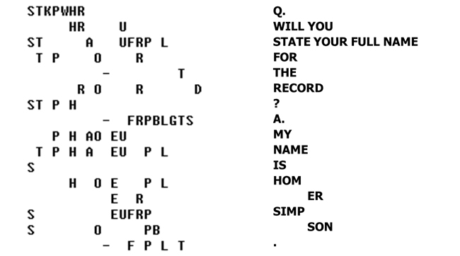
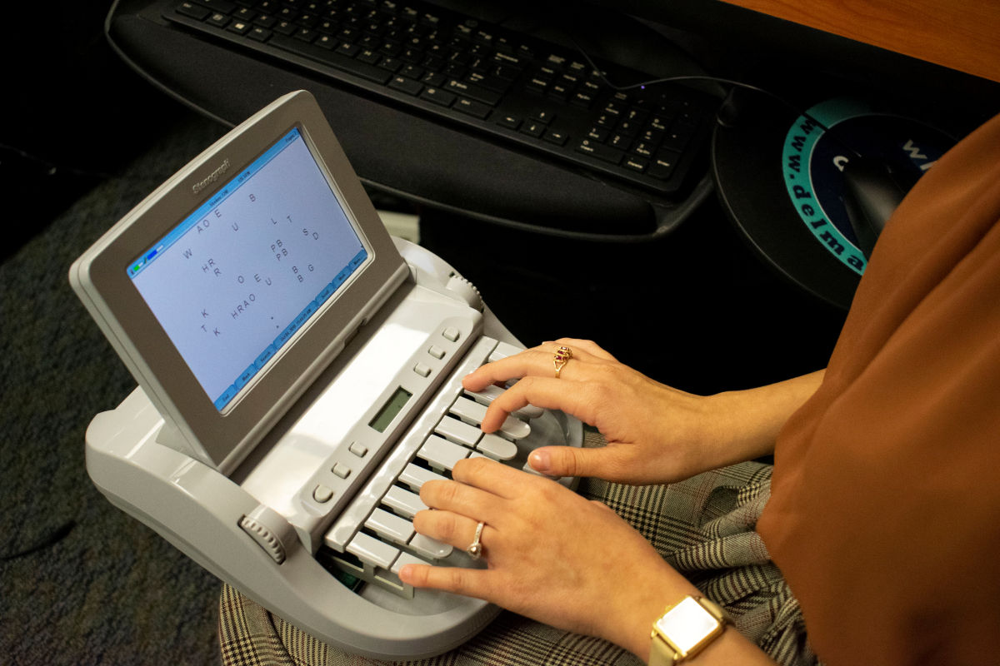

Ponieważ zrozumienie, o co chodzi w stenotypii, jest kluczowe dla pojęcia, dlaczego może być przydatna, przypomnę krótko jej filozofię:

## Filozofia steno-klawiatury

Objaśniam na przykładzie amerykańskim (polskiego jeszcze nie ma):


Klawiatura dzieli się na 3 obszary: 

- lewy = nagłos (spółgłoski)
- dolny = głos (samogłoski) - wyciskany kciukami
- prawy = wygłos (spółgłoski)

Na środku znajduje się klawisz **asterisk** pełniący różnorakie role pomocnicze. Np. w Plover kasuje ostatnie wpisane słowo (jeśli naciśnięty samotnie). W połączeniu z innymi klawiszami ma też inne rozliczne funkcje, a przede wszystkim używany jest do - stenografii, czyli pisania skrótami.

Klawiszom przypisano wartości literowe (głoskowe), ale pozostałe, których nie widać, wyciska się przez kombinacje. Zatem (tu opisuję amerykańską stenotypię w celach poglądowych) np. w strefie nagłosowej:

- *P* wyciska się wciskając klawisz górny, trzeci od lewej
- *W* (dablju) wyciska się klawiszem dolnym, trzecim od lewej, ale
- *B* uzyskujemy przez jednoczesne naciśnięcie klawiszy *P* i *W*

<!--  -->


Kiedyś maszyna do stenotypii drukowała taki "kod" na taśmie, gdzie każda "widoczna" litera miała swoje miejsce, czyli ułożone były w niezmienialnym porządku:

````
STKPWHRAO*EUFRPBLGTSDZ
````

A zatem owa litera *B* w nagłosie na taśmie odciskała się jako *PW*.

Każdy akord zajmował jedną linijkę na taśmie.


Wyszkolona stenotypistka (lub stenotypista) bez problemu umieli to odczytać i podyktować maszynistce. Dziś zastępuje ich komputer, dzięki wgranemu w oprogramowanie gotowemu słownikowi.

I cała ta filozofia taśmy stenotypicznej została przeniesiona do stenotypii komputerowej. Z tą różnicą, że wszystko odbywa się w trzewiach programu, a my jako odbiorcy możemy się cieszyć gotowym tekstem w dowolnym edytorze, który najbardziej lubimy.

## Jak gramy na klawiaturze

Na klawiaturze gramy jak początkujący gitarzyści: akordami (choć przypomina to raczej pianino). To znaczy, że zależnie od potrzeb wciskamy odpowiednią liczbę klawiszy.

Zwracam uwagę, że np. klawisze *T* i *K*, lub *P* i *W* można wcisnąć równocześnie przy pomocy zaledwie jednego palca.

**Popatrzcie:**



Oczywiście na znaki przestankowe oraz inne czynności kontrolne podczas klepania również ułożone są odpowiednie akordy.

**Akord** - bardzo dobre określenie czynności podczas stenotypowania. Każda sylaba jest akordem. Może nim być też grupa sylab, albo całe słowo. Albo nawet grupa słów. Albo jakaś sekwencja kontrolna (nowa linia, kropka, przecinek itp.).

To na początek.

Bo bardziej zaawansowani klepacze mają jeszcze zapas akordów - symboli zastępujących całe słowa i związki frazeologiczne, co przyspiesza pisanie tak, że można stenotypować szybciej, niż ktokolwiek zdolen jest mówić. I do tego robić to przez długi okres czasu, a nie zaledwie kilka sekund.

W Plover umieszczony jest słownik, który te akordy tłumaczy na słowa lub coś więcej. Na przykład:

````
strange:
   STRAEUPG
   STRAEUPBG
   STRAEUPBLG
   STRAEUPB/*PBLG
   STRAEUPB/-PBLG

````

Słowo *strange* można wyklepać aż na 5 sposobów. 

````
position:
   POGS
   P*UGS
   P*EUGS
   P*EUGTS
   PO/SEUGS
   POE/SEUGS
   PO/S*EUGS
   POE/S*EUGS
   PROE/SEUGS
````

Słowo *position* ma aż 9 sposobów, czyli 9 zestawów akordów, które w efekcie dadzą tłumaczenie w tej postaci. Z tego 4 z nich są ściśle stenograficzne, gdyż to 3-sylabowe słowo ("po=zy=szyn") pozwalają wklepać zaledwie jednym akordem, jednym układem palców na klawiaturze. Znakiem **/** oddziela się poszczególne akordy, czyli sekwencje wciśniętych klawiszy. Zwróćcie uwagę, że nie ma tu opcji 3-sylabowej. Ale rzadsze słowa mają mniej stenograficzne, a bardziej sylabowe układy.

Znalazłem nawet [stronę dla stenografów, gdzie gromadzone są wszelkie gotowe *strokes*](https://briefpedia.com/index.php) czyli akordy właśnie. Wpisujesz słowo i dostajesz wszystkie wersje, jak to można by wklepać w maszynę, byle oczywiście znalazło się w słowniku - taka propozycja stenotypistki dla stenotypisty. I tak sobie wpisałem do wyszukiwarki słowo "particular". Wyszło... 200 wariantów. Niektóre bogate, inne bardzo oszczędne. W słowniku Plover znajdziecie "zaledwie" 5 wariantów: 

````
particular:
   PRAR
   PHRAR
   PAR/TEUBG/HRAR
   PAR/TEUBG/KWRU/HRAR
   PAR/TEUBG/KWRAOU/HRAR
````

Proszę zwrócić uwagę na dwa ostatnie - składają się z 4 akordów - dla 4-sylabowego słowa (par=ti=kju=lar).

## Pseudosteno

Pomiędzy tajemniczym kodem wynikłym z techniki opisu klawiszy przy pomocy liter, a wynikowym tekstem, znajduje się coś w rodzaju języka pośredniego, który w gwarze amerykańskich stenotypistów nazywa się *pseudosteno*. Jest to przetłumaczony kod na brzmienia głosek, które składają się z wielu wciśniętych klawiszy.

Po *[sprawdzeniu we wpisie wikipedycznym](https://en.wikipedia.org/wiki/Stenotype#Chords)* łacno już będzie rozpoznać, o co chodzi.

````
particular:
   PAR/TEUBG/KWRAOU/HRAR = par/tik/yuu/lar
   PAR/TEUBG/KWRU/HRAR = par/tik/yu/lar
   PAR/TEUBG/HRAR = par/tik/lar
   PHRAR = plar
   PRAR = prar
````

Można powiedzieć, że tak nasz umysł tłumaczy słowa na kod, zanim uruchomi się pamięć mięśniowa i zostaną wciśnięte odpowiednie klawisze. I stopniowo dokonuje uproszczenia. Pod warunkiem, że dane słowo jest używane często. Jeżeli rzadko - pozostaje tylko ten długi wariant, bo nie ma potrzeby zawalać pamięci kombinacjami.

````
New York:
   TPHORB
   TPHO*RBG
   TPHO*FRBG
   TPHO*RPBG
   TPHU/KWRORBG
   TPHAO*EU/TPHAO*EU
````

Teraz widać powyżej, o co chodzi. Poniżej pomoc naukowa.

Dla głosek inicjalnych (nagłosów):

- TPH = n
- KWR = y

Dla samogłosek:

- AO = oo
- EU = i (krótkie)

Dla głosek finalnych (wygłosów):

- RB = sh
- BG = k

Po prawej mamy też złożenia, które nie występują w podstawowym słowniku głosek, ale być może pojawiają się w tym bardziej rozbudowanym.

Bardzo mi się podoba akord `TPHO*RBG` - *nork* z gwiazdką. Zgrabna [kontrakcja](https://pl.wikipedia.org/wiki/Kontrakcja_(skr%C3%B3t)). Kiedy wreszcie przyjdzie pora na tworzenie takich skrótów, dla np. Warszawy to będzie pewnie tradycyjne, znane z internetu i radia *waw* - a dalej trzeba będzie doklejać końcówkę drugim uderzeniem.

## Problem językowy

Kiedy współczesna stenografia powstawała... A dlaczego stenografia? Otóż stenotypia jest rozwinięciem koncepcji stenograficznych. Techniki pisania skrótami, symbolizacje, abrewiacje, kontrakcje itp. są wynalazkiem czasów pisma odręcznego. Czasy klawiatur są wciąż dosyć młode i nie wniosły tak wiele do sprawy.

A zatem współczesna stenografia powstawała w kręgu języków germańskich, które zasadniczo są [analityczne](https://pl.wikipedia.org/wiki/J%C4%99zyki_analityczne). Ich bazowe formy wyrazowe są zwykle nieodmienne (lub mało odmienne, jak np. w niemieckim, który jednak szczątkowo wie, co to [fleksja](https://pl.wikipedia.org/wiki/Fleksja)). Konkretnie to największy wkład miał język angielski, o wyrazach prawie nieodmiennych, gdzie formy gramatyczne tworzy się pozycją wyrazów w zdaniu i zaopatrywaniu ich w różniste wyrazy posiłkowe (jak "off", "out", "on" itp.). Tymczasem polski należy do grupy [języków fleksyjnych](https://pl.wikipedia.org/wiki/J%C4%99zyki_fleksyjne), które wyrażają się przez różniste przystawki, czyli przyrostki, przedrostki, a nawet wrostki. Sam [rdzeń wyrazowy](https://pl.wikipedia.org/wiki/Rdze%C5%84_(j%C4%99zykoznawstwo)) zwykle jest jednosylabowy, archaiczny, dość prymitywny i ukryty pod warstwami nałożonych nań dodatkowych brzmień, które dopiero rozbudowują znaczenie:

drzewo = *drw*+wo \
drewno = *drw*+no \
ale \
drzewny = *drw*+wo+ny (ścięte, bo fleksyjny, do *wny*) \
drewniany = *drw*+no+ny (ścięte i rozbudowane, bo fleksyjny, do *niany*)

Nie wchodzę tu w ogóle w problem [oboczności](https://pl.wikipedia.org/wiki/Alternacja_(j%C4%99zykoznawstwo)), która stanowi właśnie podstawę problemu z ułożeniem sensownej stenotypii.

A do tego dochodzą te ceregiele z odróżnieniem tematu wyrazowego od rdzenia wyrazowego... Ratunku!

Piszą o tym doktoraty (ja nie planuję), a nam potrzebne jest jakieś proste i jasne rozwiązanie.

**I dodajmy do tego jeszcze taki oto fakt, że nasza mowa ojczysta jest samostojącym abstraktem, giętkim-niełamliwym szkieletem gramatycznych reguł, na którym nasi przodkowie od wieków i my sami teraz, wieszamy tak zwane naleciałości, wyrazy obce, obcojęzyczne i wszelkiego rodzaju neologizmy. *Ledwo taki wyraz przyjmiemy za swój, już, nie słuchamy mądrych profesorów, tylko od razu zaczynamy deklinować: kakao, kaka-a, kakao, kakaem, kakale, kaka-o!*** Podobno lingwiści nie potrafią znaleźć w nim wielu słów, które można by uznać za "rdzennie polskie". To znaczy: znajdują w nim strrrrrasznie dużo słów, które bez wątpienia są obcego pochodzenia (NB. Anglicy mają podobny problem).

### Stenografia przyrostkowo-przedrostkowa

Zatem jedno z dość sensownych rozwiązań, jakie mi się nasuwa, to wykorzystanie związku temat-końcówka.

M. instrukcj|a \
D. instrukcji|0(zero) \
C. instrukcji|0 \
B. instrukcj|ę \
N. (z) instrukcj|ą \
Ms. (o) instrukcj|i \
W. instrukcj|o \

Na powyższym przykładzie zatem mamy temat *instrukcj* i dodajemy do niego końcówki deklinacyjne. A temat (przecież dwusylabowy) możemy stenograficznie skrócić do jednego akordu, np. (wyrażony w pseudosteno) *inst-cj*. I tak wyraz, który sylabicznie trzeba by wklepać co najmniej trzema uderzeniami, będziemy wklepywać dwoma. Oszczędność: 33%.

O tej kwestii z pewnością jeszcze nie raz się rozpiszę.


## Pianino tekstowe

Długo nad tym rozmyślałem i doszedłem do wniosku, że skoro najbardziej się liczy pamięć mięśniowa (czyli niejako palce same wiedzą, jak pisać), to literki przypisane do klawiszy pełnią tylko funkcję pomocniczą. A to oznacza, że liczy się zapamiętany układ palców powiązany z dźwiękiem (czy też symbolem dźwięku), który ma zapisać. W zasadzie dokładnie tak samo jak podczas gry na pianinie (lub fortepianie).



Dlatego na klawiaturze stenotypicznej nie ma oznaczeń liter. Stenotypist(k)a nie patrzy się w klawisze, kiedy pisze (taki rym na koniec).