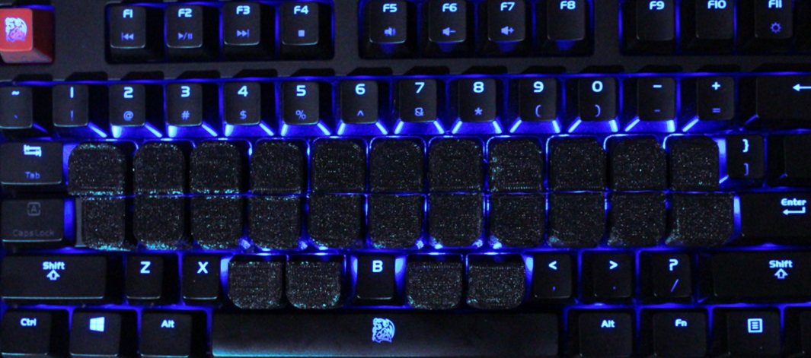

## Poprawki, poprawki

Jak powiedziałem, tak zrobiłem, czyli wziąłem się za ręczne poprawianie słownika. Jednak. Bo liczba błędów dzielenia sylab sięgała w rzeczywistości setek tysięcy (na 2,7mln słów zgromadzonych w słowniku), co stanowiło poważną odsetkę. Trwało to kilkadziesiąt roboczogodzin i zapewne parę trylionów cykli procesora. W efekcie baza, z której zamiaruję wystartować, bardziej przypomina rzeczywistość językową.

Wciągnąłem też do projektu znalezione w necie cudze dokonania, jak [słownik frekwencyjny Jerzego Kazojcia](https://pl.wiktionary.org/wiki/Indeks:Polski_-_Najpopularniejsze_s%C5%82owa_1-1000_wersja_Jerzego_Kazojcia), bo nigdy dość korzystania z już gotowych rozwiązań. Przy okazji moje pierwsze podejście do własnego słownika frekwencyjnego dało dość podobne wyniki, przynajmniej jeśli chodzi o pierwsze kilkaset najpopularniejszych słów. Co oznacza, że materiał jest wystarczająco miarodajny na potrzeby opracowania systemu stenotypii. Toż nie aspiruję tutaj do pisania doktoratu z językoznawstwa.

## Pierwsze podejście do klawiatury

Dla płodozmianu umysłowego jednocześnie zabawiałem się projektowaniem układu klawiszy.

Przypomnę krótko:

- system ma działać w oparciu o [otwarte oprogramowanie Plover](https://github.com/openstenoproject/plover), które z góry załatwia problem negocjacji między klawiaturą a komputerem,
- w związku z powyższym trzeba zachować pewną dyscyplinę i nie można pozwolić sobie na pełną dowolność, bo to oprogramowanie potrafi wiele, ale nie wszystko,
- wybrałem na start najprostszą i najtańszą wersję sprzętową, czyli klawiatura NKRO (n-key rollover) - czyli taką, która potrafi przesłać do komputera dowolną sekwencję dowolnej liczby klawiszy,
	+ w tym celu zakupiłem na aliexpress.com mini-klawiaturkę dla graczy,
	+ to już nie jest takie drogie, jak przed laty,
- a zatem układ klawiszy musi nawiązywać (choćby luźno) do zaprzeszłowiecznego projektu Warda Stone'a Irelanda, który rozwiązał problem dysgrafii wśród stenografów.


Przez ostatnie kilka lat rozwoju projektu Plover (który rozszerzając się zmienił nazwę na [OpenSteno](http://www.openstenoproject.org/)) jego uczestnicy wygenerowali wiele różności, które dziś gotowe tylko czekają. Stąd pomysł na początek, żeby kupić niedrogą klawiaturę NKRO i uzupełnić ją docelowo [specjalnie wydrukowanymi nakładkami klawiszowymi](https://cemrajc.github.io/stenotoppers/):




Ciekawostka: wysłałem zapytanie ofertowe do 3 firm drukujących 3D. Tylko jedna w ogóle odpowiedziała. Ale jej oferta **trzykrotnie** przekraczała koszt samej klawiatury. Gdybym miał zamawiać wydruk trzech - czterech kompletów nakładek klawiszowych, w tym samym koszcie wyszedłby zakup własnej drukarki 3D do tego celu...

### Filozofia steno-klawiatury

Jak widać na rysunku:


Klawiatura dzieli się na 3 obszary: 

- lewy = nagłos (spółgłoski)
- dolny = głos (samogłoski) - wyciskany kciukami
- prawy = wygłos (spółgłoski)

Na środku znajduje się klawisz **asterisk** pełniący różnorakie role pomocnicze. Np. w Plover kasuje ostatnie wpisane słowo (jeśli naciśnięty samotnie). W połączeniu z innymi klawiszami ma też inne rozliczne funkcje.

Klawiszom przypisano wartości literowe (głoskowe), ale pozostałe, których nie widać, wyciska się przez kombinacje. Zatem (tu opisuję amerykańską stenotypię w celach poglądowych) np. w strefie nagłosowej:

- *P* wyciska się wciskając klawisz górny, trzeci od lewej
- *W* (dablju) wyciska się klawiszem dolnym, trzecim od lewej, ale
- *B* uzyskujemy przez jednoczesne naciśnięcie klawiszy *P* i *W*

Kiedyś maszyna do stenotypii drukowała taki "kod" na taśmie, gdzie każda "widoczna" litera miała swoje miejsce, czyli ułożone były w niezmienialnym porządku:

````
STKPWHRAO*EUFRPBLGTSDZ
````

A zatem owa litera *B* w nagłosie na taśmie odciskała się jako *PW*.

Każdy akord zajmował jedną linijkę na taśmie.


Wyszkolona stenotypistka (lub stenotypista) bez problemu umieli to odczytać i podyktować maszynistce. Dziś zastępuje ich komputer, dzięki wgranemu w oprogramowanie gotowemu słownikowi.

### Jak gramy na klawiaturze

Na klawiaturze gramy jak początkujący gitarzyści: akordami (choć przypomina to raczej pianino). To znaczy, że zależnie od potrzeb wciskamy odpowiednią liczbę klawiszy.

Zwracam uwagę, że np. klawisze *T* i *K*, lub *P* i *W* można wcisnąć równocześnie przy pomocy zaledwie jednego palca.

Popatrzcie:



Oczywiście na znaki przestankowe oraz inne czynności kontrolne podczas klepania również ułożone są odpowiednie akordy.

**Akord** - bardzo dobre określenie czynności podczas stenotypowania. Każda sylaba jest akordem. Może nim być też grupa sylab, albo całe słowo. Albo nawet grupa słów. Albo jakaś sekwencja kontrolna (nowa linia, kropka, przecinek itp.).

To na początek.

Bo bardziej zaawansowani klepacze mają jeszcze zapas akordów - symboli zastępujących całe słowa i związki frazeologiczne, co przyspiesza pisanie tak, że można stenotypować szybciej, niż ktokolwiek zdolen jest mówić. I do tego robić to przez długi okres czasu, a nie zaledwie kilka sekund.

W Plover umieszczony jest słownik, który te akordy tłumaczy na słowa lub coś więcej. Na przykład:

````
strange:
   STRAEUPG
   STRAEUPBG
   STRAEUPBLG
   STRAEUPB/*PBLG
   STRAEUPB/-PBLG

````

Słowo *strange* można wyklepać aż na 5 sposobów. 

````
position:
   POGS
   P*UGS
   P*EUGS
   P*EUGTS
   PO/SEUGS
   POE/SEUGS
   PO/S*EUGS
   POE/S*EUGS
   PROE/SEUGS
````

Słowo *position* ma aż 9 sposobów, czyli 9 zestawów akordów, które w efekcie dadzą tłumaczenie w tej postaci. Z tego 4 z nich są ściśle stenograficzne, gdyż to 3-sylabowe słowo ("po=zy=szyn") pozwalają wklepać zaledwie jednym akordem, jednym układem palców na klawiaturze. Znakiem **/** oddziela się poszczególne akordy, czyli sekwencje wciśniętych klawiszy. Zwróćcie uwagę, że nie ma tu opcji 3-sylabowej. Ale rzadsze słowa mają mniej stenograficzne, a bardziej sylabowe układy.

````
New York:
   TPHORB
   TPHO*RBG
   TPHO*FRBG
   TPHO*RPBG
   TPHU/KWRORBG
   TPHAO*EU/TPHAO*EU
````


### Kombinacje bez powtórzeń

Jednakowoż nawiązywanie do wyżej pokazanego układu klawiszy wymagało powrotu do liceum i policzenia paru rzeczy. Mianowicie, jak wcześniej pisałem, wyszło mi około 500-600 nagłosów i około 400 wygłosów sylabowych.

Tymczasem w układzie amerykańskim mamy po lewej stronie zaledwie 7 klawiszy. A to daje nam, policzmy (po lewej liczba na raz wciśniętych klawiszy, po drugiej liczba możliwych kombinacji):

|       | 7 klawiszy |
|-------|------------|
| 1     | 7          |
| 2     | 21         |
| 3     | 35         |
| 4     | 35         |
| 5     | 21         |
| 6     | 7          |
| 7     | 1          |
| suma: | 127        |

Liczba 127 to stanowczo za mało, jeżeli w naszym ojczystym języku musimy się spodziewać aż 600 możliwych nagłosów (nie licząc kombinacji stenograficznych).