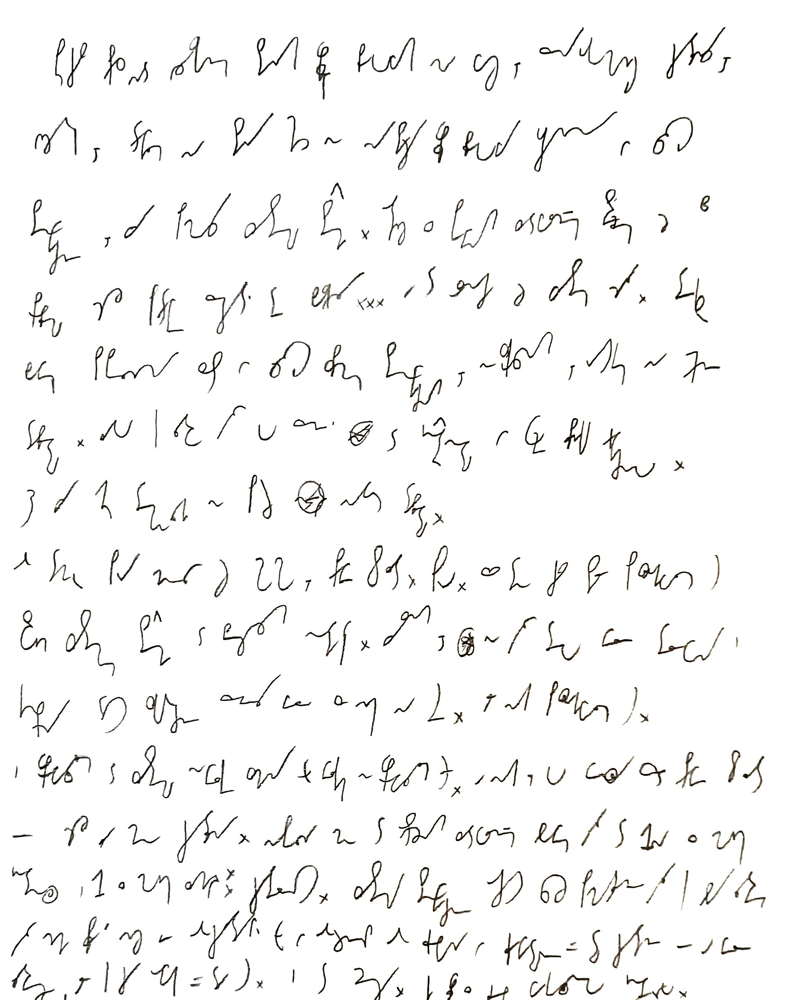

Podczas prac nad odzyskaniem starych wpisów blogowych na Wasz, Przenajukochańsi Czytelnicy, użytek, trafiłem [na stary (choć nie najstarszy) wpis blogowy uczyniony w całości stenograficznie](../2013-01-18_pierwszy-wpis-stenograficzny/), przy pomocy systemu **Ste*Mi***. Otóż z pewnym zadowolnieniem stwierdziłem, że bez problemu wciąż potrafię przeczytać te bazgroły... A to oznacza, że system działa. Tekst bowiem popełniony został w całości pismem stenograficznym, nieskróconym, rysikiem na ekranie tabletu. Dlatego tak łatwo było go przenieść do Internetu w formie pliku graficznego. Dziś, przy aktualnej technologii, nie potrzeba nawet tabletu.

Od tamtej pory minęło już hoho, prawie 8 lat. Sporo. Przez ten czas stale posługiwałem się swoim systemem **Ste*Mi*** do bieżących notatek. Przyznam, nie było tego wiele, telefony i komputery dość skutecznie przejęły wiele z nich na siebie. Ale jednak posługiwałem się.

I wprowadzałem do systemu niewielkie zmiany (wielkich nie wprowadzałem). A jednak, jego wersja sprzed prawie 8 lat jest wciąż dla mnie czytelna.

Napełnia mnie to ostrożnym zadowolnieniem, albowiem była to jedna z moich intencji, jeden z moich zamiarów: czytelność.

Systemy stenograficzne oczywiście zawsze pomyślane były tak, aby łatwiej było nimi pisać, niż je odczytywać (w odróżnieniu od klepania w klawiaturę - tu czytanie jest o wiele łatwiejsze). Ale tak czy owak - da się.

I to cieszy.

Taki wpis z głębin wakacyjnego interioru.

