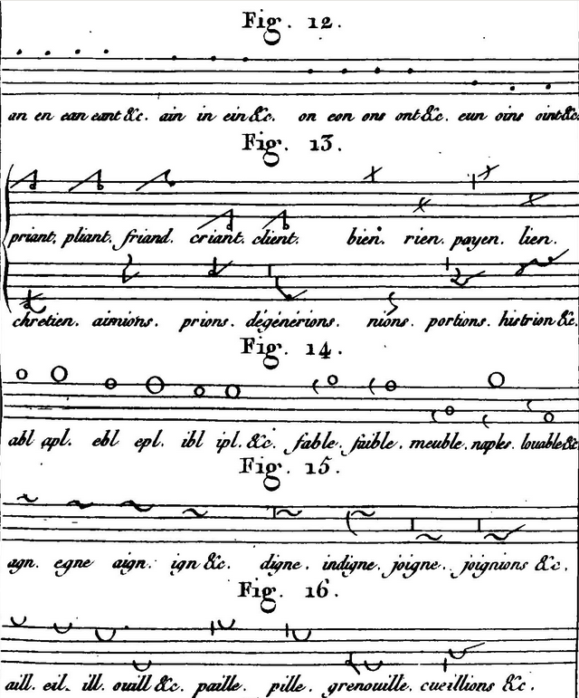

## Diariusze sejmowe 

**[Więcej na ten temat TU](https://senat.edu.pl/historia/diariusze/)**



Jeżeli przyjmiemy za początek polskiej stenografii diariusze sejmowe
spisywane na zamówienie magnatów, okaże się, że kraj nasz nie
leżał jakoś bardzo daleko od centrów cywilizacji (przynajmniej w kwestii stenografii). Specyfika wykształcenia polskiego predystynowała do używania w piśmie łaciny
zamiast języka ojczystego, którego ortografia nie była jeszcze ustalona.
Zatem na początku notowano po łacinie, a zatem i korzystano z
doświadczeń wieków uprzednich, używając rozlicznych skrótów.
Piśmiennictwo polskie przez całe wieki przetykane było gęsto łaciną, a
skrybowie wobec języka polskiego stosowali te same metody i wdrażali
kontrakcje do języka polskiego. Niektóre z nich stały się samodzielnymi
słowami:

- Wojewoda = **Wjda**
- Jego miłość = Jmć = **Imć**
- Wielki = Wlki = **Wlk**
- Wielkopolska = **Wlkp**
- Rzeczpospolita = **Rzplita** = Rpta

i najmocniejszy przykład:

*Wasza Miłość = Wasza Mość = Waszmość → Waszmość pan = Wasan = acan*

<!--  -->



<!-- *Diariusz sejmowy z końca XVIII wieku* -->

**[>>Diariusz Sejmu Czteroletniego (transkrypcja)<<](https://www.wbc.poznan.pl/dlibra/publication/20159/edition/32995/content)**

W pamiętnikach 
[Stanisława Augusta Poniatowskiego](https://pl.wikipedia.org/wiki/Stanis%C5%82aw_August_Poniatowski)
 wydanych w Petersburgu znajduje się wzmianka o
„logografach”. Wiadomo, że ostatnie sejmy były już stenografowane,
prawdopodobnie metodą logograficzną, a 
[diariusze sejmowe król Stanisław August kazał wydawać drukiem](http://www.wilanow-palac.pl/diariusze_sejmowe_z_xviii_wieku.html)
.

Metoda logograficzna polegała na tym, że pisarze siedzieli w rzędzie, lub w kole. Każdy zapisywał zaplanowany fragment zdania lub całe zdanie, a następny pisarz niezwłocznie notował kolejny fragment. Metodę tę wynaleziono jeszcze w 
[Starożytnym Rzymie i stosowano do spółki z notami tyrońskimi]({filename}../historia/Historia.StarozytnyRzym.md).

Oczywiście, z punktu widzenia współczesnej stenografii, techniki zapisu stosowane przez sekretarzy spisujących diariusze sejmowe, nie były stricte stenografią. Miło jednak jest pomyśleć, że nie wypadliśmy sroce spod ogona…

## Stenografia geometryczna

Włodzimierz Resl w pracy o polskiej stenografii „*Geschichte der
polnische Stenographie*” z roku 1908 stwierdził:

*Polacy nie byli wcale ostatnimi między słowiańskimi ludami, które przyswoiły sobie stenografię i zaczęły ją pielęgnować.*

Tamże można przeczytać, że niejaki Nowicki wydał w Warszawie w roku 1808
„*Stenografię czyli sztukę sekretnego i niedocieczonego pisania*”. Już
po tytule można poznać, że intencją autora była raczej kryptografia. Ze
stenografią nie miało to nic wspólnego, podobnie jak wydana w 1860 roku
w Berlinie praca „*Praktyczna nauka skoropisania dla szkół polskich*”
niejakiego Walacha, która traktowała o kaligrafii.

### Przyjaciele, wielbiciele i Mickiewicz

Przed rokiem 1830 studenci przepisywali stenograficznie co sławniejsze
wykłady uniwersyteckie. Wiadomo też, że 
[Mikołaj Nowosilcow](http://pl.wikipedia.org/wiki/Niko%C5%82aj_Nowosilcow)
, w czasie, kiedy był kuratorem oświaty w Wilnie, prześladował uczniów, u których znaleziono notatki stenograficzne, podejrzewając ich o pismo tajemne. Jeżeli filomaci mieli kontakt z dekabrystami (a raczej mieli na uniwersytecie w Petersburgu), to należy przypuszczać, że zetknęli się z rosyjską 
[Grafodromią](http://blogs.princeton.edu/graphicarts/2010/09/graphodromie_ou_ecriture_cursi.html)
,
autorstwa licealnego kolegi 
[Puszkina](https://pl.wikipedia.org/wiki/Aleksander_Puszkin)
, barona 
[Modesta Adriejewicza Korffa](https://ru.wikipedia.org/wiki/%D0%9A%D0%BE%D1%80%D1%84,_%D0%9C%D0%BE%D0%B4%D0%B5%D1%81%D1%82_%D0%90%D0%BD%D0%B4%D1%80%D0%B5%D0%B5%D0%B2%D0%B8%D1%87)
. 
Zetknąłem się wszakże z hipotezą, że stenografia, którą się posługiwali, była autorstwa
[Kazimierza Krupskiego](http://www.ipsb.nina.gov.pl/a/biografia/jan-nepomucen-kazimierz-krupski)
, o którym dalej.

Najstarszym znanym artykułem o stenografii jest „Zatrudnienie
stenografa” opublikowane w „Rozrywkach Umysłowych” w Krakowie w roku
1841: 

*Trudno sobie wyobrazić, jak uciążliwem jest zatrudnienie
stenografa w Paryżu i w Londynie. Blizko pięć godzin a może i więcej
siedzi zamknięty w swej klatce, w której zaledwo jego pulpit się
pomieści, i chwyta każde słowo mówcy, którego cała zasługa na tem
częstokroć polega, że w kilku minutach potok słów wyleje.*(…) 

Samego Mickiewicza 
[stenografowali](http://books.google.pl/books?id=vRFEAAAAYAAJ&pg=PR17&dq=stenografia+mickiewicz&hl=pl&ei=E00qTLH7LM-msQamzpDEBA&sa=X&oi=book_result&ct=result&resnum=3&ved=0CDQQ6AEwAg#v=onepage&q&f=false) 
jego wielbiciele i studenci, kiedy prowadził 
[wykłady](http://books.google.pl/books?id=36sOAAAAQAAJ&pg=PR65&dq=stenografia+mickiewicz&hl=pl&ei=E00qTLH7LM-msQamzpDEBA&sa=X&oi=book_result&ct=result&resnum=9&ved=0CE4Q6AEwCA#v=onepage&q&f=false) 
w 
[Kolegium Francuskim](https://pl.wikipedia.org/wiki/Coll%C3%A8ge_de_France)
, w latach 40-tych XIX wieku, w Paryżu.

A najstarszym opublikowanym systemem jest metoda, którą opracował
Kazimierz Krupski.

### Jan Nepomucen Kazimierz Krupski

Prawdopodobnie najdawniejszą, zachowaną, próbą stworzenia stenografii
polskiej był powstały roku 1828 na podstawie francuskiej 
[Okygraphie](http://gallica.bnf.fr/ark:/12148/bpt6k2084843) 
z roku 1801, system autorstwa dziennikarza i literata Kazimierza
Krupskiego (autora m.in. książki o strategii szachowej, zwolennika
wprowadzenia szachów jako przedmiotu obowiązkowego w szkole). W
zapiskach jego znaleźć można wzmianki, że zajmował się tym problemem
jeszcze jako młody człowiek, w roku 1816. Już wtedy uznawano 46 głosek
polskich, które autor ten starał się wszystkie ująć w bardzo pozycyjny
system.

Wykonał także pierwsze obliczenia częstotliwości występowania głosek, co
jest niezbędne przy projektowaniu systemu stenograficznego. Przypuszcza
się jednak, na podstawie różnic z aktualnymi wynikami badań, że liczył
on po prostu słowa w słowniku, a nie w przyjętym przez siebie korpusie
próbek językowych.

<!--  -->



<!-- *Oryginalna francuska Okygraphie* -->

System Krupskiego oparty był o trzy linie, wobec których każdy znak mógł
się znaleźć w jednej z siedmiu pozycji, co zmieniało jego brzmienie.
Uwzględniał wszelkie zmiękczenia i jotowania, za to nie utworzył wielu
tzw. grup zgłoskowych. Liczby, które mogą się pojawiać w tekście,
Krupski zalecał zapisywać wybranymi znakami swojego alfabetu. Dopuszczał
także stosowanie skrótów dla najczęściej używanych wyrazów, które
należało po prostu nauczyć się na pamięć.

Późniejsi stenografowie skrytykowali przede wszystkim pozycyjność
systemu, która była trudna do utrzymania i utrudniała czytelność: ”*W
całym układzie widzimy tylko dążność, aby jednem poruszeniem ręki każdy
znak wypisywać, mniej zaś baczności - a nawet spostrzegamy i zupełne
zapoznanie sposobów takiego samego wyrażenia całych zgłosek, co jedynie
zbliżyć może pismo stenograficzne do ideału szybkości i łatwości*”
(Felicjan Jackowski).

Podręcznik do systemu Kazimierza Krupskiego, napisany w roku 1828,
przeleżał w szufladach 
[Ludwika Jenike](http://pl.wikipedia.org/wiki/Ludwik_Jenike)
do roku 1858. W momencie wydania był zatem już przestarzały wobec
powstającej konkurencji i nie trzeba było wiele trudu, żeby to zauważyć.
W międzyczasie pojawiło się kilka innych systemów, znacznie go
przewyższających.

**Więcej o systemie Krupskiego przeczytamy w >> [artykule Lecha Klewżyca](../krupski-kazimierz/) <<, zamieszczonego w Stenografie Polskim z roku 1963, nr 1(83).**

### Józef Pysz

Urodził się w 1793 roku w chłopskiej rodzinie pochodzenia niemieckiego i
osierocony w dzieciństwie przeniósł do Krakowa, z którym związał się na
całe życie. Tam zdobył wykształcenie i został nauczycielem licealnym i
guwernerem. We wspomnieniach różnych ludzi zapisał się jako człowiek
potulny i łagodny, lecz uwielbiający się uczyć, o wszechstronnych
zainteresowaniach. Jeżeli w każdej historii musi się znaleźć jakiś
pechowiec, to mamy oto idealnego kandydata. Studiował historię naturalną
i prawo, języki obce, geografię i fizykę, lecz także literaturę i nauki
polityczne. Pozostawił po sobie wiele rękopisów dzieł na różne tematy,
stenografia była tylko jedną z wielu jego pasji.

Rękopis podręcznika swojego systemu Pysz złożył w drukarni w roku 1838,
gdzie ten zaginął. Odtworzenie materiału zajęło mu dwa lata, lecz ani w
roku 1840, ani trzy lata później, ani do śmierci autora wydać się go nie
udało. Dzięki bezinteresowności drukarzy i hojności sponsorów wydano
„*Stenografję zastosowalną do wszystkich języków i dyalektów*” Józefa
Pysza dopiero w roku 1866.

<!--  -->



<!-- *Dla wszystkich yęzyków i dyalektów…* -->

Książka zawierała wiele interesujących spostrzeżeń, jak 
„*samogłoski są mniej istotnemi wyrazów członkami, najjaśniej (to) widzieć w pisowni języków wschodnich*” 
i kuriozalnych rad, np. jak obejść się bez pióra i
atramentu, kiedy koniecznie chce nam się pisać: 
„*Namazawszy masą tłustą z sadzami zmieszaną arkusz papieru, połóż na nim czysty arkusz jedwabnego papieru oliwą napuszczony, ten przyjmuje kolor podłożonego arkusza wszędzie, gdzie rylec, którym kreślisz, przechodzi. Chcąc przeczytać, co napisano, przyłóż popisany arkusz do czystego białego. Umieściwszy papier poczerniony pomiędzy dwoma olejnemi, otrzymasz od razu dwa egzemplarze. Rylec do pisania robi się z ciał twardych, z drutu, kości, rogu, bukszpanu, hebanu*”.

System stenograficzny Pysza oparty był ideowo o francuski przekład systemu 
[Taylora - Bertina](http://fr.wikipedia.org/wiki/Th%C3%A9odore-Pierre_Bertin)
, choć kierunki
znaków opracowane zostały w dużej mierze samodzielnie. Skrótowanie
opierał przede wszystkim o opuszczanie samogłosek, ale też spółgłosek,
szczególnie w dużych grupach, np. źdźbło=dźbło, chrząszcz=sząszcz, grupy
*ws, wsz, zw, szw* oznaczał apostrofem, a *rz* przekreśleniem. Dla początków
i końców wyrazów Pysz opracował osobne skrócone znaki tak, aby podobne
końcówki, lub przedrostki opisywać tylko jednym znakiem, np. *ro-* i *roz-*,
*-ctwo, -stwo, -iedztwo, -adztwo*, itp.

<!--  -->



<!-- *Stenografia Bretina* -->

Ponieważ w systemie programowo opuszczano samogłoski, Józef Pysz zalecał
gruntowną znajomość języka, jak również tematu stenografowanego
dokumentu, aby skutecznie móc go odczytać. Zamieszczono także
przykładowy tekst w piśmie alfabetycznym, przedstawiający istotę skróceń
systemu Pysza:

„**ztrd-nie stengrf. trdn sb wbrzć k czlw st strdnie stn w parz i w lndn blsk 5 gdzn a mz i wej sdz zmknt w swj klatc w ktrj zldw g plpt się pmse i hwt kzd słw mwc ktrg cł zsłg n t czstkrc plg z w klk mnth ptk słw wyl**” 

czyli

*Zatrudnienie stenografa. Trudno sobie wyobrazić, jak uciążliwe jest zatrudnienie stenografa w Paryżu i w Londynie. Blisko 5 godzin a może i więcej siedzi zamknięty w swej klatce, w której zaledwie jego pulpit się pomieści i chwyta każde słowo mowcy, którego cała zasługa na tem częstokroć polega, że w kilku minutach potok słów wyleje*.

<!--  -->



<!-- *Okładka do podręcznika Józefa Pysza* -->

System Pysza podobny był do później opublikowanej Najłatwiejszej
Stenografji Polskiej. Ze wspomnień innych osób wiadomo, że poza samym
autorem opanowały metodę jeszcze trzy osoby, które wkrótce rozjechały
się po świecie.

### Intermezzo, czyli dlaczego stenografia geometryczna nie przyjęła się w Polsce 

Choć następni twórcy systemów geometrycznych datują się już na okresy,
dla których przeznaczyłem osobne rozdziały, postanowiłem umieścić ich
tutaj, ponieważ ich osiągnięcia nie miały dużego znaczenia dla rozwoju
stenografii w Polsce. Niektórzy sami uznali, że stenografia geometryczna
nie nadaje się dla oddania wszystkich zawiłości języka polskiego. Ich
prace były pionierskie, czasem wyprzedzały systemy kursywne, czasem były
tylko wyrazem pewnych językoznawczych przemyśleń. Tak czy owak, należy
ich odnotować, skoro uczestniczyli w polskim życiu stenograficznym.

Dlaczego stenografia geometryczna nie przyjęła się w Polsce? Z pewnością
złożyły się na to dwie przyczyny. Pierwsza, to znacznie mniejsza
aktywność twórców systemów geometrycznych. Ich projekty przypominają
prace hobbystów, a nie stenografów-praktyków. Drugą przyczyną może być
bogactwo języka polskiego, poczynając od liczby podstawowych (tj. w uproszczonej fonetyce) głosek
równą 45. Ogromna mnogość grup spółgłoskowych 
(*prz, sprz, strz, trz, krz, skrz, pr, spr*, etc.), 
mnóstwo wielosylabowych słów i niespotykana
gdzie indziej rozbudowana gramatyka wcale nie ułatwiają zadania. Na
podstawie własnych doświadczeń mogę stwierdzić, że 
**znaki pochodzenia geometrycznego, czy też w podstawach takie same znaki półkursywne, nie nadają się do oddania bogactwa języka polskiego** 
, zatem techniki stenograficzne tego typu stanowić mogą tylko osobiste eksperymenty ich
twórców. Zgadzam się z poglądem dr. Szymona Tauba, twórcy systemów,
teoretyka i praktyka , że 
„*pole stenografii polskiej leży w dziedzinie stenografii graficznej*” - czyli kursywnej.

### Feliks Saxe

Nie wiadomo, dlaczego ten francuski lekarz przybył do (nie istniejącej wówczas) Polski. Twierdził, że uznał nasz kraj za swoją drugą ojczyznę dla niezwykłej życzliwości miejscowych (sic!). Cóż, ktokolwiek bywał na Podkarpaciu, zna fantastyczną gościnność i otwartość mieszkańców byłej Galicji i Lodomerii.

W 1863 roku młody emigrant z Francji przedstawił do oceny
Polsko-Ruskiego Towarzystwa Stenografów we Lwowie swój manuskrypt w
formie krótkiej broszurki pt. „[Najłatwiejsza Stenografija Polska](http://podreczniki.stenografia.pl/saxe/saxe_felix_NAJLATWIEJSZA_STENOGRAFIJA.pdf)”.
Wiadomo, że autor równocześnie do druku szykował trzy dzieła:
stenografię polską, rosyjską i francuską. Ich egzemplarze znalazły się
ponoć w bibliotece Towarzystwa, ale niestety, sama biblioteka zaginęła w burzach dziejowych.

System stenograficzny rzeczywiście był prosty, składał się z 18 znaków
spółgłoskowych i diakrytyków dla samogłosek. Dopuszczał dzielenie
długich wyrazów na części, żeby się nie poplątało w czasie pisania i
czytania. Dla niektórych przyimków, przedrostków i przyrostków używał
symbolicznych oznaczeń, co miało przyspieszyć zapis.

<!--  -->



<!-- *Alfabet Saxe'a* -->

Najciekawsze miał podejście do kwestii skracania wyrazów oraz innych,
niestenograficznych technik przyspieszania zapisu: „*Niektóre wyrazy mniej znaczne, a nie naruszające myśli, można opuścić, np. »w krótszym daleko czasie<< itd.*”.

Zgodnie ze świadectwem Ludwika Jenike, broszurka z podręcznikiem została
w roku 1864 wyszydzona na łamach „Kurjera Niedzielnego”, na co Saxe odpowiedział czterowierszem Brodzińskiego:

„**Niejedną cząstkę życia na tom ja poświęcił,\
Bym co dobre wyszukał i drugich zachęcił.\
Chcesz lub nie chcesz korzystać z minionego znoju,\
Ja tobie życzę szczęścia, ty mi życz spokoju.**”

<!--  -->



<!-- *Modlitwa Pańska w systemie Saxe* -->

Jednak można ten podręcznik potraktować jak przykład, że projektowaniem
systemów stenograficznych powinni zajmować się ludzie o prawdziwie
głębokim pojmowaniu danego języka. Zastępowanie słów krótszymi jest
przyjętą formą notowania, lecz sam system stenograficzny nie powinien
narzucać takiej metody, której stosowanie powinno zależeć od uznania
piszącego. System Feliksa Saxego miał prawdopodobnie tylko jednego
użytkownika w osobie samego autora, któremu tym łatwiej przychodziło
pisanie w nim, że korzystał z niego także po francusku, czyli w
ojczystym swoim języku.

### Rękopis 2937

Zgodnie z książką Stefanii Bobrowskiej pt. „*Dzieje stenografii na
świecie*”, w 
[Muzeum Czartoryskich](http://www.muzeum-czartoryskich.krakow.pl/)
(w Krakowie), pod numerem 2937 spoczywa rękopis „*Art abreviateur:
Ecriture mysterieuse*”, a od strony 23 „*Variations de la methode
Stenographique Francaise, Adaptees a la langue Polonaise*” z niewyraźną datą pisaną ołówkiem: **1867**.

Ponieważ we Francji królowały systemy geometryczne, należy przypuszczać,
że jest to kolejna wariacja na temat. Jeżeli ktoś zdoła skopiować
manuskrypt, chętnie go opublikuję na tych stronach dla korzyści
przyszłych pokoleń.

[**TUTAJ** obszerny artykuł omawiający system przedstawiony w Variations...](../rekopis2937/)

### Gracjan Pyrek

Inżynier po paryskiej politechnice (rocznik 1900), po powrocie do Kraju
Przywiślańskiego założył w Warszawie kursy handlowe i języków obcych,
które prowadził przez następne dziesięciolecia.

<!--  -->



<!-- *Alfabet Duploye'a* -->

Podczas studiów we Francji pewien Chińczyk, któremu udzielał korepetycji
z rosyjskiego, zwrócił jego uwagę na system Duploye. Pyrek miał już
wcześniej do czynienia z systemem [Pitmana](https://pl.wikipedia.org/wiki/Isaac_Pitman) i był pod wrażeniem możliwości
stenografii. W 1906 roku został przyjęty na członka zwyczajnego Akademii
Stenograficznej Duploye (opowieść o niej może być tematem oddzielnego
artykułu). Podczas studiów w Paryżu utrzymywał się ze stenografowania i
pracował nad polskim przekładem systemu. Stenografia Gracjana Pyrka
zatem to przekład Duploye na polski. Opinię Gumińskiego na jej temat
cytowałem oddzielnie. System Duploye jest protoplastą [Stenografii
Gregga](https://en.wikipedia.org/wiki/Gregg_shorthand). Pyrek przyjął system fonetyczny ze stenograficznymi
uproszczeniami, jak np. *trz=cz, poszedł=poszet*. Silna krytyka ze
strony zawodowców i stałe badania autorskie doprowadziły w końcu Pyrka
do wniosku, że systemy geometryczne nie nadają się do stenografii języka
polskiego i w 1924 roku zaczął w swojej firmie nauczać systemu
Gabelsbergera-Polińskiego.

### Jan Rowiński

Bodaj najbezczelniejszy propagator swojego systemu, lub może
hohsztapler. W roku 1923 przed Wielkanocą rozesłał do wszystkich szkół
gimnazjalnych i zawodowych po kilkadziesiąt egzemplarzy drukowanego
„*Listu o stenografji z datą III 1923 stron 4 od Biura Stenografów w
Warszawie, Zielna 3-20, podpisano dyrektor Jan Rowiński*”. Do dokumentu
tego dołączony był list pisany na maszynie do dyrekcji danej szkoły z
prośbą o polecenie uczniom prenumeraty „Listów stenograficznych”.
Rowiński zwracał się tam do „Drogiego Kolegi” zachęcając do „*nauki
stenografii i prawiąc o jej korzyściach, z prośbą o przesłanie
kilku-kilkunastu tysięcy marek polskich zależnie od możności, jeżeliby
uczniowie nadesłali po 10 tyś, to nadeśle im autor drukowane odpowiedzi,
poprawione ćwiczenia i list do rodziców, aby ci wiedzieli, czego ich
dziecko tak pilnie się uczy.*” Samego systemu jednak nie podesłał, więc
nie sposób cokolwiek o nim powiedzieć. Zgodnie ze świadectwami
współczesnych stenografów miała to być kolejna wariacja nt. systemu Duploye.

W ramach swojej akcji propagandowej Rowiński stosował znane dziś
techniki marketingowe, np. przysyłał skrypt z częścią alfabetu, resztę
obiecując po opłacie. 
[Antoni Wojnar](http://www.jezuici.krakow.pl/cgi-bin/rjbo?b=wftj&q=WOJNAR,+ANTONI&f=10)
postarał się wyprzeć oszusta z rynku, skończyło się to sądowymi
procesami, w których udowodniono, że Rowiński nie zna żadnej
stenografii.

