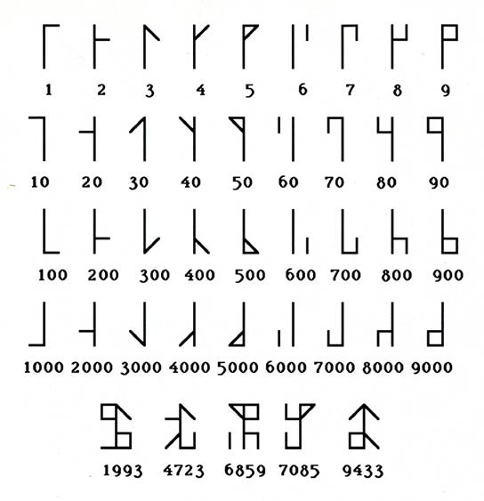

## Karolingowie

W średniowieczu używano jeszcze not tyrońskich, jednak ich popularność
spadła wraz ze spadkiem popularności słowa pisanego w ogóle. Wraz ze
coraz gorszą znajomością łaciny wśród wykształconych elit stosowano 
wersję uproszczoną znaków tyrońskich, sylabiczną, o
czym więcej można przeczytać w rozdziale o 
[starożytnym Rzymie](../starozytny_rzym/).
Uzupełniano je klasycznymi technikami skrótowania, czyli 
[kontrakcją](https://pl.wikipedia.org/wiki/Kontrakcja_(skr%C3%B3t)),
[suspensją](https://pl.wikipedia.org/wiki/Odci%C4%99cie), 
[brachygrafią](https://pl.wikipedia.org/wiki/Brachygrafia) 
i [abrewiacją](https://pl.wikipedia.org/wiki/Abrewiatura). 
Wreszcie później w pismach przez kolejne
kilkaset lat nie spotyka się stenograficznych znaków tyrońskich a
jedynie skróty. Oczywiście nie całkiem i nie wszędzie.

Warto tutaj wspomnieć 
[Karola Wielkiego](http://pl.wikipedia.org/wiki/Karol_Wielki)
 (742-814), 
króla Franków i imperatora Zachodniej Europy, który nakazał,
by nauczano 
*Psalmos, notas, cantus, compotum, grammaticam per singula monasteria vel episcopia*, 
czyli psalmy, stenografię w formie not
tyrońskich, rachunki i gramatykę w każdym klasztorze lub biskupstwie.
Studia były ciężkie. Za zapomnienie podczas wakacji wyuczonych skrótów
groziła kara chłosty. Studenci uczyli się na pamięć długich list słów
podlegających abrewiacji: 

„*Sancte sator suffragator\
legum lator largus dator\
iure pollens es qui potens\
nunc in ethra firma petra\
a quo creta cuncta freta\
quae aplaustra uerrunt flostra\
quando celox currit uelox\
cuius numen creuit lumen\
simul solum supra celum\
prece posco prout nosco\
caeliarche Christe parce\
et piacla dira iacla\
trude tetra tua cetra\
... etc. etc...* ” \
(Carmen ad Deum)

W formie łatwych do zapamiętania poematów-modlitw.

Podczas rządów Karola Wielkiego oraz jego syna, władcy
[Cesarstwa Rzymskiego Narodu Niemieckiego](https://pl.wikipedia.org/wiki/Karol_II_99te_Cesarstwo_Rzymskie_Narodu_Niemieckiego) noty tyrońskie zdołały prawie 
całkiem zaniknąć. Zachowały się nieliczne dokumenty, jak wzmianka 
z roku 971 o wyborze wójta Abbota Notkera stenografowana przez mnicha Ekkarda
di Santo Gallo. 
W kronice z czasów 
[Ottona III](https://pl.wikipedia.org/wiki/Otton_III) (983-1002)
zapisano, że cesarz był zaskoczony widząc jakieś tajemnicze
znaki na woskowej tabliczce.

Wyjście z mody not tyrońskich i poszukiwania nowych form
stenograficznych mają związek również ze zmianą narzędzi piśmienniczych - wychodzi z użycia woskowa tabliczka i papirus, a pojawia się pióro i pergamin,
welin, a wreszcie papier (i w końcu też ołówek). 
Inna technika pisania, inne narzędzia, inne
kształty pisma, inna praca piszącej ręki.

Jako ciekawostkę warto odnotować, że podczas gdy w Zachodniej Europie
zamierało zastosowanie not tyrońskich, na terenie Cesarstwa
Bizantyjskiego kwitł nowy, sylabiczny, grecki system stenograficzny.
Metody tej używano w klasztorach ortodoksyjnych w Magna Graecia. Dzięki
fundatorowi opactwa Grottaferrata niedaleko Rzymu, 
[Santo Nilo Juniore da Rossano](https://pl.wikipedia.org/wiki/Nil_z_Rossano),
i jego słynnemu „monasticum scriptorium” z lat 999-1004, dziś ów grecki
system nosi nazwę Grottaferrata.

Wiadomo, że najwięcej eksponatów dokumentów tachygraficznych z pierwszego
i początków drugiego tysiąclecia chrześcijaństwa, przechowywanych jest w
Bibliotece Watykańskiej i Muzeum Brytyjskim.

## John z Tilbury i cyfry Basingstoke'a

Atoli prace nad skróconymi formami zapisu nie ustawały. W klasztorach
podważano użyteczność rzymskiego sposobu zapisu liczb. Powstały cyfry
cysterskie, zwane też cyframi Basingstoke'a, służące do numerowania
stron w codexach, ale też do zapisu pomiarów astrologicznych.
Basingstoke był mnichem, który spędził wiele lat w Bizancjum, mieszkał
także w Atenach. Uważa się, że zetknął się z Kamieniem Akropolskim i z
niego czerpał inspirację. Dalej inspiracja ta powędruje do systemu
Brighta (o czym w innych rozdziałach).

<!--

-->

<!--
*Cyfry Basingstoke'a*
-->

W 1180 roku 
[John z Tilbury](http://freepages.history.rootsweb.ancestry.com/~cmtilbury/ancients/john_of_tilbury.html)
opracował uważany za pierwszy anglojęzyczny system skrótowego zapisu.
Opierał się on o pionową linię bazową i doklejone do niej pętle i
kreseczki. Każdy znak oznaczał słowo.

System ten należał do grupy odcyfrowych, powstałych w wyniku zetknięcia
się Europejczyków z kulturą islamu, dość wówczas nasiąkniętą matematyką.
Zatem później dają się poznać również systemy w innych krajach, jak
francuskie litery wertykalne, doraźnie importowane cyfry arabskie i
ottomańskie.

<!--

-->

<!--
*Cyfry cysterskie (pośrodku)*
-->

### Szwenter, Porta i szyfry

Choć sposób pisania oparty o pionową (czy w przypadku cyfr cysterskich,
poziomą) linię bazową okazał się ostatecznie ślepą uliczką, kolejne
systemy tworzone tą metodą powstawały w różnych krajach aż do XVIIw.
Poniżej przykład zapisu stworzonego przez niezbyt dobrze znanego w
Polsce niemieckiego geniusza, człowieka-orkiestrę, wynalazcę,
orientalistę i matematyka w jednej osobie, profesora z uniwersytetu w
Norymberdze, doktora 
[Daniela Schwentera](http://en.wikipedia.org/wiki/Daniel_Schwenter):

<!--

-->

<!--
*Alfabet Daniela Schwentera*
-->

<!--

-->

<!--
*Prezentacja alfabetu w podręczniku autorskim*
-->

<!--

-->

<!--
*Hymn luterański w zapisie Schwentera*
-->

Czy czegoś nam to nie przypomina? Mnie to jako żywo kojarzy się
z pismem [koreańskim Hangul](https://pl.wikipedia.org/wiki/Hangul),


 
choć trzeba zwrócić uwagę, że 
w przeciwieństwie do [Sejonga Wielkiego](https://pl.wikipedia.org/wiki/Sejong_Wielki)
[autor systemu](https://en.wikipedia.org/wiki/Daniel_Schwenter) 
nie zwracał uwagi na fonetykę. 
Choć badania językowe wydają się mieć źródło
właśnie w pracach nad systemami stenograficznymi, odkrycie podobieństw
brzmień różnych głosek i dopasowywanie do nich odpowiednich znaków są
odkryciami trochę późniejszymi.

Pracę Schwentera poprzedziły alfabety opublikowane w 1597 roku przez
[Jana Baptystę della Portę](http://en.wikipedia.org/wiki/Giambattista_della_Porta).
Ten jednak nie miał intencji tworzenia systemów stenograficznych.
Zainteresowany był kryptografią.

<!--

-->

<!--
*Jeden z alfabetów Gianbattisty Porty*
-->

W 1668 roku John Wilkins opracował podobny system, lecz oparty, jak
cyfry cysterskie, o poziomą linię bazową. Do dziś metodę można spotkać w
eksperymentach artystycznych i ornamentach.

## Rosja

W Nowogrodzie Wielkim i Pskowie, aż do ich upadku za przyczyną Iwana
Groźnego, stenografowano tzw. miejskie wiece, zebrania miejskiej władzy
ustawodawczej.

W domu Romanowych również zatrudniano stenografów. 
[Car Piotr I](http://pl.wikipedia.org/wiki/Piotr_I_Wielki)
korzystał z usług firmy o nazwie „Kampanija pisak”. Stąd widać jasno, że
popularność stenografii powiązana jest ściśle z demokratycznymi formami
rządów, działaniami wielkich organizacji, intensywnymi debatami oraz
rozwojem nauk i techniki (podpowiedź: to był żart).

## Wielcy oratorzy i duchowni chrześcijańscy

Po przeszło dwustu latach, kiedy sztuka szybkopisania znikła z
powszechnej świadomości, wraz z postępem i rozwojem miast stopniowo
zaczęła wracać do łask. Wiadomo, że 
[święty Tomasz z Akwinu](http://pl.wikipedia.org/wiki/Tomasz_z_Akwinu)
potrafił dyktować trzem lub czterem tachygrafom na raz. Potrzeba
utrwalania żywego słowa nie zanikła zupełnie wraz ze zmierzchem
piśmiennictwa pod koniec pierwszego tysiąclecia chrześcijaństwa.
Stenografia przechowała się w Kościele. Zakony franciszkanów,
dominikanów i augustianów kultywowały sztukę, również podczas
publicznych kazań, które skrzętnie notowano i później omawiano, aby
usunąć błędy i niedociągnięcia. W publicznej bibliotece miasta Siena
przechowały się zapisy 45 kazań wygłoszonych na Campo Formio przez
franciszkanina zwanego 
[Świętym Bernardynem ze Sjeny](http://pl.wikipedia.org/wiki/Bernardyn_ze_Sieny)
w roku 1427, a spisanych przez gręplarza wełny, niejakiego Benedetto,
który codziennie zjawiał się na placu wyposażony w tablety i stylus. I
dobrze czynił, jako że San Bernardino był podobno niezwykłym mówcą, a
jego kazania potrafiły zgromadzić nawet do 40 tysięcy słuchaczy. Sam
orator świadom był, że jego mowy są notowane i widocznie bardzo sobie to
cenił, skoro w kazaniu szóstym zwrócił się wprost do tachygrafa prosząc
go o możliwie jak największą wierność podczas notowania.

<!--

-->

<!--
*Savonarola podczas kazania, niżej stenograf.*
-->

O wiele sławniejszym mówcą, którego kazania spisano na żywo, był nie kto
inny, tylko 
[Girolamo Savonarola](http://pl.wikipedia.org/wiki/Girolamo_Savonarola)
(1452-1498), dominikanin. W 1494 roku, podczas jednego z jego pełnych
pasji wystąpień, tachygraf, niejaki Stefano da Co'di Ponte, tak się
wzruszył, że nie mógł dalej notować. Nie zapomniał jednak, na żywo,
napisać „usprawiedliwienia”: „Porwany wzruszeniem i oślepiony łzami
przerywam stenografowanie.” Ówczesne metody szybkopisania oparte jednak
były głównie na sztuce skrótowania. Oto krótki przykład zapisu z kazania
Savonaroli:

*et c. e. e. e. et c. p. p.*

co transkrybuje się na 

*et cum electo electus eris et cum perverso perverteris*

czyli 

„… a w dobrej kompanii będziesz dobrym, a w złej na złe się obrócisz”

Stenografowanie oracji i kazań pozwalało na produkowanie odpisów i
szerszą dystrybucję ich treści. Zalety tej metody zostały później
docenione również przez duchownych protestanckich, w okresie Reformacji,
czy też szerzej, Renesansu. W tym czasie, choć noty tyrońskie wyszły już
z użycia, posługiwano się skróconym pismem zwanym *mozzi lettere*, lub
*Ars Aristoteli notice*.

<!--

-->

<!--
*Aristoteli notice*
-->

Powrót słowa pisanego oznacza także powrót stenografii. Postęp naukowy,
w tym przejęcie z Chin technologii wyrobu papieru i adaptacja gęsich
piór do pisania, upadek Konstantynopola i pojawienie się wielu uczonych
ze Wschodu w Europie, wreszcie reformacja, czyli intensywny, powszechny
dyskurs na tematy religijne i filozoficzne, a też polityczne, wynalazek
druku i rozwój piśmiennictwa, a stąd także potrzeba utrwalania żywego
słowa sprzyjały renesansowi i później też rozwojowi stenografii. W XVw.
mnisi benedyktyni przywrócili światu Notas Tironianas, jak nazwał te
tajemnicze znaki ich pierwszy badacz, opat Johann Heidelberg zwany
Tritemio lub
[Trithemius](http://en.wikipedia.org/wiki/Johannes_Trithemius).
W następnym wieku badaniami not tyrońskich zajmowało się już wielu
innych (jak np. 
[Jan Gruytere](http://www.wordiq.com/definition/Jan_Gruytere)),
ale też wiek XVI to już odrodzenie stenografii.

