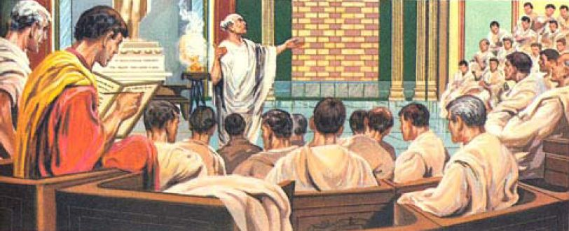
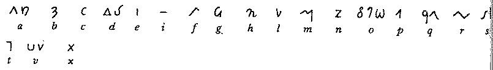
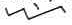
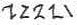
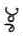
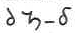
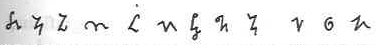

## Zapis skrótowy.

Konieczność zachowywania w formie dokumentalnej ważnych z punktu
widzenia prawa i polityki wydarzeń pozwoliła na narodziny zawodu skryby - zawodowego pisarza. Do pracy tej szkolono często niewolników, u
których stwierdzono odpowiednie zdolności. Skrybowie, z początku na
własny użytek, lecz później także drogą wymiany doświadczeń, opracowali
skuteczny system skrótowego zapisu. Metody te dają się opisać jako:

- kontrakcja (dr = doktor), ściśnięcie, z reguły pierwsza i ostatnia
    litera wyrazu, czasem jeszcze środkowa,
- suspensja (inż. = inżynier, A.D. = Anno Domini), odcięcie końca
    lub (rzadziej) początku wyrazu, użycie pierwszych liter wyrazów,
- brachygrafia (oC = stopni Celsjusza, ale też „:-)” jako uśmiech), użycie skrótu jak wyrazu, lub zmiana znaczenia przez dodawanie różnych znaczków diakrytycznych,
- abrewiacja (pekape = Polskie Koleje Państwowe, OO = ojcowie), użycie
    specjalnych symboli lub pochodnych skrótów dla oddania złożonego
    sensu,
- ligatura (Æ = AE, & = i), sklejanie liter w prostszy znak
    przenoszący ich połączone brzmienie.

    

Według świadectwa dziejopisarza, biskupa Sewilli Izydora (?-636 r.n.e.),
niejaki Enniusz Kwintus Gramatyk (prawdopodobnie helleńskiego
pochodzenia) zgromadził, czy też stworzył ponad 1000 skrótów zwanych
*notae vulgares* czyli popularnych, używanych powszechnie. Były to
skróty takie jak *SPQR* (*Senatus Populusque Romanus*), 
*NB* (*nota bene*, do dziś używane). Wymyślił także metody dla rozróżniania płci w
skrótach, tj. litery skrótów określających płeć żeńską zwrócone były w
kierunku od prawej do lewej 
(np. *F*=*filius*, syn, *F_zwrócone_w_lewo*=*filia*, córka); opisania liczby mnogiej przez
podwojenie (np. *PP* - *patres*, jak współcześnie w dokumentach
kościelnych *OO*=ojcowie). Współcześni badacze uważają, że Enniusz
Kwintus przede wszystkim zgromadził i usystematyzował skróty
alfabetyczne, które były w użyciu przez pierwsze 200 lat rozwoju państwa
rzymskiego, rozwijane przez sekretarzy przeróżnych instytucji, a którymi
ci wymieniali się poprzez urzędowe pisma. W ten sposób stworzył grunt
pod stenograficzny zapis Tyrona, jako formę bardziej dojrzałą i o niebo
bardziej efektywną.

## Noty tyrońskie

### Marcus Tullius Tiro

Wynalazek pierwszego systemu typowo stenograficznego przypisuje się
Markowi Tuliuszowi Tyronowi, sekretarzowi-wyzwoleńcowi, Marka Tuliusza
Cycerona. Opracował on na własne potrzeby uproszczone znaki i przy ich
pomocy zapisywał mowy swego pana, a później bliskiego przyjaciela.

Marcus Tullius Tiro wydał zbiór systematyczny swojego systemu pod nazwą
*[Commentarii notarum tironianarum](http://gallica.bnf.fr/ark:/12148/btv1b84267924)*,
jak tytułowano ten dokument w średniowiecznych odpisach. Dożył
stuletniej starości w miejscowości Puteola 
(dziś Pozzoli, czy też
[Pozzuoli](http://goo.gl/maps/8KEr)
)

<!--  -->

<!-- *Sprzysiężenie Katyliny (63 r.p.n.e.)* -->

Katylina konkurował z Cyceronem o urząd konsula. Jak zapisano u
[Plutarcha](http://pl.wikipedia.org/wiki/Plutarch),
Cyceron zwołał senatorów do świątyni Jowisza Statora, gdzie wygłosił
pierwszą z *oracji katylińskich*, mowę znaną pod łacińskim tytułem
*Oratio in Catilinam Prima in Senatu Habita*. Znamy ją dziś w całości,
gdyż, jak twierdzą historycy, zapisywało ją
czterdziestu[^1] 
*velocissimos scribae*, lub
*clerici*,
uczonych w piśmie szybkopisów. Korzystając z okazji Cyceron
zaprezentował niesamowity potencjał zapisu stenograficznego. 

[^1]: Skąd wiemy, że czterdziestu?
	W pracy badacza starożytności [Herculano Francisco Dourado, A TRANSPOSIÇÃO DO TEXTO FALADO PARA O TEXTO ESCRITO OS LIMITES DO REVISOR NO DISCURSO PARLAMENTAR](http://bd.camara.gov.br/bd/bitstream/handle/bdcamara/3585/transposicao_texto_dourado.pdf),
w rozdziale 1.3 Definição de Taquigrafia e sua origem stoi napisane
(str 26-27):
	*Um fato importante e de destaque para o surgimento da taquigrafia foi a criaçao do primeiro departamento taquigráfico parlamentar, com o serviço taquigráfico para tomada do discurso de Catao (63 d.C.), organizado por Cícero, com a presença de cerca de quarenta velocíssimos escreventes, entre eles o próprio Tiro. Veja, ainda, a manifestaçao de Giuseppe Aliprandi sobre as Notas Tironianas, no art. II primo27 Gabinetto stenografico parlamentar (apud CURY, Rivista Sapere, Milao, 30 de novembro de 1937-XVI)*

	W wolnym tłumaczeniu:

	*Szczególnie ważny jest fakt utworzenia pierwszego biura stenografii parlamentarnej przez Cycerona dla zapisania mowy Katona (63 p.n.e) w liczbie czterdziestu szybkopisów wliczając w to Tyrona. Zobacz jeszcze pracę Giuseppe Aliprandi w sprawie Not Tyrońskich art. II primo 27 Gabinet stenografii parlamentarnej (cytowany przez CURY, Rivista Sapere, Mediolan, 30 listopada 1937-XVI)* 

Wiadomo
także z Plutarcha, z *Żywotów sławnych mężów*, tom drugi, o życiu
Katona, że podczas obrad Senatu nad sprawą Katyliny, pracowali też
szybkopisowie:

*Mówią, że z mów Katona zachowała się tylko ta jedna, dzięki Cyceronowi, który swych sekretarzy wyróżniających się szybkością pisania nauczył znaków mających w małych i krótkich formach wyrażać treść wielu liter i rozmieścił ich tu i ówdzie w sali posiedzeń senatu. Przedtem jeszcze nie uczono i nie posiadano tak zwanych „znakopisów„. Dopiero wtedy, jak mówią, stawiano w tym pierwsze kroki.*

Obrady protokołowano na sposób zwany później *logografią*, tzn. pierwszy
szybkopis łapał strzęp wypowiedzi, np. zdanie, a następny natychmiast zaczynał pisać kolejne. I
tak aż do końca szeregu, o ile to było konieczne, kiedy znowu zaczynał pierwszy.

Cztery lata później, w 59 r.p.n.e., stenografowie weszli na stałe do
biur senackich, a efekty ich pracy złożyły się na Acta Senatus. To
właśnie dzięki stenografom tak wiele nam dziś wiadomo o Starożytnym
Rzymie.

Właściwie powinno się ich nazywać *tachygrafami*, gdyż pojęcie
*stenografii* w tamtych czasach jeszcze nie istniało.

<!--  -->

<!-- *Tyrońscy tachygrafowie w senacie rzymskim* -->

### Notae Tironianae

Noty tyrońskie były systemem ściśle stenograficznym. Wiadomo, że
równolegle był w użyciu uproszczony alfabet pisany zwany *singulariae*
lub *notae literae*, służący do bieżącego pisania pełnych słów.
Tymczasem noty tyrońskie obfitowały w tysiące symboli skrótowych,
których przybywało z każdym wiekiem.

Samemu Tyronowi badacze przypisują około 200 znaków pierwotnych systemu,
które uzupełniano pismem kursywnym.

Można przypuszczać, że pierwsze znaki systemu tyrońskiego opisywały
raczej
[frazeogramy](../../roznosci/slownik/),
niż krótkie słowa, bo na cóż by się miała przydać taka początkująca
stenografia?

<!--  -->

<!-- *Przykład not tyrońskich* -->

Wiadomo z pewnością, że noty tyrońskie miały swoich poprzedników.
Zachował się przekaz o zapisie Enniusza Kwintusa (który mógł być
Grekiem). Zapewne poszczególne wielkie rzymskie rody posiadały własne
zręby zapisu stenograficznego, który mógł być również wykorzystywany
jako szyfr wewnętrzny.

Jednocześnie zachowały się przekazy, że wszelkie ważniejsze posiedzenia
czy to urzędów, sądów, czy rad odbywały się z udziałem urzędników,
którzy ich przebieg rejestrowali na bieżąco, pracując na zmianę, zdanie
po zdaniu - ten sposób był wykorzystywany także w średniowieczu, kiedy
stenografia nie była w powszechnym użyciu.

*Niektóre znaki tyrońskie pozostały w użyciu do dziś. Powyżej widać przykład słowa **et**, który spotkać można w napisach w języku gaelickim w Irlandii.*

Protektor Tyrona zginął w efekcie błędnych wyborów politycznych. Do władzy dorwały się młode wilki z otoczenia
[Oktawiana Augusta Cezara](https://pl.wikipedia.org/wiki/Oktawian_August), 
ale oni także docenili wartość szybkopisania. 

Po Tyronie zapisali się inni stenografowie, jak Wipsaniusz Filargo, wyzwoleniec
[Agryppy](http://pl.wikipedia.org/wiki/Marek_Agrypa), 
czy Aquila, wyzwoleniec
[Mecenasa](http://pl.wikipedia.org/wiki/Gajusz_Cilniusz_Mecenas),
którzy dalej rozwijali ten system. Badacze oceniają, że w momencie
powstania liczyły sobie około 2000 znaków.

[Seneka](http://pl.wikipedia.org/wiki/Seneka_M82odszy)
(Lucjusz Anneusz Seneka 3 r.p.n.e.-65 r.p.n.e.), który sam był
stenografem, zdecydował o zamrożeniu systemu. W tym czasie miał on już
3000 znaków.

### Notariat

Zaprzysiężonych do notowania urzędowych wydarzeń stenografów nazywano
NOTARIUSZAMI. Pracowników notariatu dzielono na: *notarii* (zwanych też
cursores i semiografos), którzy pracowali zespołowo, by zapisać słowa
mówione, *librarii* (lub *amanuensi*), czyli urzędników, którzy
przepisywali księgi, ale też stenograficzne zapiski notariuszy,
*exeptores*, czyli urzędników sądowych odpowiedzialnych zarówno za
stenografię, jak i przepisanie stenogramów do akt sądowych, które mogły
zostać odczytane przez piśmiennych. Wszelkie zapisy zazwyczaj (od
wynalezienia not tyrońskich) prowadzono stenograficznie. Stenografia
weszła do użytku także w gospodarce i wojskowości - wszędzie tam
zatrudniano niewolników-sekretarzy szkolonych w szybkim pisaniu. Do
zapisywania ważniejszych spraw brano sądowych *exeptores* (tak się
narodził zawód **notariusza**). Za błędy lub oszustwa popełnione podczas
stenografowania urzędowego w Rzymie obowiązywały surowe kary:

---------------------

*Eum notarium, qui falsum causae breve in consilio imperatoris retulisset, (Severus) incisis digitorum nervis, ita ut nunquam posset scribere, deportavit.*

Temu notariuszowi, co fałszywie sprawę skrótami przedstawił w Imperialnej Radzie, (Sewer) uciął ścięgna (nerwy?) nadgarstkowe, tak aby już nigdy nie mógł pisać i wypędził. 

*(tłumaczenie moje, proszę poprawić, także poniższe)*

-------------------

### Odnośniki w rzymskiej poezji:

---------------------------

**O stenografii wspomina** [Marcjalis](http://pl.wikipedia.org/wiki/Marcjalis),
Epigram CCVIII, tom 14, Notarius:

*„Currant verba licet, manus est velocior illis,\
Nondum lingua suum, dextra peregit opus.”*

„Choć słowa pędzą, dłoń jest od nich szybsza;\
Nim język się zatrzymał, prawica zakończyła swoją pracę.”

----------------------------

*Nondum lingua suum, dextra peregit opus.* - Stało się to zawołaniem nowożytnych stenografów.

-----------------------------

[Seneka](http://pl.wikipedia.org/wiki/Seneka_M82odszy), **Epistola IX**:

*„Quid loquar verborum notas,\
quibus, quamvis citata excipitur oratio,\
et celeritatem liguoe manus sequitur?\
Vilissimorum mancipiorum ista commenta sunt.”*

„Cóż mam powiedzieć o znakach dla słów,\
przez które, jak szybko by nie przemawiać,\
dłoń nadąży za językiem?\
Oto wynalazek pogardzanych niewolników.”

------------------------------

----------------------

[Manilius](http://en.wikipedia.org/wiki/Marcus_Manilius),
**Astronomica, tom 4** chwali Fortunę za to, że urodził się pod znakiem Panny:

*„Hic et scriptor erit felix,cui litera verbum est,\
Quique notis linguam superet, cursumque loquentis.\
Excipiet longas nova per compendia voces.”*

„Szczęśliwy pisarz,dla którego litera jest słowem,\
Przez swe zapiski prześciga język i prędkość mowy.\
Podejmie się zapisać długie zdania przy pomocy nowych skrótów.”

-----------------------

(Nieznaczne różnice z transkrypcją z [książki Gustawa Sarpa "Prolegomena ad tachygraphiam romanam"](https://books.google.pl/books?id=g-tNAAAAcAAJ&printsec=frontcover&hl=pl#v=onepage&q=werres&f=false) )

*Hic et scriptor erit velox, cui litera verbum est,\
Quique notis linguam superet, cursimque loquentis.
Excipiat longas nova per compendia voces.*

------------------------------

**W hymnie z okazji śmierci Kasjanusa**, 
[który został zadźgany przez swoich uczniów przy pomocy rysików (stylusów) jako broni](https://en.wikipedia.org/wiki/Classical_Latin_literature_in_the_Church),
[Prudentius](http://pl.wikipedia.org/wiki/Aurelius_Prudentius_Clemens), 
poeta z IV w.n.e. tak opisuje nauczyciela stenografii:

*„Praefuerat studiis puerilibus, et grege multo\
Septus magister literarum sederat\
Verba notis brevibus comprendere cuncta paratus\
Raptimque punctis dicta praepetibus sequi.”*

„Mistrz szkoły przewodził młodzieńczym studiom\
I zasiadł otoczony przez tłumek gotowych zapisać\
Wszystkie słowa skrótami i prędko nadążyć\
Za przemówieniem w każdym jego podpunkcie.”

-------------------------------

[Auzoniusz Wielki](http://pl.wikipedia.org/wiki/Auzoniusz) poświęcił jej 
[cały poemat](../poemat_auzoniusza/).

<!--  -->

<!-- *Przykład not tyrońskich wedle J.Gumińskiego* -->

## Notae iuris

Noty tyrońskie zrewolucjonizowały proces administracyjny i legislacyjny,
ale nie wszyscy, a konkretnie prawnicy właśnie, uważali je za
najdoskonalsze narzędzie. Pokazały one, że wyrazu nie trzeba zapisywać
ani fonetycznie, ani ortograficznie, co w tym rejonie świata stanowiło
pewną nowość. Otworzyły drogę do przekazu przez przeróżne skróty
wyrazowe, często bliskie ideogramom.

W tym miejscu duży udział miały rękopisy prawnicze. Geneza zapisu
jurydycznego sięga prawdopodobnie II w.n.e. W V w.n.e. noty prawnicze
mają już dojrzałą postać (tak twierdzą fachowcy). Powstały głównie ze
skrótowania i dodawania znaków diakrytycznych w różnych niespodziewanych
miejscach, np.

- C' = cum
- H' = hoc
- P' = post
- T' = tur

Oprócz apostrofów stosowano kropki, przekreślenia prostą i wężykiem,
supraskrybcyjne kreski skośne, poziome oraz małe literki.

- P~i~ = pri
- Q~a~ = qua
- Q~i~ = qui
- T~m~T = testamentum

Nie wachano się dołączać liter alfabetu greckiego oraz w ograniczonym
stopniu not tyrońskich, wszystko, aby jak najbardziej skrócić proces
pisania, a jednocześnie nie uczynić sztuki zbyt zawiłą, gdyż jurysta
winien umieć coś więcej, poza sprawnym (i prawnym) pisaniem.

Noty prawnicze nigdy nie dorosły do standaryzacji zapisu. Zanim to
nastąpić mogło, kolejni władcy, jak cesarz Justynian w roku 534,
zakazali przepisywania tekstów prawniczych skrótami, co w krótkim czasie
doprowadziło do ich zaniku - a szkoda.

Notae iuris zanikły około VI-VII w.n.e. również w związku z ogólnym
rozpadem systemów prawnych, administracyjnych i oświatowych na terenach
opanowanych przez barbarzyńców.

## Stenografia w domu i zagrodzie

Na stałe przy sobie notariusza utrzymywał 
[Pliniusz Starszy](http://pl.wikipedia.org/wiki/Pliniusz_Starszy)
, tą samą metodą fakt ten odnotował 
[Pliniusz Młodszy](http://pl.wikipedia.org/wiki/Pliniusz_M82odszy).
O cesarzu 
[Gajuszu Juliuszu Cezarze Oktawianie Auguście](http://pl.wikipedia.org/wiki/Oktawian_August) 
(przełom tysiącleci) zapisano, że założył ponad 300 szkół stenografii. 
[Cesarz Dioklecjan](http://pl.wikipedia.org/wiki/Dioklecjan)
sam był synem notariusza i ustanowił państwowy mecenat nad studiami
stenografii.

Noty tyrońskie na początku naszej ery przeżywały szczyt popularności.
Używane były wszędzie, zarówno w urzędach państwowych, sądach, jak i w
prywatnej przedsiębiorczości. Zaznaczyć należy, że równolegle istniało
pismo zwane *notae singulariae* lub *notae literae*, które można uznać za protoplastę późniejszej kursywy czyli pisma odręcznego (mniej więcej). Zatem
nie wszyscy potrzebowali i musieli uczyć się trudnej sztuki
szybkopisania. W większości wypadków była to domena wyspecjalizowanych,
zawodowych pisarzy. Sztuki tej uczyli się jednak również najwybitniejsi
intelektualiści, politycy i wojskowi epoki, na własny użytek. Jednak
noty tyrońskie znajdowały najszersze zastosowanie w kręgach urzędowych i
politycznych. 
[Cesarz Tytus Flawiusz](https://pl.wikipedia.org/wiki/Tytus_Flawiusz) 
ścigał się w szybkości pisania ze swoimi sekretarzami. Na stałe przy sobie utrzymywali notariuszy 
[Marek Antoniusz](https://pl.wikipedia.org/wiki/Marek_Antoniusz) 
(238-244), cesarze 
[Aurelian](https://pl.wikipedia.org/wiki/Lucjusz_Domicjusz_Aurelian) 
(270-275), 
[Dioklecjan](https://pl.wikipedia.org/wiki/Dioklecjan) 
(284-305), aż wreszcie i 
[Konstantyn Wielki](https://pl.wikipedia.org/wiki/Konstantyn_I_Wielki)
, dzięki czemu zachowało się wiele dokumentów z okresu przenosin stolicy
Cesarstwa do Konstantynopola, gdzie wkrótce ustanowił stałe biuro
stenograficzne. W okresie panowania cesarza Konstantyna notariusze
zyskali sobie pozycję w hierarchii urzędniczej dorównującą trybunom,
pełniącym w Rzymie rolę sędziów. Jego krewniak, 
[Julian Apostata](https://pl.wikipedia.org/wiki/Julian_Apostata)
, utrzymywał przy sobie notariuszy przez całą dobę. Słynął z pracowitości
i obyczaju pracy do późnych godzin, kiedy wciąż dyktował przemówienia do
Senatu lub rozprawy filozoficzne.

Uważa się, że z usług stenografów mógł korzystać [Święty Paweł](https://pl.wikipedia.org/wiki/Pawe%C5%82_z_Tarsu) podczas pisania listów do mieszkańców miast greckich (np. list do Kolosan został podyktowany
[Tychikowi](https://pl.wikipedia.org/wiki/%C5%9Awi%C4%99ty_Tychik),
a transkrybował go
[Onesimus](https://en.wikipedia.org/wiki/Onesimus)).

## Nomina sacra

Innym, choć marginalnym rozdziałem wczesnej stenografii były *nomina sacra*, czyli brachygraficzne skróty stosowane w pismach religijnych.
Źródła tego zapisu szukano jeszcze w Biblii i innych tekstach
żydowskich, gdzie obawiano się stawiać na papirus imienia Pana - lecz
wcześnie temu zaprzeczono i uznano, że wraz z *notae iuris* jest to
wynalazek chrześcijański. W rzeczywistości mogło mieć to silny związek z techniką pisania powszechną w ojczyźnie chrześcijaństwa (i nie tylko), czyli w Izraelu. Pismo hebrajskie, już wówczas znane i używane, należy bowiem do grupy alfabetów dziś zwanych [abdżadami](https://pl.wikipedia.org/wiki/Abd%C5%BCad), w których normalną praktyką jest zapisywanie tylko (lub przede wszystkim) spółgłosek. W ten sposób zatem brachygraficzne skróty dla imion boskich, zaimportowaną z pisma hebrajskiego metodą szyfrowano przez
usunięcie samogłosek (**IHVH**). Wkrótce jednak częściej używane słowa doczekały się jeszcze większego skrócenia - skoro ich miano było oczywiste dla wszystkich, to czemu nie? Tendencja ta przeniosła się na greckie
tłumaczenie Biblii zwane
[Septuaginta](http://pl.wikipedia.org/wiki/Septuaginta)
, a następnie rozszerzyła na wiele imion (Jedyny, wszak w Trójcy), w tym
Matki Boskiej, cech boskich i tajemnic wiary. Dla oznaczenia skrótu
stawiano ponad nim poziomą kreskę, która w przyszłości stanie się
symbolem konktrakcji, czyli skrótu polegającego na zapisaniu pierwszych
i ostatnich liter wyrazu. I tak **KYPIOC** (kyrios) zapisywano **KC** lub **KPC**,
**XPICTOC** jako **XC**, itp. Metoda ta przeniosła się także do łaciny i w ten
sposób **DS** znaczyło **DEUS**, **SPS** - **SPIRITUS**, **DMS** lub **DNS** - **DOMINUS** [^2], a nawet
**DNS N** jako **DOMINUS NOSTER**. Wkrótce zastosowanie kontrakcji rozszerzyło
się też na funkcje kościelne (**DIACS = DIACONUS**, **EPS = EPISCOPUS**).

[^2]: Czyżby kolejna gra słowna nadinteligentnych twórców Internetu? Co "rządzi" siecią? Otóż *DNS* czyli Domain Name System. Ale skrót ten można tłumaczyć też jako Pan Nasz, czyli DOMINUS.

Ponieważ pisaniem tekstów sakralnych i świeckich coraz częściej
zajmowali się ci sami skrybowie, metody z *nomina sacra*, *notae iuris*
oraz *notae tironianae* zmieszały się ze sobą tworząc niejednolity, ale
skuteczny zbiór metod możliwie szybkiego pisania dla pozostałości po
Imperium Romanum.

## Okres chrześcijański

Stopniowy upadek cywilizacji rzymskiej nie spowodował jednoczesnego
wygaśnięcia sztuki szybkiego pisania. Chrześcijanie już w samych początkach uznali ją za bardzo użyteczne narzędzie. Dowodem niech będą kontrakcje
tyczące się typowo chrześcijańskiej materii i znane powszechnie do dziś:

- I.N.R.I - Iesus Nasareus Rex Iudeorum
- R.I.P. - Requiescat In Pacem

A więcej na ten temat w rozdziale
[Średniowiecze](../sredniowiecze).

[Św. Bazyli](https://pl.wikipedia.org/wiki/Bazyli_Wielki)
powiedział, że „słowa mają skrzydła”, więc tym bardziej konieczne jest
zapisywanie słów tych, którzy oddali życie za wiarę. W roku 93 papież
[Klemens I](https://pl.wikipedia.org/wiki/Klemens_I)
ustanowił siedmiu notariuszy delegowanych specjalnie do notowania słów
męczenników. Pamiętajmy, że męczeństwo za wiarę stanowi najszybszą drogę
do uświęcenia. Kościół od samego początku uważał zatem, że należy
dokumentować wszelkie akty męczeństwa. Dzięki wysiłkom chrześcijańskich
notariuszy, w XVIIw. jezuici mogli rozpocząć pracę nad stworzeniem 
[Acta Sanctorum](https://pl.wikipedia.org/wiki/Acta_sanctorum).
Oto przykładowa relacja (na podst. Acta Santorum, Aug., V, 12) mową współczesną: 

Na początku IV w.n.e. pewien młody katechumen, niejaki Genezjusz (dziś św. 
[Genezjusz z Arles](https://en.wikipedia.org/wiki/Genesius_of_Arles)
, patron m.in. notariuszy, sekretarzy i sekretarek), zatrudniony na stanowisku notariusza w magistracie miasta Arelate (jak je drzewiej nazywano), wykonywał swoją pracę podczas oficjalnego odczytania dekretu o prześladowaniu chrześcijan. To, co usłyszał, sprawiło, że cisnął na podłogę swój tablet i rysik, po czym oddalił się. Wkrótce został ujęty i stracony zgodnie z aktualną procedurą. W ten sposób przeszedł chrzest we własnej krwi. 

Kult narodził się niemal natychmiast po jego śmierci. Ołtarz poświęcony św. Genezjuszowi w kościele jego imienia w Arles datuje się na IV w.n.e.

<!--  -->

<!-- *Święty Genezjusz po prawej* -->

Chrześcijańscy stenografowie ryzykowali więcej od swoich współwyznawców - publikowanie pism oznaczało zdemaskowanie. Tak zginął 
[święty Kasjan](https://pl.wikipedia.org/wiki/Kasjan_z_Imoli)
, zakłuty stylusami przez swoich niechrześcijańskich uczniów[^3]. Został w ten sposób patronem stenografów.

[^3]: W innej wersji wydarzeń uczniowie zabili go rozdrażnieni nieustanną surowością nauczyciela.

[Św. Hieronim ze Strydonu](https://pl.wikipedia.org/wiki/Hieronim_ze_Strydonu)
był sekretarzem papieża Damazego I. Przypisuje mu się autorstwo 6000 (słownie: sześciu tysięcy)
książek i listów (sic!). Dokonał też sztuki tłumaczenia Starego
Testamentu w taki oto sposób: Rabin odczytywał pismo po hebrajsku, a św.
Hieronim na gorąco je stenografował (czy też: tachygrafował) po łacinie.
To tłumaczenie znane jest do dziś pod nazwą
[Wulgata](https://pl.wikipedia.org/wiki/Wulgata).

Z usług tachygrafów korzystały synody, począwszy od Soboru Nicejskiego,
który odbył się w 325 roku w Bitynii (sic!), Sirmium (351r.), Rimini (359r.), Efezie (431r.). Sobór w Akwilei zwołany
na rok 381 dla pokonania herezji ariańskiej dwóch iliryjskich biskupów,
[Palladiusza](https://pl.wikipedia.org/wiki/Palladiusz_z_Auxerre) 
i Sekundiana, pozostawił szczególnie ciekawe dla historyków dokumenty,
gdyż notowali tam stenografowie różnych wyznań chrześcijańskich.

Podczas 
[synodu w Kartaginie](https://pl.wikipedia.org/wiki/Kontrowersja_Pelagia%C5%84ska)
, w 411r.n.e. liczne 
[kontrowersje i intrygi](https://www.misjonarze.rybnik.pl/index.php?name=News&file=article&sid=307)
, jakie tam prowadzono, w tym wokół domniemanych (wtedy domniemanych) herezji 
[Celestiusza](https://pl.wikipedia.org/wiki/Celestiusz) 
i 
[Pelagiusza](https://pl.wikipedia.org/wiki/Pelagiusz_(mnich))
, wywołały potrzebę szczegółowego notowania przebiegu obrad, aby w każdej
chwili móc przypomnieć, kto jakie i w jakiej sprawie zajmował
stanowisko. Stąd dziś wiemy tak wiele o tym wydarzeniu. Synod ten
zwołano także w celu pokonania herezji 
[donatystycznej](https://pl.wikipedia.org/wiki/Donatyzm). 
W tej sprawie wypowiadał się sam święty
[Augustyn](https://pl.wikipedia.org/wiki/Augustyn_z_Hippony). 
Tachygrafowie zanotowali jego 60 przemówień. Pracowali w parach i mieli
obowiązek przedstawić gotowy skrypt w piśmie kursywnym już dnia
następnego. Ponieważ nie mogli nadążyć, biskupi złożyli propozycję
przełożenia drugiej sesji obrad aż do powstania gotowych zapisów. W
efekcie doszło do incydentów ze strony donatystów, którzy obawiali się,
że w ten sposób katolicy chcą uniknąć debaty. W związku z tym
zaproponowano odczytywanie zapisów wprost z woskowanych tabliczek, czyli
tabletów, ale nie zostało to zaakceptowane.

[Papież Gelazjusz](https://pl.wikipedia.org/wiki/Gelazjusz_I)
 (492-496) nakazał, aby każdy kleryk[^4] najpierw opanował 
sztukę stenografii, zanim zostanie akolitą. W ten sposób przyszykował liczne
kadry kościelne gotowe służyć świeckiej władzy i na długie wieki
ugruntował pozycję Kościoła w polityce i administracji.

[^4]: Znawcy języków zapewne zauważyli związek pomiędzy słowem *kleryk* i angielskim *clerc*. Historycznie rzecz biorąc ma to właśnie związek z umiejętnością pisania.

Zorganizowane biura stenograficzne obsługiwały też kolejne synody, w
Seleucji syryjskiej, i Chalcedonie, gdzie w roku 451 zgromadziło się
ponad 150 biskupów. Rozsądzano spór pomiędzy kościołem ortodoksyjnym a
nestorianami w sprawie świętości osoby Chrystusa. Obrady były tak
burzliwe, że tachygrafowie obu stron porzucili zawodowy stoicyzm i
zaczęli się okładać tabletami.

Znany z brutalności i temperamentu 
[papież Wigiliusz](https://pl.wikipedia.org/wiki/Wigiliusz_papie%C5%BC) 
(538-555) miał zwyczaj bijać swoich notariuszy, aż wreszcie raz
przesadził. Oskarżony o morderstwo schronił się w Konstantynopolu, gdzie
jego przeciwnik polityczny, 
[cesarz Justynian](http://pl.wikipedia.org/wiki/Justynian_I_Wielki)
, internował go przez ponad 8 lat.

Również następne synody i sobory były stenografowane. I tak sobór
rzymski w roku 495 i 531, również sobór konstantynopolski w roku 536. W
dokumentach V Soboru Ekumenicznego II Konstantynopolskiego z roku 553
powtarzają się nazwiska tachygrafów z roku 536, co stanowi jeden z
dowodów na stałe ich zatrudnienie przy urzędach biskupich. Zachowały się
też stenogramy laterańskiego w roku 549 zwołanego przez papieża 
[Marcina I](https://pl.wikipedia.org/wiki/Marcin_I) 
oraz z 
[III Ekumenicznego Soboru Konstantynopolskiego](https://pl.wikipedia.org/wiki/Sob%C3%B3r_konstantynopolita%C5%84ski_III) 
w latach 680-681. W dokumentacji
[IV Soboru Konstantynopolskiego](https://pl.wikipedia.org/wiki/Sob%C3%B3r_konstantynopolita%C5%84ski_IV)
pod egidą papieża 
[Adriana II](https://en.wikipedia.org/wiki/Pope_Adrian_II)
z lat 869-870 znaleziono notatkę - oświadczenie, że "*wszystko, co tu zostało powiedziane, zostało zapisane przez biegłych tachygrafów dokładnie tak, jak oni to usłyszeli*".

Od tej pory tego typu oświadczenia zapisane w notach tyrońskich znajduje
się w dokumentach wszystkich następnych synodów, soborów i konwokacji aż
do roku 1869, czasu 
[I Soboru Watykańskiego](https://pl.wikipedia.org/wiki/Sob%C3%B3r_watyka%C5%84ski_I), którego stenograficzną obsługę zapewniał zespół 23 kleryków różnych
narodowości. Specjalnie do tego celu nauczono ich włoskiego systemu
*Taylora-Delpino* zmodyfikowanego na zamówienie Watykanu przez
zawodowego stenografa Parlamentu Subalpejskiego, dona Virginio Marchesi.
Tachygrafowie pracowali parami, każda po 5 minut. Interesujące jest, że
każdy z nich zapisywał co drugie wypowiedziane zdanie. Wiadomo, że wielu
biskupów było bardzo poruszonych faktem, iż ich przemówienia spisywane
są słowo w słowo. W latach 1962-1965, podczas II Soboru Watykańskiego, w
biurze stenograficznym pracowało 30 kleryków. Pisali metodą DEK
([Deutsche Einheitskurzschrift](https://en.wikipedia.org/wiki/Deutsche_Einheitskurzschrift)
, Zunifikowany System Niemiecki) specjalnie na ich użytek zaadaptowaną
przez profesora Alojzego Kennerknechta z Uniwersytetu w Mainz.

## Spadek popularności stenografii 

Uważa się, że spadek popularności stenografii, jaki nastąpił u schyłku
cywilizacji rzymskiej, wynikał z rozwoju pisma jako takiego: pojawiło
się pismo kursywne, łatwiejsze do wyuczenia, bardziej stałe w
przeciwieństwie do ciągle zmieniających się systemów stenograficznych.

Były także przyczyny natury urzędowej. Niespójność i dynamika rozwoju
not tyrońskich spowodowała, że pojawiały się wątpliwości interpretacyjne
przy odczycie aktów prawnych. W związku z tym coraz częściej zakazywano
stosowania czystego zapisu stenograficznego w jurydycznych kodeksach.
Pierwszy zakaz wszedł w życie w roku 483, za rządów cesarza Teodozjusza
II. Dotyczył Acta Senatus. Od tej pory stenogramy miały być natychmiast
transkrybowane na zapis kursywny.

Cesarz Justynian żyjący w latach 482-565, znany reformator prawa
rzymskiego, już w pierwszym swoim kodeksie nakazał, aby akty prawne
przechowywano w wersji alfabetycznej, w tym zakazał wszelkich
symbolizacji i skrótów, żeby nawet po wielu latach nie było wątpliwości,
co w nich jest zawarte. Wraz ze średniowieczem nadchodzi też upadek
instytucji obywatelskich, a zatem i sztuki oratorskiej, zatem zmniejsza
się zapotrzebowanie na zapisywanie przemówień.

Z mody również wyszło uprawianie nauk, zatem coraz mniej ludzi odczuwało
potrzebę korzystania z zapisu - upadek piśmiennictwa pociągnął za sobą
upadek stenografii.

Upadek nie oznaczał całkowitego zaniku, a jedynie wyjście z powszechnego
użycia. Na dworach Merowingów i Karolingów stenografowie pracowali w
biurach spraw zagranicznych. Stosowano tam, obok tradycyjnego zapisu
stenograficznego, uproszczoną formę not tyrońskich, pozwalającą na
pisanie sylabami, a nie symbolami wyrazów. 
I tak na przykład, zamiast stenograficznej formy słowa \
”*municipium*„ - „*mpum*” , \
pisano „*mu-ni-ci-pium*” ,\
zamiast skróconej „*dotio*” czyli ”*donatio*„ , \
pisano „*do-na-tio*” . 

Papież 
[Sylwester II](https://pl.wikipedia.org/wiki/Sylwester_II) 
podpisywał się 
„*Silvester Gerberus*” czyli \
. \
Taki zabieg upraszczający tachygrafię był
konieczny, ponieważ łacina stopniowo przestawała być naturalnym językiem
lokalnej i państwowej administracji, a stawała się językiem obcym i
wreszcie - martwym. Bez doskonałej znajomości języka nie ma mowy o
pełnej stenografii. Istotny spadek popularności stenografii opartej o
noty tyrońskie ustala się na XIw. A zatem, skoro karierę zaczęły w
I w.p.n.e., służyły z powodzeniem Europie przez prawie 12 wieków.

