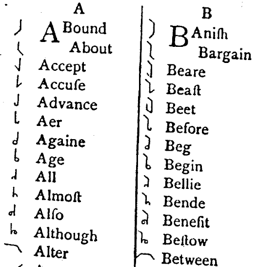

Na początek należy zwrócić uwagę, że niżej wymienione metody nie
stanowią samodzielnych narzędzi budowania systemów stenograficznych. 
Jest to podział teoretyczny, wyliczenie pewnych szczegółowych metod. 
Każda z nich została przez autorów szczegółowo rozważona i użyta w takim
stopniu, w jakim uznał on za konieczne. Generalnie twórcy stenografii projektowali swoje systemy w trzech krokach:

- upraszczali pismo, zwykle łacińskie, aby zmniejszyć liczbę ruchów piórem 
dla oddania danego znaku (budowa znaków/liter),
- ustalali pewne i proste reguły pisania (czasami czerpiąc z [innych systemów pisma](https://pl.wikipedia.org/wiki/Abd%C5%BCad)), które pozwolą adeptom
zwiększać prędkość zapisu (ortografia systemu), 
- tworzyli skróty dla najczęściej występujących słów, a nawet zdań
(frazeogramy). 

W poniższym zestawieniu koncentrujemy się przede
wszystkim na pierwszych dwóch aspektach.

## Budowa znaków

### Systemy geometryczne

Znaki stenografii geometrycznej bazują na kółkach, łukach i prostych,
położonych poziomo, pionowo lub ukośnie. Jest to domyślna metoda
poszukiwania najprostszych znaków, bo rzeczywiście odcinki są
najprostszymi dostępnymi figurami. Geometryczna metoda tworzenia
alfabetów stenograficznych pochodzi z Anglii i tam doczekała się
największej liczby realizacji. Typowymi jej przykładami są system
Taylora oraz Pitmana. Znanym, oryginalnym systemem był również francuski
Duploye, na bazie którego opracowano pismo dla Indian Kri oraz Inuitów.
Polskim przykładem systemu geometrycznego jest system Feliksa Saxe.



### Graficzne (kursywne)

Systemy graficzne oparte są o uproszczenia znaków alfabetycznych zgodnie
z zasadą, że poszukiwać należy najłatwiejszych ruchów dla ręki, przy
zachowaniu czytelności pisma. Pierwszym takim systemem były starożytne
[Notae Tironianae](http://en.wikipedia.org/wiki/Tironian_notes)
(
[noty tyrońskie](http://www.mgh-bibliothek.de/lexikothek/hs_b_16/hs_b_16.html)
). 
W czasach nowożytnych pierwszeństwo należy się Szymonowi Bordley'owi,
który w roku 1787 opublikował książkę pt. 
[Cadmus Britanicus](http://www.stenografia.pl/historia/oswiecenie/Bordley_George_Simon_1787.pdf?attredirects=0)
, 
w której przedstawił projekt systemu graficznego. Jednak pierszym
praktycznie używanym systemem graficznym była stenografia Franciszka
Gabelsbergera z roku 1834, która zawojowała całą Europę na wschód od
Renu.

<!--  -->



<!-- *Notae Tironianae ze średniowiecznego leksykonu*   -->

### Półkursywne

Kategoria ta powstała pod koniec XIX wieku, kiedy zaczęły się pojawiać
systemy oparte o elipsy i krzywe Beziera. W założeniu mają być
kompromisem pomiędzy geometryczną prostotą i graficzną wygodą pisania.
Zatem znaki poddają się geometrycznemu opisowi, ale kładzione na papier
są metodą graficzną, czyli bez wymogu ścisłej, geometrycznej precyzji.
Przykładowe systemy to prekursorski Grzegorza Karola Maeresa z roku
1885, 
[Tomasza Malone'a](http://www.archive.org/details/scriptphonograph00maloiala)
,
czy trzy lata młodszy 
[system Gregga](http://en.wikipedia.org/wiki/Gregg_shorthand)
,
wreszcie międzywojenny 
[Thomas Natural Shorthand](http://en.wikipedia.org/wiki/Thomas_Natural_Shorthand)
.
Przykładem polskiego systemu półkursywnego może być 
[Stenografija Narodowa Arkadiusza Bielskiego](http://podreczniki.stenografia.pl/bielski/bielski-STENOGRAFIA_NARODOWA.pdf)
.

<!--  -->

<!-- *Gdzie na tym obrazku jest system Gregga?*   -->

### Alfabetyczne

Niektóre systemy stenograficzne zostały oparte ściśle o łaciński
alfabet. Ich autorzy starali się uniknąć zmuszania adeptów do opanowania
nowego, często trudnego, zestawu znaków i całą stenografię przenieść do
reguł gramatyczno-ortograficznych. Zasadniczo sprowadza się to do budowy
skomplikowanych słowników skrótów i metod skrótowania. Stare systemy
alfabetyczne to np. system Forknera, komponowany ponad 10 lat,
Speedwriting, czy Personal Shorthand. Współcześnie najbardziej znany
jest Easyscript, daleko za nim w tyle podąża Keyscript. Nic mi nie
wiadomo, aby w Polsce istniała podobna metoda skrótowego zapisu. Ale
może kiedyś powstanie.

<!--  -->

<!-- *System Forknera*   -->

W podziale wedle zasad fonetyki i ortografii możemy wyróżnić rodzaje
systemów:

## Ortografia i fonetyka 

### Literalne (ortograficzne)

Istotą podejścia literalnego jest stworzenie nowego alfabetu znaków dla
ustalonych znaków alfabetu danego języka. Zatem, na przykładzie
polskiego, dla „sz” mielibyśmy ustalony dwuznak złożony z „s” oraz „z”.
Przykładem takiego systemu może być Najłatwiejsza Stenografija Polska
Feliksa Saxe. Zastosowanie tej metody jest bardzo rzadkie, gdyż w
większości języków odejście od tradycyjnej ortografii przynosi korzyść w
postaci skrócenia czasu pisania. W przypadku np. języka angielskiego
jest to nawet 40%. Metoda ta jednak, w całości lub częściowo, znajdowała
zastosowanie we wczesnych systemach nowożytnych, w XVII wieku. Częściowo
została przywrócona w najnowszym systemie angielskim,
[Teeline](http://en.wikipedia.org/wiki/Teeline_Shorthand)
.
Stało się to możliwe dzięki zastosowaniu pewnych tricków.

<!--  -->

<!-- *Przykład systemu Teeline*   -->

### Fonetyczne 

Najpopularniejsze podejście do stenografii polegające na arbitralnym
rozbiorze języka na jednolite „cegiełki”, tak zwane fonemy, czyli
głoski. W przeciwieństwie do tradycyjnego językoznawstwa, w stenografii
zawsze najistotniejszy jest cel, czyli szybkość. Z tego wynika, że
metoda ta niekoniecznie musi odzwierciedlać rzeczywistą, czy też
ustaloną naukowo fonetykę danego języka, a może stanowić jej
uproszczenie, lub wręcz może prezentować odmienne zupełnie podejście.
Przykładem rozbieżności może być angielski 
[system Pitmana](http://www.long-live-pitmans-shorthand.org.uk/)
lub turecki system 
[Ihsana Yenera](https://tr.wikipedia.org/wiki/%C4%B0hsan_S%C4%B1tk%C4%B1_Yener)
.

<!--  -->

<!-- *Turecki System Ihsana Yenera*   -->

W podejściu fonetycznym chodzi nie tylko o skrócenie ortografii pisma do
najniezbędniejszej formy, ale także o zniwelowanie problemów z błędami
ortograficznymi. Koronną zasadą systemów fonetycznych jest „
[pisz, jak słyszysz](https://pl.wikipedia.org/wiki/B%C5%82%C4%85d_ortograficzny)
”.

### Sylabiczne

Metoda sylabiczna jest rozwinięciem stenografii fonetycznej opartej na
spostrzeżeniu, że w każdym języku istnieje ograniczona liczba sylab,
którymi się posługuje. Stworzenie alfabetu sylabicznego, tzw.
[sylabariusza](http://pl.conlang.wikia.com/wiki/Sylabariusz_Polski)
,
oczywiście w większości wypadków mija się z celem, czyli szybkim
pisaniem, jako że mowa o tysiącach możliwych znaków. Zatem w systemach
sylabicznych istotne jest, że budując słowa z fonemów, można łatwo
zapisywać je sylaba po sylabie. W niektórych systemach dopuszczalne jest
dzielenie tekstu na sylaby, zamiast na słowa. Systemy te mają
zastosowanie głównie w tzw. językach sylabicznych, jak japoński,
chiński, czy tybetański. Przykładem systemu sylabicznego może być
**[japoński system Waseda](http://www.youtube.com/watch?v=DLpJwDy3zxg) (kliknij w link, aby obejrzeć film)**
.

<!--  -->

<!-- *System Waseda (kliknij link, aby zobaczyć pisanie na filmie)*   -->

Metodę sylabiczną stosują także częściowo systemy graficzne poprzez tzw.
wokalizację, czyli ustalenie prostych znaków dla zgłosek czyli sylab.
Niektórzy zaliczają także 
[system Pitmana](http://pitmanshorthand.homestead.com/) 
do grupy sylabicznych.

### Funkcjonalne 

Metoda funkcjonalna nigdy nie występuje jako jedyna w systemach
stenograficznych, lecz jest interesującym trickiem skracającym zapis. Za
jej prekursora uważa się Timothy Brighta z XVI wieku. Podejście
funkcjonalne do zapisu polega na rezygnacji z odtwarzania dźwięków mowy,
a koncentrację na jej warstwie gramatycznej oraz treściowej. W przypadku
języka, w którym nie ma wielu wyjątków, a odpowiednie afiksy zmieniają
znaczenie wyrazu, może to być znakomity pomysł pozwalający uprościć
zapis. Można to zilustrować na przykładach: Funkcjonalne podejście do
treści (np. w systemie Brighta)

*Matka = kobieta + dziecko\
Syn = dziecko + mężczyzna\
Córka = dziecko + kobieta\
Ojciec = mężczyzna + dziecko*

<!--  -->

<!-- *System Timothy Brighta z XVIw*   -->

**Funkcjonalne podejście do gramatyki**

Zdanie „*I wielka ryba połknęła Jonasza*” - zostanie zapisane jako:

*\[partykuła\] wielk(bezrodzajowo) ryba połknąć+\[czas przeszły\] Jonasz(dopełniacz niepotrzebny)*

Nikomu jednak (tak sądzę) nie udało się stworzyć w całości funkcjonalnego systemu. Zresztą chyba nie byłoby to efektywne. Dla języków nie posiadających koniugacji i deklinacji - być może (jak np. chiński). Brak danych.

W polskiej stenografii mamy przykład systemu posiadającego cechy systemu funkcjonalnego: 
[Stenografija Narodowa Arkadiusza Bielskiego](http://podreczniki.stenografia.pl/bielski/bielski-STENOGRAFIA_NARODOWA.pdf)
.

