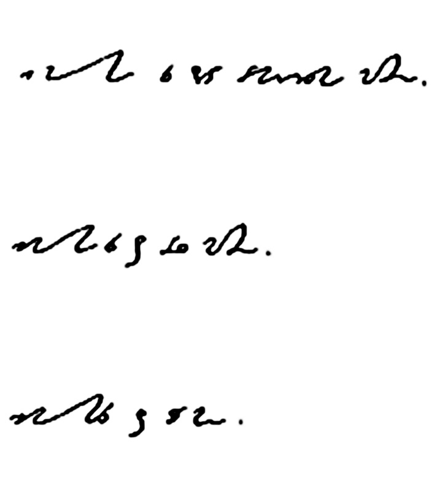

Począwszy od stenografów niemieckich przyjęło się dzielić systemy
stenograficzne zależnie od ich zastosowania na - stenografię
parlamentarną, zwaną też debatową (Redeschrift) - stenografię pospieszną
(Eilschrift), którą nie będziemy się tu zajmować - stenografię
korespondencyjną, zwaną też kupiecką lub notatkową (Verkehrsschrift).

W stenografii niemieckiej przyjęło się objaśniać podstawową różnicę,
czyli prędkość tak: *Pismo odręczne (czyli długie, Langschrift) pozwala
na pisanie z prędkością do 40 sylab na minutę. Pismo kupieckie
(Verkehrschrift) pozwala pisać z prędkością ok. 120 sylab na minutę.
Pismo pośpieszne (Eilschrift) pozwala pisać z prędkością 200 sylab na
minutę. Pismo parlamentarne (Redeschrift) pozwala pisać z prędkością
nawet 400 sylab na minutę. Dla informacji, przeciętne tempo czytania
(wzrokowego, nie na głos!) u człowieka wykształconego to około 300 sylab
na minutę.*

## Stenografia parlamentarna

Jak sama nazwa wskazuje, od początku służy do zapisywania przemówień, a
zatem żywej mowy. Zajmują się nią profesjonalni stenografowie, którzy
stałym ćwiczeniem i doskonaleniem skrótów zdolni są osiągnąć nawet
dwukrotność prędkości, z jaką mówi człowiek. W ten sposób mogą zapisywać
żywy dialog, mają czas na rozpoznanie i opisanie mówców oraz opatrzenie
stenogramu na bieżąco didaskaliami (np. „śmiechy na sali”, albo „poseł
rzuca burakiemkietem”). Stenografia parlamentarna była w szerokim użyciu
jeszcze pół wieku temu. Później jej popularność zaczęła spadać, choć
trudno wskazać jednolite przyczyny. W niektórych krajach dalej docenia
się korzyści płynące z zapisu żywej mowy przez stenografa. Biura
stenograficzne (wzmiankuję tylko te, w których wciąż stenografuje się
odręcznie, nie zaś stenografią maszynową) działają przy Bundestagu, przy
parlamencie Brazylii, przy niektórych radach miejskich, jak np. Sao
Paulo. Stenografa na stałe przy sobie utrzymywała Condoleezza Rice. Była
to niegdyś rutynowa praktyka polityków amerykańskich. Stenografia
parlamentarna to sztuka dla zawodowców. Trudno znaleźć podobieństwa do
zwykłego pisma, chyba, że porównamy ją z chińskimi ideogramami - aby móc
uzyskać naprawdę wielką prędkość pisania, rzeczywiście potrzeba lat
ćwiczeń i nauki. Należy opanować z kaligraficzną precyzją nie tylko
trudny, bo niezwykle uproszczony graficznie układ znaków podstawowych,
ale też setki skrótów i znaczników, czyli symboli mających przyspieszyć
pisanie. Zacytujmy tutaj dickensowskiego bohatera, Davida Copperfielda:

*Nabyłem za cenę sześciu pensów praktyczną metodę stenografii i
zatopiłem się w badaniu jej tajemnic, które nie po kilku tygodniach
doprowadziły do zupełnego zamętu myśli. Kropki, cętki, pałeczki,
oznaczające raz to, drugi raz tamto, znaczenia zygzaków – wirowały mi w
myśli na jawie i we śnie. Gdym się już przedarł przez te zawikłania i
opanował alfabet przypominający przybytek egipskich tajemnic, zjawiały
się orszaki nowych trudności w postaci tak zwanych znaczników. Okropne
to było do opanowania. Bo coś w rodzaju środka pajęczyny oznaczało
„oczekujmy”, a coś w kształcie rakiety – znaczyło „niegodny”. Gdy mi się
wreszcie udało zapamiętać i te szczegóły, dostrzegłem, żem zapomniał
wszystkiego, czego się przedtem tak pracowicie wyuczyłem, a
rozpoczynając znów od początku, zapominałem dalszego ciągu, i tak dalej,
i tak dalej. Doprowadzało to mnie do rozpaczy.*

Mistrz świata w stenografii, Josip Hanjs, trzyma rekord 497 zgłosek na
minutę (czyli ok. 1242 litery na minutę, czyli 20 liter na sekundę - w
jego ojczystym języku!).

Ta sama fraza („***Ich möchte Sie darauf aufmerks am machen.***”, czyli
„*Chciałbym zwrócić uwagę na to.*”) napisana w trzech poziomach
stenografii niemieckiej DEK, najdłuższa linijka to oczywiście pismo
notatkowe, średnia to *Eilschrift* czyli pismo przyspieszone, najkrótsza
to pismo parlamentarne:

<!--  -->

<!-- *Stenografia notatkowa, pospieszna i parlamentarna* -->

## Stenografia korespondencyjna

W stenografii korespondencyjnej (bardzo rzadko sprawdzanej oddzielnie od
parlamentarnej) rekord prędkości trzyma Georg Paucker, zawodowy
stenograf i reformator niemieckiego systemu DEK. W 1950 roku pisał z
prędkością 260 zgłosek na minutę, co wystarcza aż nadto, żeby zapisywać
wykład uniwersytecki lub oficjalne przemówienie, bowiem jest to szybciej
niż przeciętna prędkość mowy w języku niemieckim.

W większości wypadków nie potrzebujemy dokładnego brzmienia wykładu, a
jedynie jego streszczenia bądź skrótu, wreszcie wyjątków zawierających
potrzebne, lub interesujące nas treści. Każdy uczeń i student wie, że
wykład składa się nie tylko z rdzennej informacji, którą studenci
starają się skrzętnie zapisać, ale też dygresji, anegdot oraz innych
komunikatów nadmiarowych. Ma to związek z techniką prowadzenia lekcji,
podczas której nauczyciel musi dać szansę słuchaczom na zapisanie tego,
co potrzebne, ale też powinien dać szansę zmęczonym umysłom na krótkie
chwile odprężenia. Stąd zawodowi wykładowcy dowcipkują, opatrują swoje
przemówienia dygresjami, aluzjami i nie raz nie zdążą dobrnąć do puenty
przed końcem zajęć.

We wstępach do podręczników stenografii różnych systemów, w różnych
językach i w różnych okresach dziejowych, autorzy wskazywali na
niezaprzeczalne zalety tej umiejętności nie tylko podczas zapisu
przemówień. Zacytujmy wyjątek z książki pt. „Dzieje stenografii”
Stefanii Bobrowskiej z roku 1931:

*Ale każdy inteligentny człowiek powinien na tyle umieć opanować
odpowiednie pismo stenograficzne, by zyskać wydatne zaoszczędzenie pracy
pisania i osiągnąć przynajmniej taką szybkość, by nadążyć za
powolniejszym mówcą, a szybsze przemówienia lub myśli swobodnie i
zarazem wydatnie skracać. Granicę trudno ustalić, przyjąć możnaby jako
przeciętną szybkość pisania, osiągalną przez każdego przy należytem
ćwiczeniu, 150-180 zgłosek/min. I w tym wypadku zaoszczędzi
stenografujący znacznie na czasie, energii i materiale, odnosząc znaczne
korzyści. Prócz tych wyczynów normalnych dokonywanych przez
niezawodowców, bardziej uzdolnieni oraz zawodowi stenografowie dochodzą
do daleko lepszych wyników uzyskując rekordową szybkość.*

Wskazana przez Bobrowską prędkość stenografowania to 2-3 zgłoski, czyli
sylaby, na sekundę. Jest to prędkość znaczna, zważywszy, że większość
absolwentów liceów nie potrafi szybciej stukać w klawiaturę komputera
(czyli uzyskuje z trudem taką prędkość w przeliczeniu na litery, a nie
sylaby). I znowu, jest to przeciętna prędkość, z jaką zwykle przemawia
wykładowca, który specjalnie spowalnia potok wymowy, aby wszyscy mogli
go usłyszeć, zrozumieć i zanotować. Zawodowy prezenter radiowy lub
telewizyjny potrafi mówić niemal trzykrotnie szybciej.

